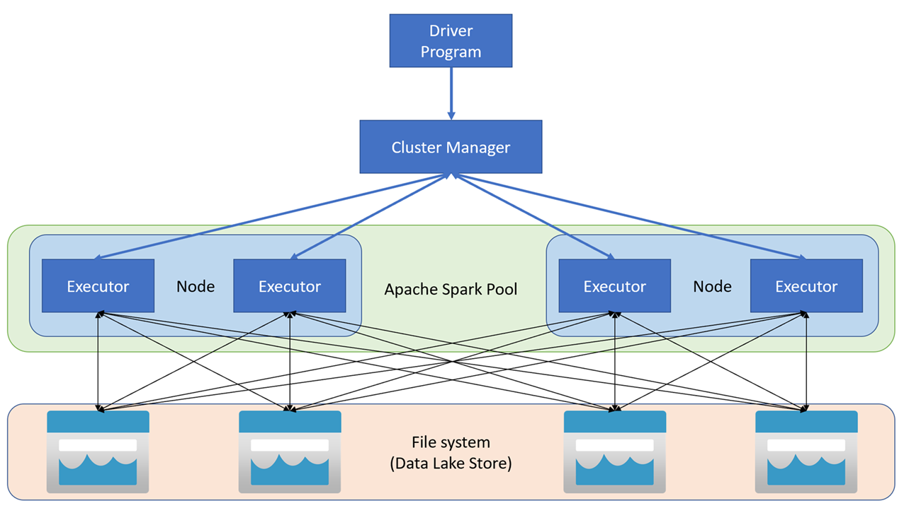
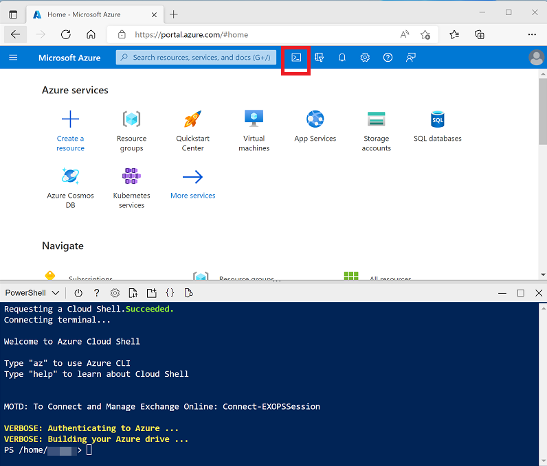

# Analyze data with Apache Spark in Azure Synapse Analytics

Apache Spark is a core technology for large-scale data analytics. Learn how to use Spark in Azure Synapse Analytics to analyze and visualize data in a data lake.

## Learning Objectives

After completing this module, you will be able to:

 - Identify core features and capabilities of Apache Spark.
 - Configure a Spark pool in Azure Synapse Analytics.
 - Run code to load, analyze, and visualize data in a Spark notebook.

## Introduction

Apache Spark is an **open source parallel processing framework for large-scale data processing and analytics**. Spark has become extremely popular in "big data" processing scenarios, and **is available in multiple platform** implementations; including **Azure HDInsight, Azure Databricks, and Azure Synapse Analytics**.

This module explores **how you can use Spark** in Azure Synapse Analytics **to ingest, process, and analyze data from a data lake**. While the core techniques and code described in this module are common to all Spark implementations, the integrated tools and ability to work with Spark in the same environment as other Synapse analytical runtimes are specific to Azure Synapse Analytics.

## Get to know Apache Spark

Apache Spark is distributed data processing framework that enables large-scale data analytics by coordinating work across multiple processing nodes in a cluster.

### How Spark works

Apache Spark **applications run as independent sets of processes on a cluster**, **coordinated** by the SparkContext object in your main program (called the driver program). The SparkContext connects to the cluster manager, which allocates resources across applications using an implementation of Apache Hadoop YARN. Once connected, Spark acquires executors on nodes in the cluster to run your application code.

The **SparkContext runs the main function and parallel operations on the cluster nodes**, and **then collects the results of the operations**. The nodes read and write data from and to the file system and cache transformed data in-memory as Resilient Distributed Datasets (RDDs).

<a href="#">
    
</a>

The SparkContext is responsible for converting an application to a **directed acyclic graph (DAG)**. The graph consists of individual tasks that get executed within an executor process on the nodes. Each application gets its own executor processes, which stay up for the duration of the whole application and run tasks in multiple threads.

### Spark pools in Azure Synapse Analytics

In Azure Synapse Analytics, **a cluster is implemented as a Spark poo**l, which provides a runtime for Spark operations. You can create one or more Spark pools in an Azure Synapse Analytics workspace by using the Azure portal, or in Azure Synapse Studio. When defining a Spark pool, you can specify configuration options for the pool, including:

 - A name for the spark pool.
 - The size of virtual machine (VM) used for the nodes in the pool, including the option to use hardware [accelerated GPU-enabled nodes](https://learn.microsoft.com/en-us/azure/synapse-analytics/spark/apache-spark-overview).
 - The number of nodes in the pool, and whether the pool size is fixed or individual nodes can be brought online dynamically to auto-scale the cluster; in which case, you can specify the minimum and maximum number of active nodes.
 - The version of the Spark Runtime to be used in the pool; which dictates the versions of individual components such as Python, Java, and others that get installed.

#### Tip [Apache Spark pool configurations](https://learn.microsoft.com/en-us/azure/synapse-analytics/spark/apache-spark-pool-configurations)

    For more information about Spark pool configuration options, see Apache Spark pool configurations in Azure Synapse Analytics in the Azure Synapse Analytics documentation.

## Use Spark in Azure Synapse Analytics

You can run many different kinds of application on Spark, including **code in Python or Scala scripts**, **Java code compiled as a Java Archive (JAR)**, and others. Spark is commonly used in two kinds of workload:

 - Batch or stream processing jobs to ingest, clean, and transform data - often running as part of an automated pipeline.
 - Interactive analytics sessions to explore, analyze, and visualize data.


### Running Spark code in notebooks

Azure Synapse Studio includes an integrated notebook interface for working with Spark. Notebooks provide an intuitive way to combine code with Markdown notes, commonly used by data scientists and data analysts. The look and feel of the integrated notebook experience within Azure Synapse Studio is similar to that of Jupyter notebooks - a popular open source notebook platform.

<a href="#">
    
</a>

 Note: While usually used interactively, notebooks can be included in automated pipelines and run as an unattended script.

Notebooks consist of one or more *cells*, each containing either code or markdown. Code cells in notebooks have some features that can help you be more productive, including:

 - Syntax highlighting and error support.
 - Code auto-completion.
 - Interactive data visualizations.
 - The ability to export results.

#### Tip [article link](https://learn.microsoft.com/en-us/azure/synapse-analytics/spark/apache-spark-development-using-notebooks)

 To learn more about working with notebooks in Azure Synapse Analytics, see the Create, develop, and maintain Synapse notebooks in Azure Synapse Analytics article in the Azure Synapse Analytics documentation.

### Accessing data from a Synapse Spark pool

You can use Spark in Azure Synapse Analytics to work with data from various sources, including:

 - A data lake based on the primary storage account for the Azure Synapse Analytics workspace.
 - A data lake based on storage defined as a linked service in the workspace.
 - A dedicated or serverless SQL pool in the workspace.
 - An Azure SQL or SQL Server database (using the Spark connector for SQL Server)
 - An Azure Cosmos DB analytical database defined as a linked service and configured using Azure Synapse Link for Cosmos DB.
 - An Azure Data Explorer Kusto database defined as a linked service in the workspace.
 - An external Hive metastore defined as a linked service in the workspace.

One of the most **common uses of Spark is to work with data in a data lake**, where you can read and write files in multiple commonly used formats, including delimited text, Parquet, Avro, and others.

## Analyze data with Spark

One of the **benefits of using Spark is that you can write and run code in various programming languages**, enabling you to use the programming skills you already have and to use the most appropriate language for a given task. The default language in a new Azure Synapse Analytics **Spark notebook is PySpark** - a Spark-optimized version of **Python**, which is commonly used by data scientists and analysts due to its strong support for data manipulation and visualization. Additionally, **you can use languages such as Scala** (a Java-derived language that can be used interactively) **and SQL** (a variant of the commonly used SQL language included in the Spark SQL library to work with relational data structures). Software engineers can also create compiled solutions that run on Spark using frameworks such as Java and Microsoft .NET.

### Exploring data with dataframes

Natively, **Spark uses a data structure called** a **resilient distributed dataset (RDD)**; but while you can write code that works directly with RDDs, the most commonly used data structure for working with structured data in Spark is the dataframe, which is provided as part of the Spark SQL library. Dataframes in Spark are similar to those in the ubiquitous Pandas Python library, but optimized to work in Spark's distributed processing environment.

 Note: In addition to the Dataframe API, Spark SQL provides a strongly-typed Dataset API that is supported in Java and Scala. We'll focus on the Dataframe API in this module.

### Loading data into a dataframe

Let's explore a hypothetical example to see how you can use a dataframe to work with data. Suppose you have the following data in a comma-delimited text file named **products.csv** in the primary storage account for an Azure Synapse Analytics workspace:

```csv
ProductID,ProductName,Category,ListPrice
771,"Mountain-100 Silver, 38",Mountain Bikes,3399.9900
772,"Mountain-100 Silver, 42",Mountain Bikes,3399.9900
773,"Mountain-100 Silver, 44",Mountain Bikes,3399.9900
...
```

In a Spark notebook, you could use the following PySpark code to load the data into a dataframe and display the first 10 rows:

```py
%%pyspark
df = spark.read.load('abfss://container@store.dfs.core.windows.net/products.csv',
    format='csv',
    header=True
)
display(df.limit(10))
```

The ***%%pyspark*** line at the beginning **is called a magic**, and **tells Spark that the language used in this cell is PySpark**. You can select the language you want to use as a default in the toolbar of the Notebook interface, and then use a magic to override that choice for a specific cell. For example, here's the equivalent Scala code for the products data example:

```scala
%%spark
val df = spark.read.format("csv").option("header", "true").load("abfss://container@store.dfs.core.windows.net/products.csv")
display(df.limit(10))
```

The magic **%%spark** is used to specify Scala.

Both of these code samples would produce output like this:

ProductID	|ProductName |Category	|ListPrice
--- | :---: | :---: | ---: 
771	|Mountain-100 Silver, 38	|Mountain Bikes	|3399.9900
772	|Mountain-100 Silver, 42	|Mountain Bikes	|3399.9900
773	|Mountain-100 Silver, 44	|Mountain Bikes	|3399.9900
...	|...	|...	|...


### Specifying a dataframe schema

In the previous example, the first row of the CSV file contained the column names, and Spark was able to infer the data type of each column from the data it contains. You **can also specify an explicit schema for the data**, which is useful when the column names aren't included in the data file, like this CSV example:

```csv
771,"Mountain-100 Silver, 38",Mountain Bikes,3399.9900
772,"Mountain-100 Silver, 42",Mountain Bikes,3399.9900
773,"Mountain-100 Silver, 44",Mountain Bikes,3399.9900
...
```

The following PySpark example shows how to specify a schema for the dataframe to be loaded from a file named product-data.csv in this format:

```py
from pyspark.sql.types import *
from pyspark.sql.functions import *

productSchema = StructType([
    StructField("ProductID", IntegerType()),
    StructField("ProductName", StringType()),
    StructField("Category", StringType()),
    StructField("ListPrice", FloatType())
    ])

df = spark.read.load('abfss://container@store.dfs.core.windows.net/product-data.csv',
    format='csv',
    schema=productSchema,
    header=False)
display(df.limit(10))
```

The results would once again be similar to:

ProductID	|ProductName |Category	|ListPrice
--- | :---: | :---: | ---: 
771	|Mountain-100 Silver, 38	|Mountain Bikes	|3399.9900
772	|Mountain-100 Silver, 42	|Mountain Bikes	|3399.9900
773	|Mountain-100 Silver, 44	|Mountain Bikes	|3399.9900
...	|...	|...	|...

### Filtering and grouping dataframes

You can use the methods of the Dataframe class to filter, sort, group, and otherwise manipulate the data it contains. For example, the following code example uses the **select** method to retrieve the **ProductName** and **ListPrice** columns from the df dataframe containing product data in the previous example:

```py
pricelist_df = df.select("ProductID", "ListPrice")
```

The results from this code example would look something like this:

ProductID	|ListPrice
--- | ---: 
771	|3399.9900
772	|3399.9900
773	|3399.9900
...	|...

In common with most data manipulation methods, select returns a new dataframe object.

#### Tip

    Selecting a subset of columns from a dataframe is a common operation, which can also be achieved by using the following shorter syntax:

    pricelist_df = df["ProductID", "ListPrice"]

You can *"chain"* methods together to perform a series of manipulations that results in a transformed dataframe. For example, this example code chains the select and where methods to create a new dataframe containing the **ProductName** and **ListPrice** columns for products with a category of **Mountain Bikes** or **Road Bikes**:

```py
bikes_df = df.select("ProductName", "ListPrice").where((df["Category"]=="Mountain Bikes") | (df["Category"]=="Road Bikes"))
display(bikes_df)
```

The results from this code example would look something like this:

ProductName	|ListPrice
--- | ---: 
Mountain-100 Silver, 38	|3399.9900
Road-750 Black, 52	|539.9900
...	|...

To group and aggregate data, you can use the **groupBy** method and aggregate functions. For example, the following **PySpark** code counts the number of products for each category:

```py
counts_df = df.select("ProductID", "Category").groupBy("Category").count()
display(counts_df)
```

The results from this code example would look something like this:

Category	|count
--- | ---: 
Headsets	| 3
Wheels	| 14
Mountain Bikes	| 32
...	| ...

## Using SQL expressions in Spark

The **Dataframe API** is part of a Spark library named **Spark SQL**, which enables data analysts to use SQL expressions to query and manipulate data.

## Creating database objects in the Spark catalog

The Spark catalog is a metastore for relational data objects such as views and tables. The Spark runtime can use the catalog to seamlessly integrate code written in any Spark-supported language with SQL expressions that may be more natural to some data analysts or developers.

One of the simplest ways **to make data in a dataframe available for querying** in the Spark catalog is to **create a temporary view**, as shown in the following code example:

```py
df.createOrReplaceTempView("products")
```

A **view is temporary**, meaning that **it's automatically deleted at the end of the current session**. You **can also create tables that are persisted** in the catalog to define a database that can be queried using Spark SQL.

 - NOTE:
    We won't explore Spark catalog tables in depth in this module, but it's worth taking the time to highlight a few key points:

     - You can create an empty table by using the **spark.catalog.createTable** method. Tables are metadata structures that store their underlying data in the storage location associated with the catalog. Deleting a table also deletes its underlying data.
     - You can save a dataframe as a table by using its **saveAsTable** method.
    You can create an external table by using the **spark.catalog.createExternalTable** method. External tables define metadata in the catalog but get their underlying data from an external storage location; typically a folder in a data lake. Deleting an external table does not delete the underlying data.

### Using the Spark SQL API to query data

You can use the Spark SQL API in code written in any language to query data in the catalog. For example, the following PySpark code uses a SQL query to return data from the products view as a dataframe.

```py
bikes_df = spark.sql("SELECT ProductID, ProductName, ListPrice \
                      FROM products \
                      WHERE Category IN ('Mountain Bikes', 'Road Bikes')")
display(bikes_df)
```

The results from the code example would look similar to the following table:

ProductID | ProductName	|ListPrice
--- | :---: | ---: 
38	|Mountain-100 Silver,| 38	3399.9900
52	|Road-750 Black, 52	|539.9900
...|	...	|...

### Using SQL code

The previous example demonstrated how to use the Spark SQL API to embed SQL expressions in Spark code. **In a notebook**, you can also use the **%%sql** magic **to run SQL code** that queries objects in the catalog, like this:

```sql
%%sql

SELECT Category, COUNT(ProductID) AS ProductCount
FROM products
GROUP BY Category
ORDER BY Category
```

The SQL code example returns a resultset that is automatically displayed in the notebook as a table, like the one below:

Category	|ProductCount
--- | ---:|
Bib-Shorts	| 3
Bike Racks	| 1
Bike Stands	| 1
...	| ...

## Visualize data with Spark

One of the most intuitive ways to analyze the results of data queries is to visualize them as charts. Notebooks in Azure Synapse Analytics provide some **basic charting capabilities** in the user interface, and when that functionality doesn't provide what you need, you can use one of the many Python graphics libraries to create and display data visualizations in the notebook.

### Using built-in notebook charts
When you display a dataframe or run a SQL query in a Spark notebook in Azure Synapse Analytics, the results are displayed under the code cell. By default, results are rendered as a table, but you can also change the results view to a chart and use the chart properties to customize how the chart visualizes the data, as shown here:

<a href="#">
    
</a>

The built-in charting functionality in notebooks is useful when you're working with results of a query that don't include any existing groupings or aggregations, and you want to quickly summarize the data visually. When you want to have more control over how the data is formatted, or to display values that you have already aggregated in a query, you should consider using a graphics package to create your own visualizations.

### Using graphics packages in code

There are many graphics packages that you can use to create data visualizations in code. In particular, **Python** supports a large selection of packages; most of them built on the base **Matplotlib** library. The output from a graphics library can be rendered in a notebook, making it easy to combine code to ingest and manipulate data with inline data visualizations and markdown cells to provide commentary.

For example, you could use the following **PySpark** code to aggregate data from the hypothetical products data explored previously in this module, and use **Matplotlib** to create a chart from the aggregated data.

```py
from matplotlib import pyplot as plt

# Get the data as a Pandas dataframe
data = spark.sql("SELECT Category, COUNT(ProductID) AS ProductCount \
                  FROM products \
                  GROUP BY Category \
                  ORDER BY Category").toPandas()

# Clear the plot area
plt.clf()

# Create a Figure
fig = plt.figure(figsize=(12,8))

# Create a bar plot of product counts by category
plt.bar(x=data['Category'], height=data['ProductCount'], color='orange')

# Customize the chart
plt.title('Product Counts by Category')
plt.xlabel('Category')
plt.ylabel('Products')
plt.grid(color='#95a5a6', linestyle='--', linewidth=2, axis='y', alpha=0.7)
plt.xticks(rotation=70)

# Show the plot area
plt.show()
```

The **Matplotlib** library requires data to be in a Pandas dataframe rather than a Spark dataframe, so the **toPandas** method is used to convert it. The code then creates a figure with a specified size and plots a bar chart with some custom property configuration before showing the resulting plot.

The chart produced by the code would look similar to the following image:

<a href="#">
    
</a>

You can use the **Matplotlib** library to create many kinds of chart; or if preferred, you can use other libraries such as Seaborn to create highly customized charts.

## Exercise - Analyze data with Spark

Now it's your opportunity to use a Spark pool in Azure Synapse Analytics. In this exercise, you'll use a provided script to provision an Azure Synapse Analytics workspace in your Azure subscription; and then use a Spark pool to analyze and visualize data from files in a data lake.

### Analyze data in a data lake with Spark

Apache Spark is an open source engine for distributed data processing, and is widely used to explore, process, and analyze huge volumes of data in data lake storage. Spark is available as a processing option in many data platform products, including Azure HDInsight, Azure Databricks, and Azure Synapse Analytics on the Microsoft Azure cloud platform. One of the benefits of Spark is support for a wide range of programming languages, including Java, Scala, Python, and SQL; making Spark a very flexible solution for data processing workloads including data cleansing and manipulation, statistical analysis and machine learning, and data analytics and visualization.

### Provision an Azure Synapse Analytics workspace

You’ll need an Azure Synapse Analytics workspace with access to data lake storage. You can use the built-in serverless SQL pool to query files in the data lake.

In this exercise, you’ll use a combination of a PowerShell script and an ARM template to provision an Azure Synapse Analytics workspace.

 1) Sign into the Azure portal at [Azure Portal link](https://portal.azure.com).

 2) Use the **[>_]** button to the right of the search bar at the top of the page to create a new Cloud Shell in the Azure portal, selecting a **PowerShell** environment and creating storage if prompted. The cloud shell provides a command line interface in a pane at the bottom of the Azure portal, as shown here:

<a href="#">
    
</a>

    NOTE: If you have previously created a cloud shell that uses a Bash environment, use the the drop-down menu at the top left of the cloud shell pane to change it to PowerShell.

 3) Note that you can resize the cloud shell by dragging the separator bar at the top of the pane, or by using the **—**, **◻**, and **X** icons at the top right of the pane to minimize, maximize, and close the pane. For more information about using the Azure Cloud Shell, see the [Azure Cloud Shell documentation](https://learn.microsoft.com/en-us/azure/cloud-shell/overview).

 4) In the PowerShell pane, enter the following commands to clone this repo:

```bash
 rm -r dp-203 -f
 git clone https://github.com/MicrosoftLearning/dp-203-azure-data-engineer dp-203
```

 5) After the repo has been cloned, enter the following commands to change to the folder for this exercise and run the **setup.ps1** script it contains:

```bash
 cd dp-203/Allfiles/labs/05
 ./setup.ps1
```

 6) **If prompted**, choose which subscription you want to use (this will only happen if you have access to multiple Azure subscriptions).

 7) When prompted,**enter a suitable password** to be set for your Azure Synapse SQL pool.

    NOTE: Be sure to remember this password!

 8) Wait for the script to complete - this typically takes around 10 minutes, but in some cases may take longer. While you are waiting, review the Apache Spark in [Azure Synapse Analytics article in the Azure Synapse Analytics documentation](https://learn.microsoft.com/en-us/azure/synapse-analytics/spark/apache-spark-overview).

### Query data in files

The script provisions an Azure Synapse Analytics workspace and an Azure Storage account to host the data lake, then uploads some data files to the data lake.

#### View files in the data lake

 1) After the script has completed, in the Azure portal, go to the **dp500-xxxxxxx** resource group that it created, and select your Synapse workspace.
 2) In the **Overview** page for your Synapse workspace, in the **Open Synapse Studio** card, select **Open** to open Synapse Studio in a new browser tab; signing in if prompted.
 3) On the left side of Synapse Studio, use the ›› icon to expand the menu - this reveals the different pages within Synapse Studio that you’ll use to manage resources and perform data analytics tasks.
 4) On the **Manage** page, select the **Apache Spark pools** tab and note that a Spark pool with a name similar to **sparkxxxxxxx** has been provisioned in the workspace. Later you will use this Spark pool to load and analyze data from files in the data lake storage for the workspace.
 5) On the **Data** page, view the **Linked** tab and verify that your workspace includes a link to your Azure Data Lake Storage Gen2 storage account, which should have a name similar to **synapsexxxxxxx** (**Primary - datalakexxxxxxx**).
 6) Expand your storage account and verify that it contains a file system container named **files**.
 7) Select the **files** container, and note that it contains folders named **sales** and **synapse**. The **synapse** folder is used by Azure Synapse, and the **sales** folder contains the data files you are going to query.
 8) Open the **sales** folder and the orders folder it contains, and observe that the **orders** folder contains **.csv** files for three years of **sales** data.
9) Right-click any of the files and select **Preview** to see the data it contains. Note that the files do not contain a header row, so you can unselect the option to display column headers.

### Use Spark to explore data

 1) Select any of the files in the **orders** folder, and then in the **New notebook** list on the toolbar, select **Load to DataFrame**. A dataframe is a structure in Spark that represents a tabular dataset.
 2) In the new **Notebook 1** tab that opens, in the **Attach to** list, select your Spark pool (**sparkxxxxxxx**). Then use the ▷ Run all button to run all of the cells in the notebook (there’s currently only one!).

Since this is the first time you’ve run any Spark code in this session, the Spark pool must be started. This means that the first run in the session can take a few minutes. Subsequent runs will be quicker.

 3) While you are waiting for the Spark session to initialize, review the code that was generated; which looks similar to this:

```py
 %%pyspark
 df = spark.read.load('abfss://files@datalakexxxxxxx.dfs.core.windows.net/sales/orders/2019.csv', format='csv'
 ## If header exists uncomment line below
 ##, header=True
 )
 display(df.limit(10))
```

 4) When the code has finished running, review the output beneath the cell in the notebook. It shows the first ten rows in the file you selected, with automatic column names in the form **_c0, _c1, _c2**, and so on.

 5) Modify the code so that the **spark.read.load** function reads data from all of the CSV files in the folder, and the display function shows the first 100 rows. Your code should look like this (with **datalakexxxxxxx** matching the name of your data lake store):

```py
 %%pyspark
 df = spark.read.load('abfss://files@datalakexxxxxxx.dfs.core.windows.net/sales/orders/*.csv', format='csv'
 )
 display(df.limit(100))
```

 6) Use the **▷** button to the left of the code cell to run just that cell, and review the results.

    The dataframe now includes data from all of the files, but the column names are not useful. Spark uses a “schema-on-read” approach to try to determine appropriate data types for the columns based on the data they contain, and if a header row is present in a text file it can be used to identify the column names (by specifying a **header=True** parameter in the **load** function). Alternatively, you can define an explicit schema for the dataframe.

 7) Modify the code as follows (replacing **datalakexxxxxxx**), to define an explicit schema for the dataframe that includes the column names and data types. Rerun the code in the cell.

```py
 %%pyspark
 from pyspark.sql.types import *
 from pyspark.sql.functions import *

 orderSchema = StructType([
     StructField("SalesOrderNumber", StringType()),
     StructField("SalesOrderLineNumber", IntegerType()),
     StructField("OrderDate", DateType()),
     StructField("CustomerName", StringType()),
     StructField("Email", StringType()),
     StructField("Item", StringType()),
     StructField("Quantity", IntegerType()),
     StructField("UnitPrice", FloatType()),
     StructField("Tax", FloatType())
     ])

 df = spark.read.load('abfss://files@datalakexxxxxxx.dfs.core.windows.net/sales/orders/*.csv', format='csv', schema=orderSchema)
 display(df.limit(100))
```

 8) Under the results, use the **+ Code** button to add a new code cell to the notebook. Then in the new cell, add the following code to display the dataframe’s schema:

```py
 df.printSchema()
```

 9) Run the new cell and verify that the dataframe schema matches the orderSchema you defined. The printSchema function can be useful when using a dataframe with an automatically inferred schema.

### Analyze data in a dataframe

The **dataframe** object in Spark is similar to a Pandas dataframe in Python, and includes a wide range of functions that you can use to manipulate, filter, group, and otherwise analyze the data it contains.

#### Filter a dataframe

 1) Add a new code cell to the notebook, and enter the following code in it:

```py
 customers = df['CustomerName', 'Email']
 print(customers.count())
 print(customers.distinct().count())
 display(customers.distinct())
```

 2) Run the new code cell, and review the results. Observe the following details:
     - When you perform an operation on a dataframe, the result is a new dataframe (in this case, a new **customers** dataframe is created by selecting a specific subset of columns from the **df** dataframe)
     - Dataframes provide functions such as count and distinct that can be used to summarize and filter the data they contain.
     - The **dataframe['Field1', 'Field2', ...]** syntax is a shorthand way of defining a subset of column. You can also use **select** method, so the first line of the code above could be written as **customers = df.select("CustomerName", "Email")**

 3) Modify the code as follows:

```py
 customers = df.select("CustomerName", "Email").where(df['Item']=='Road-250 Red, 52')
 print(customers.count())
 print(customers.distinct().count())
 display(customers.distinct())
```

 4) Run the modified code to view the customers who have purchased the *Road-250 Red, 52* product. Note that you can “chain” multiple functions together so that the output of one function becomes the input for the next - in this case, the dataframe created by the **select** method is the source dataframe for the **where** method that is used to apply filtering criteria.

#### Aggregate and group data in a dataframe

 1) Add a new code cell to the notebook, and enter the following code in it:

```py
 productSales = df.select("Item", "Quantity").groupBy("Item").sum()
 display(productSales)
```

 2) Run the code cell you added, and note that the results show the sum of order quantities grouped by product. The **groupBy** method groups the rows by Item, and the subsequent **sum** aggregate function is applied to all of the remaining numeric columns (in this case, Quantity)

 3) Add another new code cell to the notebook, and enter the following code in it:

 ```py
 yearlySales = df.select(year("OrderDate").alias("Year")).groupBy("Year").count().orderBy("Year")
 display(yearlySales)
```

 4) Run the code cell you added, and note that the results show the number of sales orders per year. Note that the **select** method includes a SQL **year** function to extract the year component of the **OrderDate** field, and then an **alias** method is used to assign a columm name to the extracted year value. The data is then grouped by the derived Year column and the count of rows in each group is calculated before finally the **orderBy** method is used to sort the resulting dataframe.

### Query data using Spark SQL

As you’ve seen, the native methods of the dataframe object enable you to query and analyze data quite effectively. However, many data analysts are more comfortable working with SQL syntax. Spark SQL is a SQL language API in Spark that you can use to run SQL statements, or even persist data in relational tables.

#### Use Spark SQL in PySpark code

The default language in Azure Synapse Studio notebooks is PySpark, which is a Spark-based Python runtime. Within this runtime, you can use the **spark.sql** library to embed Spark SQL syntax within your Python code, and work with SQL constructs such as tables and views.

 1) Add a new code cell to the notebook, and enter the following code in it:

```py
 df.createOrReplaceTempView("salesorders")

 spark_df = spark.sql("SELECT * FROM salesorders")
 display(spark_df)
```

 2) Run the cell and review the results. Observe that:

     - The code persists the data in the **df** dataframe as a temporary view named **salesorders**. Spark SQL supports the use of temporary views or persisted tables as sources for SQL queries.
     - The **spark.sql** method is then used to run a SQL query against the **salesorders** view.
     - The results of the query are stored in a dataframe.

#### Run SQL code in a cell

While it’s useful to be able to embed SQL statements into a cell containing PySpark code, data analysts often just want to work directly in SQL.

 1) Add a new code cell to the notebook, and enter the following code in it:

```sql
 %%sql
 SELECT YEAR(OrderDate) AS OrderYear,
        SUM((UnitPrice * Quantity) + Tax) AS GrossRevenue
 FROM salesorders
 GROUP BY YEAR(OrderDate)
 ORDER BY OrderYear;
```

 2) Run the cell and review the results. Observe that:

     - The **%%sql** line at the beginning of the cell (called a magic) indicates that the Spark SQL language runtime should be used to run the code in this cell instead of **PySpark**.
     - The SQL code references the **salesorder** view that you created previously using PySpark.
     - The output from the SQL query is automatically displayed as the result under the cell.


### Visualize data with Spark

A picture is proverbially worth a thousand words, and a chart is often better than a thousand rows of data. While notebooks in Azure Synapse Analytics include a built in chart view for data that is displayed from a dataframe or Spark SQL query, it is not designed for comprehensive charting. However, you can use Python graphics libraries like **matplotlib** and **seaborn** to create charts from data in dataframes.

#### View results as a chart

 1) Add a new code cell to the notebook, and enter the following code in it:

```sql
 %%sql
 SELECT * FROM salesorders
```

 2) Run the code and observe that it returns the data from the salesorders view you created previously.
 3) In the results section beneath the cell, change the View option from Table to Chart.
 4) Use the View options button at the top right of the chart to display the options pane for the chart. Then set the options as follows and select Apply:
     - **Chart type**: Bar chart
     - **Key**: Item
     - **Values**: Quantity
     - **Series Group**: leave blank
     - **Aggregation**: Sum
     - **Stacked**: Unselected
 5) Verify that the chart looks similar to this:

<a href="#">
    
</a>

#### Get started with matplotlib

 1) Add a new code cell to the notebook, and enter the following code in it:

```py
 sqlQuery = "SELECT CAST(YEAR(OrderDate) AS CHAR(4)) AS OrderYear, \
                 SUM((UnitPrice * Quantity) + Tax) AS GrossRevenue \
             FROM salesorders \
             GROUP BY CAST(YEAR(OrderDate) AS CHAR(4)) \
             ORDER BY OrderYear"
 df_spark = spark.sql(sqlQuery)
 df_spark.show()
```

 2) Run the code and observe that it returns a Spark dataframe containing the yearly revenue.

    To visualize the data as a chart, we’ll start by using the matplotlib Python library. This library is the core plotting library on which many others are based, and provides a great deal of flexibility in creating charts.

 3) Add a new code cell to the notebook, and add the following code to it:

```py
 from matplotlib import pyplot as plt

 # matplotlib requires a Pandas dataframe, not a Spark one
 df_sales = df_spark.toPandas()

 # Create a bar plot of revenue by year
 plt.bar(x=df_sales['OrderYear'], height=df_sales['GrossRevenue'])

 # Display the plot
 plt.show()
```

 4) Run the cell and review the results, which consist of a column chart with the total gross revenue for each year. Note the following features of the code used to produce this chart:
     - The **matplotlib** library requires a Pandas dataframe, so you need to convert the Spark dataframe returned by the Spark SQL query to this format.
     - At the core of the **matplotlib** library is the **pyplot** object. This is the foundation for most plotting functionality.
     - The default settings result in a usable chart, but there’s considerable scope to customize it

 5) Modify the code to plot the chart as follows:

```py
 # Clear the plot area
 plt.clf()

 # Create a bar plot of revenue by year
 plt.bar(x=df_sales['OrderYear'], height=df_sales['GrossRevenue'], color='orange')

 # Customize the chart
 plt.title('Revenue by Year')
 plt.xlabel('Year')
 plt.ylabel('Revenue')
 plt.grid(color='#95a5a6', linestyle='--', linewidth=2, axis='y', alpha=0.7)
 plt.xticks(rotation=45)

 # Show the figure
 plt.show()
```

 6) Re-run the code cell and view the results. The chart now includes a little more information.

    A plot is technically contained with a **Figure**. In the previous examples, the figure was created implicitly for you; but you can create it explicitly.

 7) Modify the code to plot the chart as follows:

```py
 # Clear the plot area
 plt.clf()

 # Create a Figure
 fig = plt.figure(figsize=(8,3))

 # Create a bar plot of revenue by year
 plt.bar(x=df_sales['OrderYear'], height=df_sales['GrossRevenue'], color='orange')

 # Customize the chart
 plt.title('Revenue by Year')
 plt.xlabel('Year')
 plt.ylabel('Revenue')
 plt.grid(color='#95a5a6', linestyle='--', linewidth=2, axis='y', alpha=0.7)
 plt.xticks(rotation=45)

 # Show the figure
 plt.show()
```

 8) Re-run the code cell and view the results. The figure determines the shape and size of the plot.

    A figure can contain multiple subplots, each on its own axis.

 9) Modify the code to plot the chart as follows:

```py
 # Clear the plot area
 plt.clf()

 # Create a figure for 2 subplots (1 row, 2 columns)
 fig, ax = plt.subplots(1, 2, figsize = (10,4))

 # Create a bar plot of revenue by year on the first axis
 ax[0].bar(x=df_sales['OrderYear'], height=df_sales['GrossRevenue'], color='orange')
 ax[0].set_title('Revenue by Year')

 # Create a pie chart of yearly order counts on the second axis
 yearly_counts = df_sales['OrderYear'].value_counts()
 ax[1].pie(yearly_counts)
 ax[1].set_title('Orders per Year')
 ax[1].legend(yearly_counts.keys().tolist())

 # Add a title to the Figure
 fig.suptitle('Sales Data')

 # Show the figure
 plt.show()
```

 10) Re-run the code cell and view the results. The figure contains the subplots specified in the code.

#### Tip [matplotlib](https://matplotlib.org/)

    To learn more about plotting with matplotlib, see the matplotlib documentation.

### Use the seaborn library

While **matplotlib** enables you to create complex charts of multiple types, it can require some complex code to achieve the best results. For this reason, over the years, many new libraries have been built on the base of **matplotlib** to abstract its complexity and enhance its capabilities. One such library is **seaborn**.

 1) Add a new code cell to the notebook, and enter the following code in it:

```py
 import seaborn as sns

 # Clear the plot area
 plt.clf()

 # Create a bar chart
 ax = sns.barplot(x="OrderYear", y="GrossRevenue", data=df_sales)
 plt.show()
```

 2) Run the code and observe that it displays a bar chart using the seaborn library.
 3) Add a new code cell to the notebook, and enter the following code in it

 ```py
  # Clear the plot area
 plt.clf()

 # Set the visual theme for seaborn
 sns.set_theme(style="whitegrid")

 # Create a bar chart
 ax = sns.barplot(x="OrderYear", y="GrossRevenue", data=df_sales)
 plt.show()
 ```

 4) Run the code and note that seaborn enables you to set a consistent color theme for your plots.

 5) Add a new code cell to the notebook, and enter the following code in it:

```py
 # Clear the plot area
 plt.clf()

 # Create a bar chart
 ax = sns.lineplot(x="OrderYear", y="GrossRevenue", data=df_sales)
 plt.show()
```

 6) Run the code to view the yearly revenue as a line chart.

 Note: To learn more about plotting with seaborn, see the [seaborn documentation](https://seaborn.pydata.org/index.html).

## Delete Azure resources

If **you’ve finished** exploring Azure Synapse Analytics, **you should delete the resources you’ve created to avoid unnecessary Azure costs**.

 1) Close the Synapse Studio browser tab and **return to the Azure portal**.
 2) On the Azure portal, on the **Home** page, select **Resource groups**.
 3) Select the **dp203-xxxxxxx** resource group for your Synapse Analytics workspace (not the managed resource group), and verify that it contains the Synapse workspace and storage account for your workspace.
 4) At the top of the **Overview** page for your resource group, select **Delete resource group**.
 5) Enter the **dp203-xxxxxxx** resource group name to confirm you want to delete it, and select **Delete**.

After a few minutes, your Azure Synapse workspace resource group and the managed workspace resource group associated with it will be deleted.