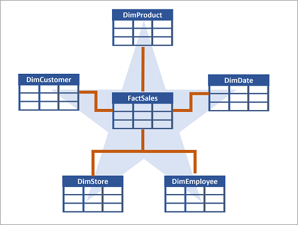
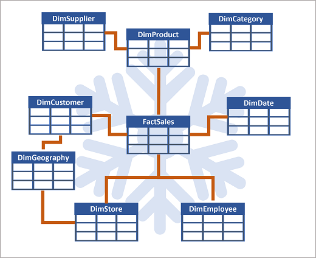
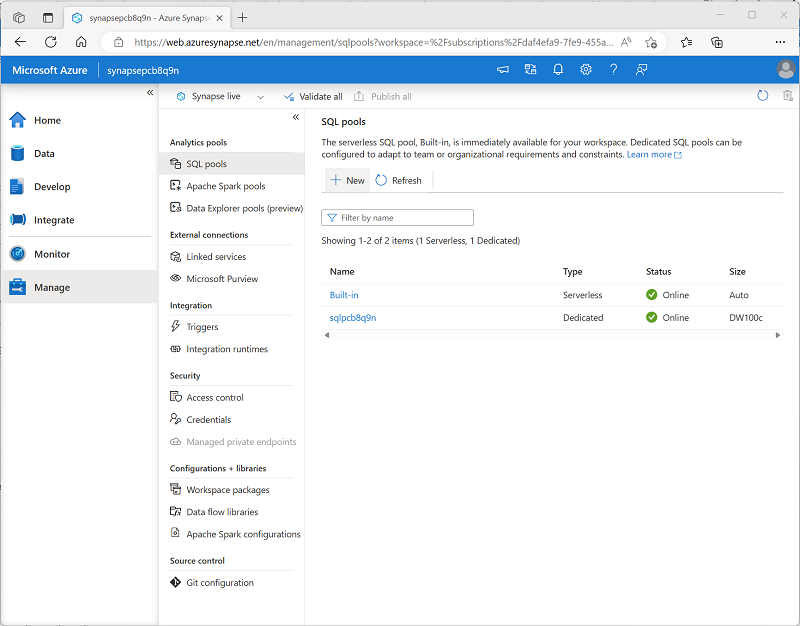

# Analyze data in a relational data warehouse

Relational data warehouses are a core element of most enterprise Business Intelligence (BI) solutions, and are used as the basis for data models, reports, and analysis.

## Learning objectives

In this module, you'll learn how to:

 - Design a schema for a relational data warehouse.
 - Create fact, dimension, and staging tables.
 - Use SQL to load data into data warehouse tables.
 - Use SQL to query relational data warehouse tables.

## Introduction

**Relational data warehouses** are at the center of most enterprise business intelligence (BI) solutions. While the specific details may vary across data warehouse implementations, a common pattern based on a **denormalized, multidimensional schema** has emerged as the standard design for a relational data warehouse.

Azure Synapse Analytics includes a highly scalable relational database engine that is optimized for data warehousing workloads. By using dedicated SQL pools in Azure Synapse Analytics, you can create databases that are capable of hosting and querying huge volumes of data in relational tables.

## Design a data warehouse schema

Like all relational databases, **a data warehouse contains tables** in which the data you want to analyze is stored. Most commonly, these **tables are organized in a schema** that is optimized for multidimensional modeling, in which numerical measures associated **with events known as facts** can be aggregated by the attributes of associated entities across multiple dimensions. For example, measures associated with a sales order (such as the amount paid or the quantity of items ordered) can be aggregated by attributes of the date on which the sale occurred, the customer, the store, and so on.

### Tables in a data warehouse

A common pattern for relational **data warehouses** is to define a **schema** that **includes two kinds of table: dimension tables and fact tables.**

#### Dimension tables

**Dimension tables describe business entities**, such as products, people, places, and dates. **Dimension tables contain columns for attributes of an entity**. For example, a customer entity might have a first name, a last name, an email address, and a postal address (which might consist of a street address, a city, a postal code, and a country or region). In addition to attribute columns, a dimension table contains a unique key column that uniquely identifies each row in the table. In fact, **it's common for a dimension table to include two key columns**:

 - ***A surrogate key*** that is specific to the data warehouse and **uniquely identifies each row** in the dimension table in the data warehouse - usually an incrementing integer number.
 - ***An alternate key***, often a natural or business key that is used to **identify a specific instance of an entity** in the transactional source system from which the entity record originated - such as a product code or a customer ID.

    **Note**: Why have two keys? There are a few good reasons:

    - The data warehouse may be populated with data from multiple source systems, which can lead to the risk of duplicate or incompatible business keys.
    - Simple numeric keys generally perform better in queries that join lots of tables - a common pattern in data warehouses.
    - Attributes of entities may change over time - for example, a customer might change their address. Since the data warehouse is used to support historic reporting, you may want **to retain a record for each instance of an entity at multiple points in time**; so that, for example, sales orders for a specific customer are counted for the city where they lived at the time the order was placed. In this case, multiple customer records would have the same business key associated with the customer, but different surrogate keys for each discrete address where the customer lived at various times.

An example of a dimension table for customer might contain the following data:

CustomerKey	| CustomerAltKey	| Name	| Email	| Street	| City	| PostalCode	| CountryRegion
:---	| :--	| :---	| :---	| :---	| :---:	| ---:	| :---:
**123**	| **I-543**	| **Navin Jones**	| navin1@contoso.com	| **1 Main St.**	| **Seattle**	| **90000**	| United States
124	| R-589	| Mary Smith	| mary2@contoso.com	| 234 190th Ave	| Buffalo	| 50001	| United States
125	| I-321	| Antoine Dubois	| antoine1@contoso.com	| 2 Rue Jolie	| Paris	| 20098	| France
**126**	| **I-543**	| **Navin Jones**	| navin1@contoso.com	| **24 125th Ave.**	| **New York**	| **50000**	| United States
...	| ...	| ...	| ...	| ...	| ...	| ...	| ...

 Note: Observe that the **table contains two records for Navin Jones**. Both records use the same alternate key to identify this person (I-543), but **each record has a different surrogate key**. From this, you can surmise that the customer moved from Seattle to New York. Sales made to the customer while living in Seattle are associated with the key 123, while purchases made after moving to New York are recorded against record 126.

In addition to dimension tables that represent business entities, **it's common for a data warehouse to include a dimension table that represents time**. This table enables data analysts to aggregate data over temporal intervals. Depending on the type of data you need to analyze, the lowest granularity (referred to as the grain) of a time dimension could represent times (to the hour, second, millisecond, nanosecond, or even lower), or dates.

An example of a time dimension table with a grain at the date level might contain the following data:

DateKey	| DateAltKey	| DayOfWeek	| DayOfMonth	| Weekday	| Month	|MonthName	|Quarter	|Year
:---:	| :---:	| :---:	| :---:	| ---	| :---:	| :---:	| ---:	| ---:
19990101|	01-01-1999	|6	|1	|Friday	|1	|January	|1	|1999
...	|...	|...	|...	|...	|...	|...	|...	|...
20220101	|01-01-2022	|7	|1	|Saturday	|1	|January	|1	|2022
20220102	|02-01-2022	|1	|2	|Sunday	|1	|January	|1	|2022
...	|...	|...	|...	|...	|...	|...	|...	|...
20301231	|31-12-2030	|3	|31	|Tuesday	|12	|December	|4	|2030

The timespan covered by the records in the table must include the earliest and latest points in time for any associated events recorded in a **related fact table**. Usually there's a record for every interval at the appropriate grain in between.

#### Fact tables

**Fact tables store details of observations or events**; for example, sales orders, stock balances, exchange rates, or recorded temperatures. A fact table contains columns for numeric values that can be aggregated by dimensions. In addition to the numeric columns, a **fact table contains key columns that reference unique keys in related dimension tables**.

For example, a fact table containing details of sales orders might contain the following data:

OrderDateKey	| CustomerKey	| StoreKey	| ProductKey	| OrderNo	| LineItemNo	| Quantity	| UnitPrice	| Tax	| ItemTotal
---	| ---	| ---	| ---	| ---	| ---	| ---	| ---	| ---	| ---
**20220101**	| 123	| 5	| 701	| 1001	| 1	| 2	| 2.50	| 0.50	| 5.50
**20220101**	| 123	| 5	| 765	| 1001	| 2	| 1	| 2.00	| 0.20	| 2.20
**20220102**	| 125	| 2	| 723	| 1002	| 1	| 1	| 4.99	| 0.49	| 5.48
20220103	| 126	| 1	| 823	| 1003	| 1	| 1	| 7.99	| 0.80	| 8.79
...	| ...	| ...	| ...	| ...	| ...| 	...| 	...| 	...	| ...

A fact table's dimension key columns determine its grain. For example, the sales orders fact table includes keys for dates, customers, stores, and products. An order might include multiple products, so the grain represents line items for individual products sold in stores to customers on specific days.

#### Data warehouse schema designs

In most transactional databases that are used in business applications, the data is normalized to reduce duplication. In a data warehouse however, the dimension data is generally de-normalized to reduce the number of joins required to query the data.

**Often, a data warehouse is organized as a star schema**, in which a fact table is directly related to the dimension tables, as shown in this example:

<a href="#">
    
</a>

The **attributes of an entity can be used to aggregate measures in fact tables** over multiple hierarchical levels - for example, to find total sales revenue by country or region, city, postal code, or individual customer. The attributes for each level can be stored in the same dimension table. However, when an entity has a large number of hierarchical attribute levels, or when some attributes can be shared by multiple dimensions (for example, both customers and stores have a geographical address), it can make sense to apply some normalization to the dimension tables and create a snowflake schema, as shown in the following example:

<a href="#">
    
</a>

In this case, the **DimProduct** table *has been normalized* to create separate dimension tables for **product**, **categories** and **suppliers**, and a **DimGeography** table has been added to represent geographical attributes for both customers and stores. Each row in the **DimProduct** table contains key values for the corresponding rows in the **DimCategory** and **DimSupplier** tables; and each row in the **DimCustomer** and **DimStore** tables contains a key value for the corresponding row in the **DimGeography** table.

## Create data warehouse tables

Now that you understand the basic architectural principles for a relational data warehouse schema, let's explore how to create a data warehouse.

### Creating a dedicated SQL pool

**To create a relational data warehouse** in Azure Synapse Analytics, **you must create a dedicated SQL Pool**. The simplest way to do this in an existing Azure Synapse Analytics workspace is to **use the Manage page in Azure Synapse Studio**, as shown here:

<a href="#">
    
</a>

When provisioning a dedicated SQL pool, you can *specify the following configuration settings*:

 - A **unique name** for the dedicated SQL pool.
 - A **performance level** for the SQL pool, which can range from **DW100c** to **DW30000c** and which *determines the cost per hour for the pool when it's running*.
 - Whether to start with an empty pool or restore an existing database from a backup.
 - The **collation** of the SQL pool, which *determines sort order and string comparison rules for the database*. (**You can't change the collation after creation**).

After creating a dedicated SQL pool, **you can control its running state** in the **Manage** page of Synapse Studio; *pausing it when not required to prevent unnecessary costs*.

When the pool is running, you can explore it on the **Data** page, and create SQL scripts to run in it.

### Considerations for creating tables

To create tables in the dedicated SQL pool, you use the **CREATE TABLE** (or sometimes the **CREATE EXTERNAL TABLE**) Transact-SQL statement. The specific options used in the statement depend on the type of table you're creating, which can include:

 - Fact tables
 - Dimension tables
 - Staging tables

 Note: The data warehouse is composed of fact and dimension tables as discussed previously. **Staging tables** are often used as part of the data warehousing **loading process to ingest data from source systems**.

When designing a star schema model for small or medium sized datasets you can use your preferred database, such as Azure SQL. For larger data sets you may benefit from implementing your data warehouse in Azure Synapse Analytics instead of SQL Server. It's important to understand some key differences when creating tables in Synapse Analytics.

#### Data integrity constraints

Dedicated **SQL pools in Synapse Analytics don't support foreign key and unique constraints as found in other relational database** systems like SQL Server. *This means that jobs used to load data must maintain uniqueness and referential integrity for keys, without relying on the table definitions* in the database to do so.

 Tip: For more information about constraints in Azure Synapse Analytics dedicated SQL pools, see [Primary key, foreign key, and unique key using dedicated SQL pool in Azure Synapse Analytics](https://learn.microsoft.com/en-us/azure/synapse-analytics/sql-data-warehouse/sql-data-warehouse-table-constraints).

#### Indexes

While Synapse Analytics dedicated **SQL pools support clustered indexes as found in SQL Server**, the **default index type is clustered columnstore**. This **index type offers** a significant **performance** advantage when querying large quantities of data in a typical data warehouse schema **and should be used where possible**. However, **some tables may include data types that can't be included in a clustered columnstore index** (for example, **VARBINARY(MAX)**), *in which case a clustered index can be used instead*.

 Tip: For more information about indexing in Azure Synapse Analytics dedicated SQL pools, see [Indexes on dedicated SQL pool tables in Azure Synapse Analytics](https://learn.microsoft.com/en-us/azure/synapse-analytics/sql-data-warehouse/sql-data-warehouse-tables-index).

#### Distribution

Azure Synapse Analytics dedicated **SQL pools use a massively parallel processing (MPP)** architecture, **as opposed to the symmetric multiprocessing (SMP)** architecture used in most OLTP database systems. In an MPP system, the data in a table is distributed for processing across a pool of nodes. Synapse Analytics supports the following kinds of distribution:

 - **Hash**: A deterministic hash value is calculated for the specified column and used to assign the row to a compute node.
 - **Round-robin**: Rows are distributed evenly across all compute nodes.
 - **Replicated**: A copy of the table is stored on each compute node.

The table type often determines which option to choose for distributing the table.

Table type	| Recommended distribution option
:---: | ---
Dimension	| Use replicated distribution for smaller tables to avoid data shuffling when joining to distributed fact tables. If tables are too large to store on each compute node, use hash distribution.
Fact	| Use hash distribution with clustered columnstore index to distribute fact tables across compute nodes.
Staging	| Use round-robin distribution for staging tables to evenly distribute data across compute nodes.

 Tip: For more information about distribution strategies for tables in Azure Synapse Analytics, see [Guidance for designing distributed tables using dedicated SQL pool in Azure Synapse Analytics](https://learn.microsoft.com/en-us/azure/synapse-analytics/sql-data-warehouse/sql-data-warehouse-tables-distribute).

### Creating dimension tables

When you create a **dimension table**, ensure that the table definition includes surrogate and alternate keys as well as columns for the attributes of the dimension that you want to use to group aggregations. It's often easiest to use an **IDENTITY column to auto-generate an incrementing surrogate key** (otherwise you need to generate unique keys every time you load data). The following example shows a **CREATE TABLE** statement for a hypothetical **DimCustomer** dimension table.

```sql
CREATE TABLE dbo.DimCustomer
(
    CustomerKey INT IDENTITY NOT NULL,
    CustomerAlternateKey NVARCHAR(15) NULL,
    CustomerName NVARCHAR(80) NOT NULL,
    EmailAddress NVARCHAR(50) NULL,
    Phone NVARCHAR(25) NULL,
    StreetAddress NVARCHAR(100),
    City NVARCHAR(20),
    PostalCode NVARCHAR(10),
    CountryRegion NVARCHAR(20)
)
WITH
(
    DISTRIBUTION = REPLICATE,
    CLUSTERED COLUMNSTORE INDEX
);
```

 Note: If desired, you can create a specific schema as a namespace for your tables. In this example, the default **dbo** schema is used.

If you intend to use a *snowflake* schema in which dimension tables are related to one another, you *should include the key for the parent dimension in the definition of the child dimension table*. For example, the following SQL code could be used to move the geographical address details from the **DimCustomer** table to a separate **DimGeography** dimension table:

```sql
CREATE TABLE dbo.DimGeography
(
    GeographyKey INT IDENTITY NOT NULL,
    GeographyAlternateKey NVARCHAR(10) NULL,
    StreetAddress NVARCHAR(100),
    City NVARCHAR(20),
    PostalCode NVARCHAR(10),
    CountryRegion NVARCHAR(20)
)
WITH
(
    DISTRIBUTION = REPLICATE,
    CLUSTERED COLUMNSTORE INDEX
);

CREATE TABLE dbo.DimCustomer
(
    CustomerKey INT IDENTITY NOT NULL,
    CustomerAlternateKey NVARCHAR(15) NULL,
    GeographyKey INT NULL,
    CustomerName NVARCHAR(80) NOT NULL,
    EmailAddress NVARCHAR(50) NULL,
    Phone NVARCHAR(25) NULL
)
WITH
(
    DISTRIBUTION = REPLICATE,
    CLUSTERED COLUMNSTORE INDEX
);
```


### Time dimension tables

Most data warehouses include a time dimension table that enables you to aggregate data by multiple hierarchical levels of time interval. For example, the following example creates a **DimDate** table with attributes that relate to specific dates.

```sql
CREATE TABLE dbo.DimDate
( 
    DateKey INT NOT NULL,
    DateAltKey DATETIME NOT NULL,
    DayOfMonth INT NOT NULL,
    DayOfWeek INT NOT NULL,
    DayName NVARCHAR(15) NOT NULL,
    MonthOfYear INT NOT NULL,
    MonthName NVARCHAR(15) NOT NULL,
    CalendarQuarter INT  NOT NULL,
    CalendarYear INT NOT NULL,
    FiscalQuarter INT NOT NULL,
    FiscalYear INT NOT NULL
)
WITH
(
    DISTRIBUTION = REPLICATE,
    CLUSTERED COLUMNSTORE INDEX
);
```

 Tip: A common pattern when creating a dimension table for dates is to use the numeric date in **DDMMYYYY** or **YYYYMMDD** format **as an integer surrogate key**, and the date as a **DATE** or **DATETIME** *datatype* **as the alternate key**.

### Creating fact tables

**Fact tables include the keys for each dimension** to which they're related, and the attributes and numeric measures for specific events or observations that you want to analyze.

The following code example creates a hypothetical fact table named **FactSales** that is related to multiple dimensions through key columns (date, customer, product, and store)

```sql
CREATE TABLE dbo.FactSales
(
    OrderDateKey INT NOT NULL,
    CustomerKey INT NOT NULL,
    ProductKey INT NOT NULL,
    StoreKey INT NOT NULL,
    OrderNumber NVARCHAR(10) NOT NULL,
    OrderLineItem INT NOT NULL,
    OrderQuantity SMALLINT NOT NULL,
    UnitPrice DECIMAL NOT NULL,
    Discount DECIMAL NOT NULL,
    Tax DECIMAL NOT NULL,
    SalesAmount DECIMAL NOT NULL
)
WITH
(
    DISTRIBUTION = HASH(OrderNumber),
    CLUSTERED COLUMNSTORE INDEX
);
```

### Creating staging tables

**Staging tables are used as temporary storage** **for data** as it's **being loaded into the data warehouse**. A typical pattern is to structure the table to make it as efficient as possible to ingest the data from its external source (**often files in a data lake**) into the relational database, and then use SQL statements to load the data from the staging tables into the dimension and fact tables.

The following code example *creates a staging table for product data that will ultimately be loaded into a dimension table*:

```sql
CREATE TABLE dbo.StageProduct
(
    ProductID NVARCHAR(10) NOT NULL,
    ProductName NVARCHAR(200) NOT NULL,
    ProductCategory NVARCHAR(200) NOT NULL,
    Color NVARCHAR(10),
    Size NVARCHAR(10),
    ListPrice DECIMAL NOT NULL,
    Discontinued BIT NOT NULL
)
WITH
(
    DISTRIBUTION = ROUND_ROBIN,
    CLUSTERED COLUMNSTORE INDEX
);
```

### Using external tables

In some cases, **if the data to be loaded is in files** with an appropriate structure, **it can be more effective to create external tables that reference the file location**. This way, the data can be read directly from the source files instead of being loaded into the relational store. The following example, shows how to create an external table that references files in the data lake associated with the Synapse workspace:

```sql
-- External data source links to data lake location
CREATE EXTERNAL DATA SOURCE StagedFiles
WITH (
    LOCATION = 'https://mydatalake.blob.core.windows.net/data/stagedfiles/'
);
GO

-- External format specifies file format
CREATE EXTERNAL FILE FORMAT ParquetFormat
WITH (
    FORMAT_TYPE = PARQUET,
    DATA_COMPRESSION = 'org.apache.hadoop.io.compress.SnappyCodec'
);
GO

-- External table references files in external data source
CREATE EXTERNAL TABLE dbo.ExternalStageProduct
(
    ProductID NVARCHAR(10) NOT NULL,
    ProductName NVARCHAR(200) NOT NULL,
    ProductCategory NVARCHAR(200) NOT NULL,
    Color NVARCHAR(10),
    Size NVARCHAR(10),
    ListPrice DECIMAL NOT NULL,
    Discontinued BIT NOT NULL
)
WITH
(
    DATA_SOURCE = StagedFiles,
    LOCATION = 'products/*.parquet',
    FILE_FORMAT = ParquetFormat
);
GO
```

 Note: For more information about using external tables, see [Use external tables with Synapse SQL](https://learn.microsoft.com/en-us/azure/synapse-analytics/sql/develop-tables-external-tables?tabs=hadoop) in the Azure Synapse Analytics documentation.

## Load data warehouse tables

At a basic level, **loading a data warehouse** is typically achieved by **adding new data from files in a data lake into tables in the data warehouse**. The COPY statement is an effective way to accomplish this task, as shown in the following example:

```sql
COPY INTO dbo.StageProducts
    (ProductID, ProductName, ProductCategory, Color, Size, ListPrice, Discontinued)
FROM 'https://mydatalake.blob.core.windows.net/data/stagedfiles/products/*.parquet'
WITH
(
    FILE_TYPE = 'PARQUET',
    MAXERRORS = 0,
    IDENTITY_INSERT = 'OFF'
);
```

### Considerations for designing a data warehouse load process

One of the most common patterns for **loading a data warehouse is to transfer data from source systems to files in a data lake**, **ingest the file data into staging tables**, **and then** use SQL statements to **load the data from the staging tables into the dimension and fact tables**. Usually *data loading is performed as a periodic batch process* in which inserts and updates to the data warehouse are coordinated to occur at a regular interval (for example, daily, weekly, or monthly).

In most cases, you should implement a data warehouse load process that performs tasks in the following order:

 1. Ingest the new data to be loaded into a data lake, applying pre-load cleansing or transformations as required.
 2. Load the data from files into staging tables in the relational data warehouse.
 3. Load the dimension tables from the dimension data in the staging tables, updating existing rows or inserting new rows and generating surrogate key values as necessary.
 4. Load the fact tables from the fact data in the staging tables, looking up the appropriate surrogate keys for related dimensions.
 5. Perform post-load optimization by updating indexes and table distribution statistics.

After using the **COPY** statement to load data into staging tables, you can use a combination of **INSERT**, **UPDATE**, **MERGE**, and **CREATE TABLE AS SELECT (CTAS)** statements to load the staged data into dimension and fact tables.

 Note: Implementing an effective data warehouse loading solution requires careful consideration of how to manage surrogate keys, slowly changing dimensions, and other complexities inherent in a relational data warehouse schema. To learn more about techniques for loading a data warehouse, consider completing the Load data into a relational data warehouse module.

## Query a data warehouse

When the **dimension and fact tables** in a data warehouse **have been loaded** with data, you can **use SQL to query the tables and analyze the data they contain**. The Transact-SQL syntax used to query tables in a Synapse dedicated SQL pool is similar to SQL used in SQL Server or Azure SQL Database.

### Aggregating measures by dimension attributes

Most data analytics with a data warehouse involves **aggregating numeric measures in fact tables by attributes in dimension tables**. Because of the way a star or snowflake schema is implemented, **queries to perform this kind of aggregation rely on JOIN clauses to connect fact tables to dimension tables**, and a combination of aggregate functions and GROUP BY clauses to define the aggregation hierarchies.

For example, the following SQL queries the **FactSales** and **DimDate** tables in a hypothetical data warehouse *to aggregate sales amounts by year and quarter*:

```sql
SELECT  dates.CalendarYear,
        dates.CalendarQuarter,
        SUM(sales.SalesAmount) AS TotalSales
FROM dbo.FactSales AS sales
JOIN dbo.DimDate AS dates ON sales.OrderDateKey = dates.DateKey
GROUP BY dates.CalendarYear, dates.CalendarQuarter
ORDER BY dates.CalendarYear, dates.CalendarQuarter;
```

The results from this query would look similar to the following table:

CalendarYear	| CalendarQuarter	| TotalSales
:---:	| :---:	| ---:
2020	| 1	| 25980.16
2020	| 2	| 27453.87
2020	| 3	| 28527.15
2020	| 4	| 31083.45
2021	| 1	| 34562.96
2021	| 2	| 36162.27
...	| ...	| ...

**You can join as many dimension tables as needed** to calculate the aggregations you need. For example, the following code extends the previous example to break down the quarterly sales totals by city based on the customer's address details in the **DimCustomer** table:

```sql
SELECT  dates.CalendarYear,
        dates.CalendarQuarter,
        custs.City,
        SUM(sales.SalesAmount) AS TotalSales
FROM dbo.FactSales AS sales
JOIN dbo.DimDate AS dates ON sales.OrderDateKey = dates.DateKey
JOIN dbo.DimCustomer AS custs ON sales.CustomerKey = custs.CustomerKey
GROUP BY dates.CalendarYear, dates.CalendarQuarter, custs.City
ORDER BY dates.CalendarYear, dates.CalendarQuarter, custs.City;
```

This time, the results include a quarterly sales total for each city:

CalendarYear	| CalendarQuarter	| City| 	TotalSales
---	| :---:	| :---: | 	---:
2020	| 1	| Amsterdam	| 5982.53
2020	| 1	| Berlin	| 2826.98
2020	| 1	| Chicago	| 5372.72
...	| ...	| ...	| ..
2020	| 2	| Amsterdam| 	7163.93
2020	| 2	| Berlin	| 8191.12
2020	| 2	| Chicago	| 2428.72
...	| ...	| ...	| ..