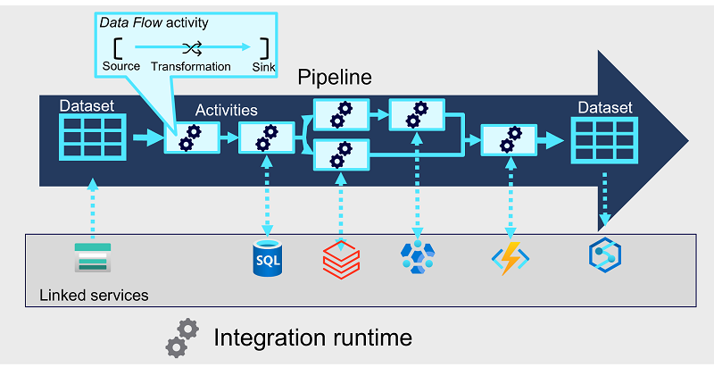

# Build a data pipeline in Azure Synapse Analytics

**Pipelines are the lifeblood** of a data analytics solution. Learn how to use Azure Synapse Analytics pipelines to build integrated data solutions that extract, transform, and load data across diverse systems.

## Learning objectives

In this module, you will learn how to:

 - Describe core concepts for Azure Synapse Analytics pipelines.
 - Create a pipeline in Azure Synapse Studio.
 - Implement a data flow activity in a pipeline.
 - Initiate and monitor pipeline runs.

## Introduction

With the wide range of data stores available in Azure, **there's the need to manage and orchestrate the movement data** between them. In fact, **you'll usually want to automate extract, transform, and load (ETL) workloads as a regular process** in a wider enterprise analytical solution. *Pipelines are a mechanism for defining and orchestrating data movement activities*. In this module, you'll be introduced to Azure Synapse Analytics pipelines, their component parts, and how to implement and run a pipeline in Azure Synapse Studio.

 Note: Azure Synapse Analytics pipelines are built on the same technology as Azure Data Factory, and offer a similar authoring experience. The authoring processes described in this module are also applicable to Azure Data Factory. For a detailed discussion of the differences between Azure Synapse Analytics pipelines and Azure Data Factory, see [Data integration in Azure Synapse Analytics versus Azure Data Factory](https://learn.microsoft.com/en-us/azure/synapse-analytics/data-integration/concepts-data-factory-differences).

## Understand pipelines in Azure Synapse Analytics

Pipelines in Azure Synapse Analytics **encapsulate a sequence of activities that perform data movement and processing tasks**. You can use a pipeline to define data transfer and transformation activities, and orchestrate these activities through control flow activities that manage branching, looping, and other typical processing logic. The graphical design tools in Azure Synapse Studio enable you to build complex pipelines with minimal or no coding required.

### Core pipeline concepts

Before building pipelines in Azure Synapse Analytics, you should understand a few core concepts.

### Activities

**Activities are the executable tasks** in a pipeline. You can define a flow of activities by connecting them in a sequence. The outcome of a particular activity (success, failure, or completion) can be used to direct the flow to the next activity in the sequence.

**Activities can encapsulate data transfer operations**, including simple data copy operations that extract data from a source and load it to a target (or sink), as well as more complex data flows that apply transformations to the data as part of an extract, transfer, and load (ETL) operation. Additionally, there are activities that encapsulate processing tasks on specific systems, such as running a Spark notebook or calling an Azure function. Finally, *there are control flow activities that you can use to implement loops, conditional branching, or manage variable and parameter values*.