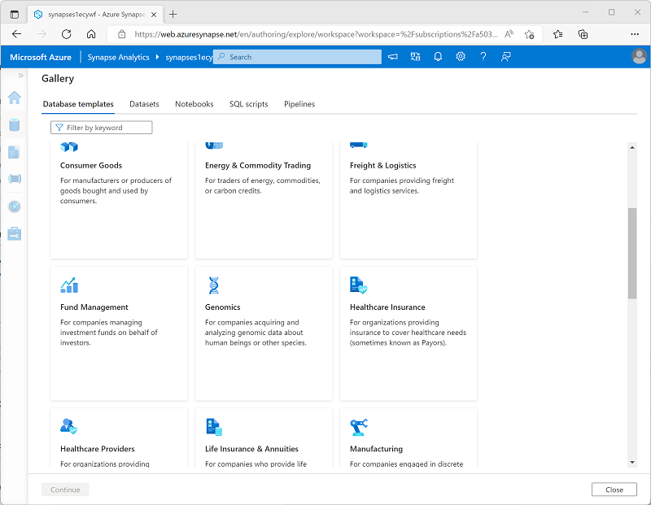
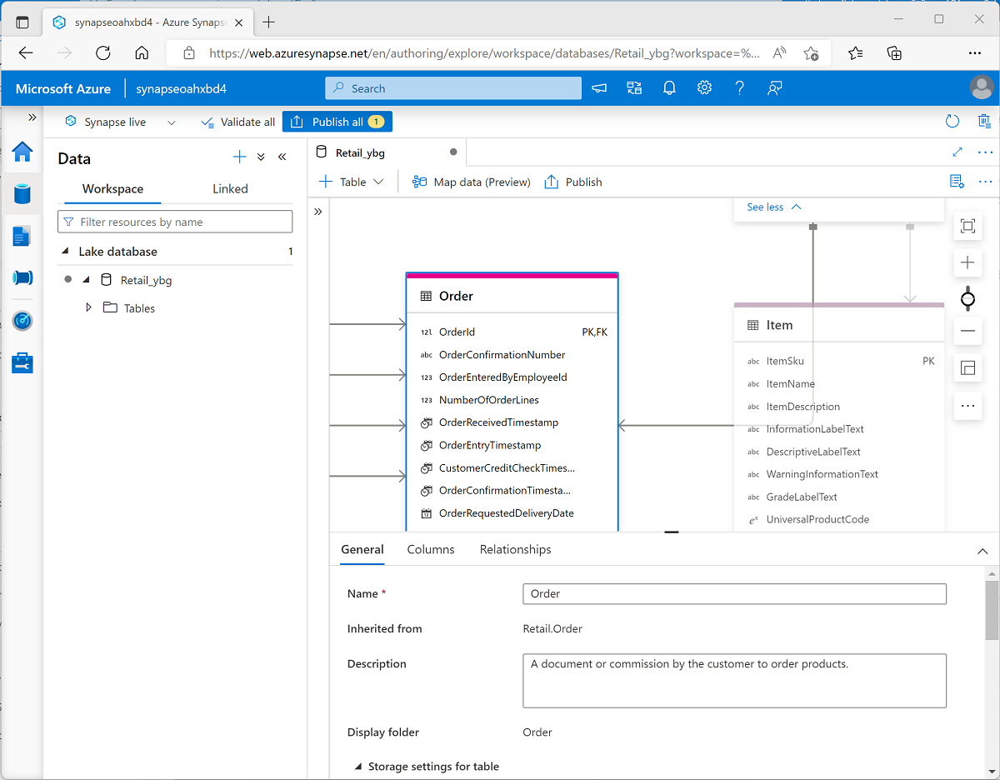

# Create a lake database in Azure Synapse Analytics

Why choose between working with files in a data lake or a relational database schema? With lake databases in Azure Synapse Analytics, you can combine the benefits of both.

## Learning Objectives

After completing this module, you will be able to:

 - Understand lake database concepts and components
 - Describe database templates in Azure Synapse Analytics
 - Create a lake database

## Introduction

Data analysts and engineers often find themselves forced to **choose between the flexibility of storing data files** in a data lake, with the advantages of a structured schema in a relational database. Lake databases in **Azure Synapse Analytics provide a way to combine these two approaches** and benefit from an explicit relational schema of tables, views, and relationships that is decoupled from file-based storage.

In this module, you'll learn how to:

 - Understand lake database concepts and components
 - Describe database templates in Azure Synapse Analytics
 - Create a lake database

## Understand lake database concepts

In a traditional relational database, the database schema is composed of tables, views, and other objects. Tables in a relational database define the entities for which data is stored - for example, a retail database might include tables for products, customers, and orders. Each entity consists of a set of attributes that are defined as columns in the table, and each column has a name and a data type. The data for the tables is stored in the database, and is tightly coupled to the table definition; which enforces data types, nullability, key uniqueness, and referential integrity between related keys. All queries and data manipulations must be performed through the database system.

**In a data lake, there is no fixed schema**. **Data is stored in files**, which may be structured, semi-structured, or unstructured. Applications and data analysts can work directly with the files in the data lake using the tools of their choice; without the constraints of a relational database system.

A **lake database provides a relational metadata layer** over one or more files in a data lake. You can create a lake database that includes definitions for tables, including column names and data types as well as relationships between primary and foreign key columns. The **tables reference files in the data lake**, enabling you to apply relational semantics to working with the data and querying it using SQL. However, the **storage of the data files is decoupled from the database schema**; enabling more flexibility than a relational database system typically offers.

### Lake database schema

You can create a lake database in Azure Synapse Analytics, and define the tables that represent the entities for which you need to store data. You can apply proven data modeling principles to create relationships between tables and use appropriate naming conventions for tables, columns, and other database objects.

Azure Synapse Analytics includes a graphical database design interface that you can use to model complex database schema, using many of the same best practices for database design that you would apply to a traditional database.

### Lake database storage

The data for the tables in your lake database is stored in the data lake as Parquet or CSV files. The files can be managed independently of the database tables, making it easier to manage data ingestion and manipulation with a wide variety of data processing tools and technologies.

### Lake database compute

To query and manipulate the data through the tables you have defined, you can use an Azure Synapse serverless SQL pool to run SQL queries or an Azure Synapse Apache Spark pool to work with the tables using the Spark SQL API.

## Explore database templates

You can** create a Lake database from an empty schema**, to which you add definitions for tables and the relationships between them. However, **Azure Synapse Analytics provides** a comprehensive **collection of database templates** that reflect common schemas found in multiple business scenarios; including:

 - Agriculture
 - Automotive
 - Banking
 - Consumer goods
 - Energy and commodity trading
 - Freight and logistics
 - Fund management
 - Healthcare insurance
 - Healthcare provider
 - Manufacturing
 - Retail
 - and many others...

<a href="#">
    
</a>

You can use one of the enterprise database templates as the starting point for creating your lake database, or you can start with a blank schema and add and modify tables from the templates as required.

## Create a lake database

You can create a lake database using the lake database designer in Azure Synapse Studio. Start by adding a new lake database on the **Data** page, selecting a template from the gallery or starting with a blank lake database; and then add and customize tables using the visual database designer interface.

As you create each table, you can specify the type and location of the files you want to use to store the underlying data, or you can create a table from existing files that are already in the data lake. In most cases, it's advisable to store all of the database files in a consistent format within the same root folder in the data lake.

### Database designer

The database designer interface in Azure Synapse Studio provides a drag-and-drop surface on which you can edit the tables in your database and the relationships between them.

<a href="#">
    
</a>

Using the database designer, you can define the schema for your database by adding or removing tables and:

 - **Specifying** the name and storage settings for each **table**.
 - **Specifying** the names, key usage, nullability, and data types **for each column**.
 - **Defining relationships** between key columns in tables.
 
When your database schema is ready for use, you can publish the database and start using it.

## Use a lake database

After creating a lake database, you can store data files that match the table schemas in the appropriate folders in the data lake, and query them using SQL.

### Using a serverless SQL pool

You can **query a lake database** **in a SQL script** by using a **serverless SQL pool**.

For example, suppose a lake *database* named **RetailDB** contains an **Customer** table. You could query it using a standard **SELECT statement** like this:

```sql
USE RetailDB;
GO

SELECT CustomerID, FirstName, LastName
FROM Customer
ORDER BY LastName;
```

There is **no need to use an OPENROWSET function** or include any additional code **to access the data from** the underlying **file storage**. The serverless SQL pool handles the mapping to the files for you.

### Using an Apache Spark pool

In addition to using a serverless SQL pool, you can **work with lake database tables using Spark SQL** in an **Apache Spark pool**.

For example, you could use the following code to **insert a new customer** record into the **Customer** table.

```sql
%%sql
INSERT INTO `RetailDB`.`Customer` VALUES (123, 'John', 'Yang')
```

You could then use the following code to query the table:

```sql
%%sql
SELECT * FROM `RetailDB`.`Customer` WHERE CustomerID = 123
```

## Exercise - Analyze data in a lake database

Now it's your opportunity to create and use a lake database. In this exercise, you'll use a provided script to provision an Azure Synapse Analytics workspace in your Azure subscription; and then create a lake database in Azure Synapse Studio.

### Analyze data in a lake database

Azure Synapse Analytics enables you to combine the flexibility of file storage in a data lake with the structured schema and SQL querying capabilities of a relational database through the ability to create a lake database. A lake database is a relational database schema defined on a data lake file store that enables data storage to be separated from the compute used to query it. Lake databases combine the benefits of a structured schema that includes support for data types, relationships, and other features typically only found in relational database systems, with the flexibility of storing data in files that can be used independently of a relational database store. Essentially, the lake database “overlays” a relational schema onto files in folders in the data lake.

### Provision an Azure Synapse Analytics workspace

You’ll need an Azure Synapse Analytics workspace with access to data lake storage. You can use the built-in serverless SQL pool to query files in the data lake.

In this exercise, you’ll use a combination of a PowerShell script and an ARM template to provision an Azure Synapse Analytics workspace.

 1) Sign into the Azure portal at [Azure Portal link](https://portal.azure.com).

 2) Use the **[>_]** button to the right of the search bar at the top of the page to create a new Cloud Shell in the Azure portal, selecting a **PowerShell** environment and creating storage if prompted. The cloud shell provides a command line interface in a pane at the bottom of the Azure portal, as shown here:

<a href="#">
    
</a>

    NOTE: If you have previously created a cloud shell that uses a Bash environment, use the the drop-down menu at the top left of the cloud shell pane to change it to PowerShell.

 3) Note that you can resize the cloud shell by dragging the separator bar at the top of the pane, or by using the **—**, **◻**, and **X** icons at the top right of the pane to minimize, maximize, and close the pane. For more information about using the Azure Cloud Shell, see the [Azure Cloud Shell documentation](https://learn.microsoft.com/en-us/azure/cloud-shell/overview).

 4) In the PowerShell pane, enter the following commands to clone this repo:

```bash
 rm -r dp-203 -f
 git clone https://github.com/MicrosoftLearning/dp-203-azure-data-engineer dp-203
```

 5) After the repo has been cloned, enter the following commands to change to the folder for this exercise and run the **setup.ps1** script it contains:

```bash
 cd dp-203/Allfiles/labs/04
 ./setup.ps1
```

 6) **If prompted**, choose which subscription you want to use (this will only happen if you have access to multiple Azure subscriptions).

 7) When prompted,**enter a suitable password** to be set for your Azure Synapse SQL pool.

    NOTE: Be sure to remember this password!

 8) Wait for the script to complete - this typically takes around 10 minutes, but in some cases may take longer. While you are waiting, review the [Lake database](https://learn.microsoft.com/en-us/azure/synapse-analytics/database-designer/concepts-lake-database) and [Lake database templates](https://learn.microsoft.com/en-us/azure/synapse-analytics/database-designer/concepts-database-templates) articles in the Azure Synapse Analytics documentation.