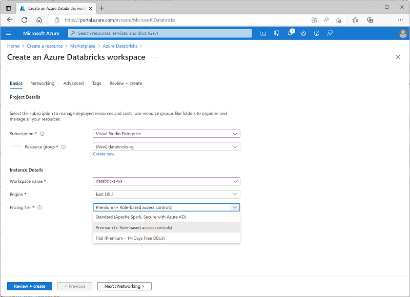
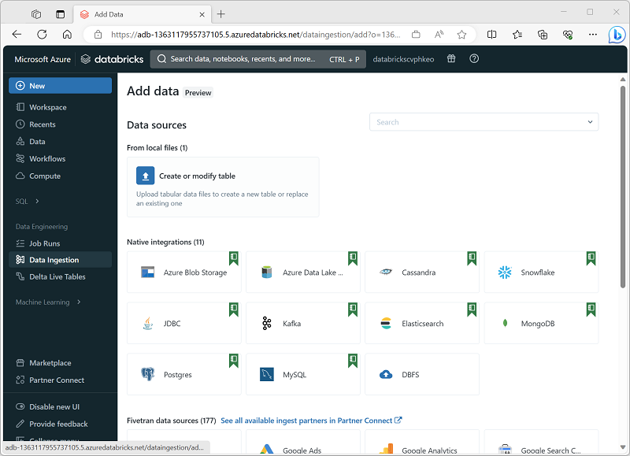
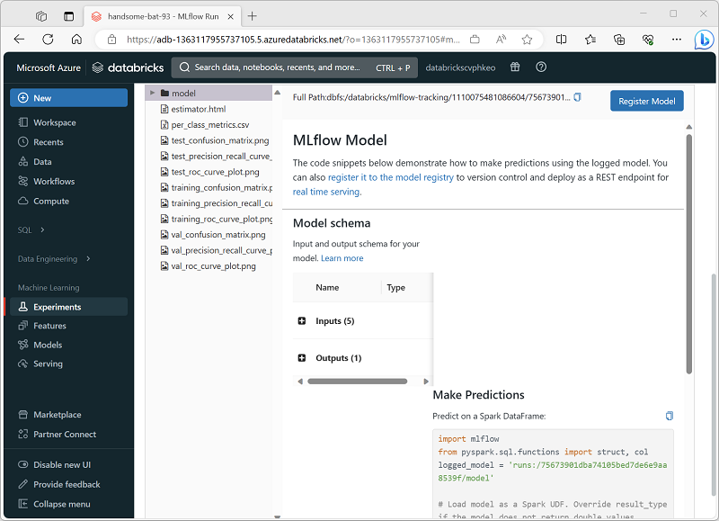
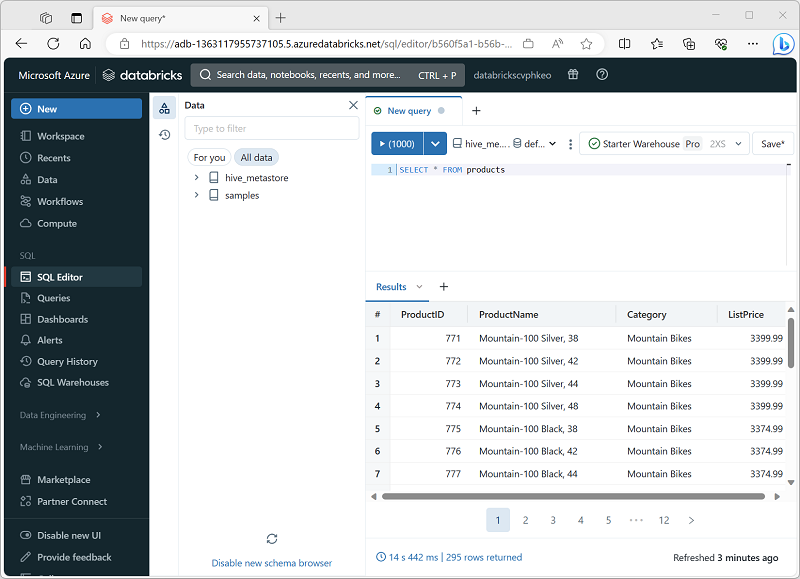

# Explore Azure Databricks

Azure Databricks is a cloud service that provides a scalable platform for data analytics using Apache Spark.

### Learning objectives

In this module, you'll learn how to:

 - Provision an Azure Databricks workspace.
 - Identify core workloads and personas for Azure Databricks.
 - Describe key concepts of an Azure Databricks solution.

## Introduction

**Azure Databricks is a fully managed, cloud-based data analytics platform**, which empowers developers to accelerate AI and innovation by simplifying the process of building enterprise-grade data applications. Built as a joint effort by Microsoft and the team that started Apache Spark, **Azure Databricks provides data science, engineering, and analytical teams with a single platform for [data lakehouse](https://learn.microsoft.com/en-us/azure/databricks/lakehouse/) analytics and machine learning**.

By combining the power of Databricks, an end-to-end, managed Apache Spark platform optimized for the cloud, with the enterprise scale and security of Microsoft's Azure platform, Azure Databricks enables organizations to run large-scale data analytics workloads that power comprehensive business intelligence and AI solutions.

## Get started with Azure Databricks

Azure Databricks is a cloud-based distributed platform for data processing and analytics in a data lakehouse. Databricks is built on Apache Spark and related open source technologies, and is designed to unify data science, data engineering, and business data analytics in an easy to use environment that enables users to spend more time working effectively with data, and less time focused on managing clusters and infrastructure. As the platform has evolved, it has kept up to date with the latest advances in the Spark runtime and other technologies, and added usability features to support common data workloads in a single, centrally managed interface.

Azure Databricks is hosted on the Microsoft Azure cloud platform, and integrated with Azure services such as Microsoft Entra ID, Azure Storage, Azure Synapse Analytics, and Azure Machine Learning. Organizations can apply their existing capabilities with the Databricks platform, and build fully integrated data analytics solutions that work with cloud infrastructure used by other enterprise applications.

### Creating an Azure Databricks workspace

To use Azure Databricks, you **must create an Azure Databricks workspace** in your Azure subscription. You can accomplish this by:

 - Using the Azure portal user interface.
 - Using an Azure Resource Manager (ARM) or Bicep template.
 - Using the ``New-AzDatabricksWorkspace`` Azure PowerShell cmdlet
 - Using the ``az databricks workspace create`` Azure command line interface (CLI) command.

When you create a workspace, you must specify one of the following pricing tiers:

 - **Standard** - Core Apache Spark capabilities with Microsoft Entra integration.
 - **Premium** - Role-based access controls and other enterprise-level features.
 - **Trial** - A 14-day free trial of a premium-level workspace

### Using the Azure Databricks portal

After you've provisioned an Azure Databricks workspace, you can **use the Azure Databricks portal to work with data and compute resources**. The Azure Databricks portal is a web-based user interface through which you can create and manage workspace resources (such as Spark clusters) and use notebooks and queries to work with data in files and tables.

## Identify Azure Databricks workloads

Azure Databricks is a comprehensive platform that offers many data processing capabilities. While you can use the service to support any workload that requires scalable data processing, Azure Databricks particularly supports the following types of data workload:

 - Data Science and Engineering
 - Machine Learning
 - SQL*

**SQL workloads are only available in premium tier workspaces.*

### Data Science and Engineering

**Azure Databricks provides Apache Spark** based ingestion, processing, and analysis of large volumes of data in a data lakehouse. Data engineers, data scientists, and data analysts can ***use interactive notebooks to run code in Python, Scala, SparkSQL, or other languages*** to cleanse, transform, aggregate, and analyze data.

### Machine Learning

**Azure Databricks supports machine learning workloads** that involve data exploration and preparation, training and evaluating machine learning models, and serving models to generate predictions for applications and analyses. Data scientists and ML engineers can use AutoML to quickly train predictive models, or apply their skills with common machine learning frameworks such as SparkML, Scikit-Learn, PyTorch, and Tensorflow. They can also manage the end-to-end machine learning lifecycle with **MLFlow**.

### Data warehousing

**Azure Databricks supports SQL-based querying** for data stored in tables in a SQL Warehouse. This capability enables data analysts to query, aggregate, summarize, and visualize data using familiar SQL syntax and a wide range of SQL-based data analysis and visualization tools.

#### Note

SQL Warehouses are only available in ***premium*** Azure Databricks workspaces.

## Understand key concepts