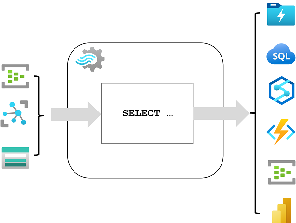
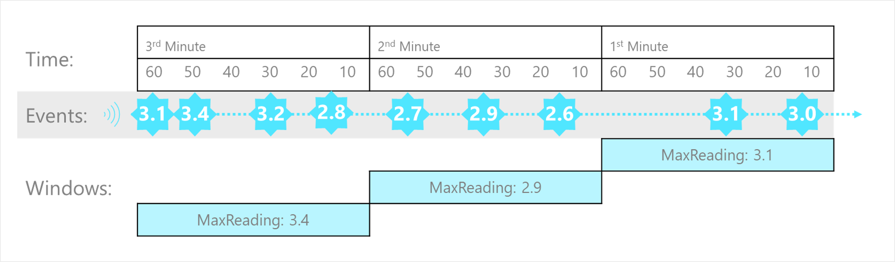
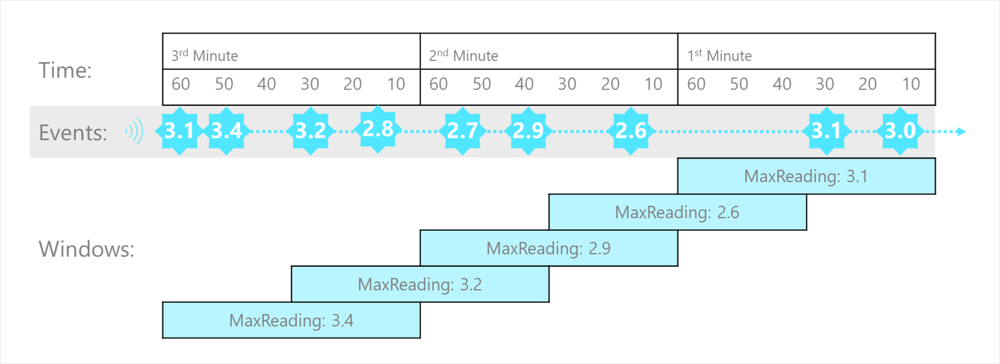
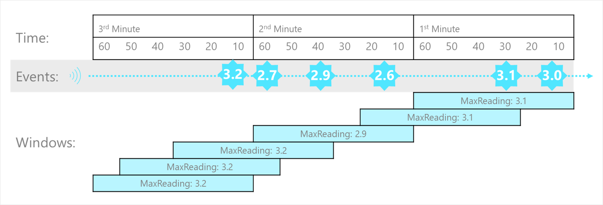
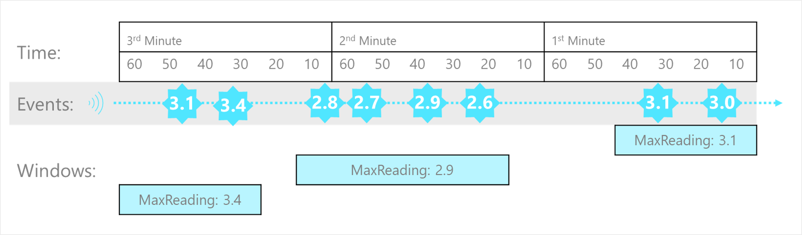
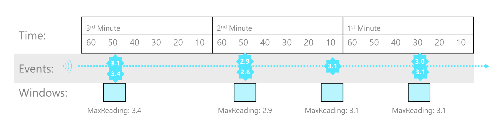

# Get started with Azure Stream Analytics

Azure Stream Analytics enables you to process real-time data streams and integrate the data they contain into applications and analytical solutions.

## Learning objectives

In this module, you'll learn how to:

 - Understand data streams.
 - Understand event processing.
 - Understand window functions.
 - Get started with Azure Stream Analytics.

## Introduction

Today, massive amounts of real-time data are generated by connected applications, Internet of Things (IoT) devices and sensors, and various other sources. The proliferation of streaming data sources has made the ability to consume and make informed decisions from these data in near-real-time an operational necessity for many organizations.

Some typical examples of streaming data workloads include:

 - Online stores analyzing real-time clickstream data to provide product recommendations to consumers as they browse the website.
 - Manufacturing facilities using telemetry data from IoT sensors to remotely monitor high-value assets.
 - Credit card transactions from point-of-sale systems being scrutinized in real-time to detect and prevent potentially fraudulent activities.

**Azure Stream Analytics** provides a cloud-based stream processing engine that you can use to filter, aggregate, and otherwise process a real-time stream of data from various sources. The results of this processing can then be used to trigger automated activity by a service or application, generate real-time visualizations, or integrate streaming data into an enterprise analytics solution.

In this module, you'll learn how to get started with Azure Stream Analytics, and use it to process a stream of event data.

## Understand data streams

A data stream consists of a perpetual series of data, typically related to specific point-in-time events. For example, a stream of data might contain details of messages submitted to a social media micro-blogging site, or a series of environmental measurements recorded by an internet-connected weather sensor. Streaming data analytics is most often used to better understand change over time. For example, a marketing organization may perform sentiment analysis on social media messages to see if an advertising campaign results in more positive comments about the company or its products, or an agricultural business might monitor trends in temperature and rainfall to optimize irrigation and crop harvesting.

Common goals for stream analytics include

 - Continuously analyzing data to report issues or trends.
 - Understanding component or system behavior under various conditions to help plan future enhancements.
 - Triggering specific actions or alerts when certain events occur or thresholds are exceeded.

### Characteristics of stream processing solutions

Stream processing solutions typically exhibit the following characteristics:

<a href="#">
    
</a>

 1. The source data stream is *unbounded* - data is added to the stream perpetually.
 2. Each data record in the stream includes *temporal* (time-based) data indicating when the event to which the record relates occurred (or was recorded).
 3. Aggregation of streaming data is performed over temporal *windows* - for example, recording the number of social media posts per minute or the average rainfall per hour.
 4. The results of streaming data processing can be used to support real-time (or ***near*** real-time) automation or visualization, or persisted in an analytical store to be combined with other data for historical analysis. Many solutions combine these approaches to support both real-time and historical analytics.

## Understand event processing

**Azure Stream Analytics is a service for complex event processing and analysis of streaming data**. Stream Analytics is used to:

 - Ingest data from an ***input***, such as an Azure event hub, Azure IoT Hub, or Azure Storage blob container.
 - Process the data by using a ***query*** to select, project, and aggregate data values.
 - Write the results to an ***output***, such as Azure Data Lake Gen 2, Azure SQL Database, Azure Synapse Analytics, Azure Functions, Azure event hub, Microsoft Power BI, or others.

<a href="#">
    
</a>

Once started, a Stream Analytics query will run perpetually, processing new data as it arrives in the input and storing results in the output.

Stream Analytics guarantees ***exactly*** once event processing and ***at-least-once*** event delivery, so events are never lost. It has built-in recovery capabilities in case the delivery of an event fails. Also, Stream Analytics provides built-in checkpointing to maintain the state of your job and produces repeatable results. Because ***Azure Stream Analytics is a platform-as-a-service (PaaS)*** solution, it's fully managed and highly reliable. Its built-in integration with various sources and destinations and provides a flexible programmability model. The Stream Analytics engine enables in-memory compute, so it offers high performance.

### Azure Stream Analytics jobs and clusters

The easiest way to use Azure Stream Analytics is to create a Stream Analytics job in an Azure subscription, configure its input(s) and output(s), and define the query that the job will use to process the data. The query is expressed using structured query language (SQL) syntax, and can incorporate static reference data from multiple data sources to supply lookup values that can be combined with the streaming data ingested from an input.

If your stream process requirements are complex or resource-intensive, you can create a Stream Analysis *cluster*, which uses the same underlying processing engine as a Stream Analytics job, but in a dedicated tenant (so your processing is not affected by other customers) and with configurable scalability that enables you to define the right balance of throughput and cost for your specific scenario.

### Inputs

Azure Stream Analytics can ingest data from the following kinds of input:

 - Azure Event Hubs
 - Azure IoT Hub
 - Azure Blob storage
 - Azure Data Lake Storage Gen2

Inputs are generally used to reference a source of streaming data, which is processed as new event records are added. Additionally, you can define ***reference*** inputs that are used to ingest static data to augment the real-time event stream data. For example, you could ingest a stream of real-time weather observation data that includes a unique ID for each weather station, and augment that data with a static reference input that matches the weather station ID to a more meaningful name.

### Outputs

Outputs are destinations to which the results of stream processing are sent. Azure Stream Analytics supports a wide range of outputs, which can be used to:

 - Persist the results of stream processing for further analysis; for example by loading them into a data lake or data warehouse.
 - Display a real-time visualization of the data stream; for example by appending data to a dataset in Microsoft Power BI.
 - Generate filtered or summarized events for downstream processing; for example by writing the results of stream processing to an event hub.

### Queries

The stream processing logic is encapsulated in a query. Queries are defined using SQL statements that ``SELECT`` data fields ``FROM`` one or more inputs, filter or aggregate the data, and write the results ``INTO`` an output. For example, the following query filters the events from the **weather-events** input to include only data from events with a **temperature** value less than 0, and writes the results to the **cold-temps** output:

```sql
SELECT observation_time, weather_station, temperature
INTO cold-temps
FROM weather-events TIMESTAMP BY observation_time
WHERE temperature < 0
```

A field named **EventProcessedUtcTime** is automatically created to define the time when the event is processed by your Azure Stream Analytics query. You can use this field to determine the timestamp of the event, or you can explicitly specify another DateTime field by using the ``TIMESTAMP BY`` clause, as shown in this example. Depending on the input from which the streaming data is read, one or more potential timestamp fields may be created automatically; for example, when using an *Event Hubs* input, a field named **EventQueuedUtcTime** is generated to record the time when the event was received in the event hub queue.

The field used as a timestamp is important when aggregating data over temporal windows, which is discussed next.

## Understand window functions

A common goal of stream processing is to aggregate events into temporal intervals, or ***windows***. For example, to count the number of social media posts per minute or to calculate the average rainfall per hour.

Azure Stream Analytics includes native support for [five kinds of temporal windowing functions](https://learn.microsoft.com/en-us/stream-analytics-query/windowing-azure-stream-analytics). These functions enable you to define temporal intervals into which data is aggregated in a query. The supported windowing functions are [Tumbling](https://learn.microsoft.com/en-us/stream-analytics-query/tumbling-window-azure-stream-analytics), [Hopping](https://learn.microsoft.com/en-us/stream-analytics-query/hopping-window-azure-stream-analytics), [Sliding](https://learn.microsoft.com/en-us/stream-analytics-query/sliding-window-azure-stream-analytics), [Session](https://learn.microsoft.com/en-us/stream-analytics-query/session-window-azure-stream-analytics), and [Snapshot](https://learn.microsoft.com/en-us/stream-analytics-query/snapshot-window-azure-stream-analytics).

### Tumbling

**Tumbling** window functions segment a data stream into a contiguous series of fixed-size, non-overlapping time segments and operate against them. **Events can't belong to more than one tumbling window**.

<a href="#">
    
</a>

The Tumbling window example, represented by the following query, finds the maximum reading value in each one-minute window. Windowing functions are applied in Stream Analytics jobs using the [GROUP BY](https://learn.microsoft.com/en-us/stream-analytics-query/group-by-azure-stream-analytics) clause of the query syntax. The ``GROUP BY`` clause in the following query contains the ``TumblingWindow()`` function, which specifies a one-minute window size.

```sql
SELECT DateAdd(minute,-1,System.TimeStamp) AS WindowStart,
       System.TimeStamp() AS WindowEnd,
       MAX(Reading) AS MaxReading
INTO
    [output]
FROM
    [input] TIMESTAMP BY EventProcessedUtcTime
GROUP BY TumblingWindow(minute, 1)
```

### Hopping

**Hopping** window functions model scheduled overlapping windows, jumping forward in time by a fixed period. It's easiest to think of them as Tumbling windows that can overlap and be emitted more frequently than the window size. In fact, tumbling windows are simply a hopping window whose ``hop`` is equal to its ``size``. When you use Hopping windows, events can belong to more than one window result set.

<a href="#">
    
</a>

To create a **hopping window, you must specify three parameters**. The first parameter indicates the time unit, such as second, minute, or hour. The following parameter sets the window size, which designates how long each window lasts. The final required parameter is the hop size, which specifies how much each window moves forward relative to the previous one. An optional fourth parameter denoting the offset size may also be used.

The following query demonstrates using a ``HoppingWindow()`` where the ``timeunit`` is set to ``second``. The ``windowsize`` is 60 seconds, and the ``hopsize`` is 30 seconds. This query outputs an event every 30 seconds containing the maximum reading value that occurred over the last 60 seconds.

```sql
SELECT DateAdd(second,-60,System.TimeStamp) AS WindowStart,
       System.TimeStamp() AS WindowEnd,
       MAX(Reading) AS MaxReading
INTO
    [output]
FROM
    [input] TIMESTAMP BY EventProcessedUtcTime
GROUP BY HoppingWindow(second, 60, 30)
```

### Sliding

**Sliding** windows generate events for points in time when the content of the window actually changes. This function model limits the number of windows that need to be considered. Azure Stream Analytics outputs events for only those points in time when an event entered or exited the window. As such, every window contains a minimum of one event. Events in Sliding windows can belong to more than one sliding window, similar to Hopping windows.

<a href="#">
    
</a>

The following query uses the ``SlidingWindow()`` function to find the maximum reading value in each one-minute window in which an event occurred.

```sql
SELECT DateAdd(minute,-1,System.TimeStamp) AS WindowStart,
       System.TimeStamp() AS WindowEnd,
       MAX(Reading) AS MaxReading
INTO
    [output]
FROM
    [input] TIMESTAMP BY EventProcessedUtcTime
GROUP BY SlidingWindow(minute, 1)
```

### Session

**Session** window functions cluster together events that arrive at similar times, filtering out periods of time where there's no data. It has three primary parameters: timeout, maximum duration, and partitioning key (optional).

<a href="#">
    
</a>

The occurrence of the first event starts a session window. Suppose another event occurs within the specified timeout from the last ingested event. In that case, the window will be extended to incorporate the new event. However, if no other events occur within the specified timeout period, the window will be closed at the timeout. If events keep happening within the specified timeout, the session window will extend until the maximum duration is reached.

The following query measures user session length by creating a ``SessionWindow`` over clickstream data with a ``timeoutsize`` of 20 seconds and a ``maximumdurationsize`` of 60 seconds.

```sql
SELECT DateAdd(second,-60,System.TimeStamp) AS WindowStart,
       System.TimeStamp() AS WindowEnd,
       MAX(Reading) AS MaxReading
INTO
    [output]
FROM
    [input] TIMESTAMP BY EventProcessedUtcTime
GROUP BY SessionWindow(second, 20, 60)
```

### Snapshot

**Snapshot** windows groups events by identical timestamp values. Unlike other windowing types, a specific window function isn't required. You can employ a snapshot window by specifying the ``System.Timestamp()`` function to your query's ``GROUP BY`` clause.

<a href="#">
    
</a>

For example, the following query finds the maximum reading value for events that occur at precisely the same time.

```sql
SELECT System.TimeStamp() AS WindowTime,
       MAX(Reading) AS MaxReading
INTO
    [output]
FROM
    [input] TIMESTAMP BY EventProcessedUtcTime
GROUP BY System.Timestamp()
```

``System.Timestamp()`` is considered in the ``GROUP BY`` clause as a snapshot window definition because it groups events into a window based on the equality of timestamps.


## Exercise - Get started with Azure Stream Analytics

<a href="https://microsoftlearning.github.io/dp-203-azure-data-engineer/Instructions/Labs/17-stream-analytics.html" target="_blank">
    Exercise
</a>

## Knowledge check

1. Which definition of stream processing is correct? 

    - [x] Data is processed continually as new data records arrive.
    - [ ] Data is collected in a temporary store, and all records are processed together as a batch.
    - [ ] Data that is incomplete or contains errors is redirected to separate storage for correction by a human operator.

2. You need to process a stream of sensor data, aggregating values over one minute windows and storing the results in a data lake. Which service should you use?

    - [ ] Azure SQL Database
    - [ ] Azure Cosmos DB
    - [x] Azure Stream Analytics

3. You want to aggregate event data by contiguous, fixed-length, non-overlapping temporal intervals. What kind of window should you use? 

    - [ ] Sliding
    - [ ] Session
    - [x] Tumbling