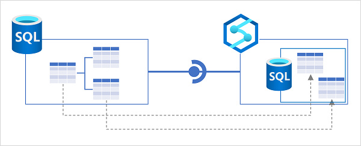
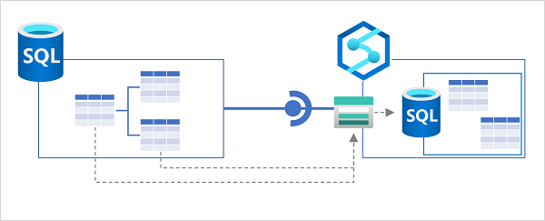

# Implement Azure Synapse Link for SQL

Azure Synapse Link for SQL enables low-latency synchronization of operational data in a relational database to Azure Synapse Analytics.

## Learning objectives

In this module, you'll learn how to:

 - Understand key concepts and capabilities of Azure Synapse Link for SQL.
 - Configure Azure Synapse Link for Azure SQL Database.
 - Configure Azure Synapse Link for Microsoft SQL Server.

## Introduction

Azure Synapse Link for SQL is a hybrid transactional / analytical processing (HTAP) capability in Azure Synapse Analytics that you can use to synchronize transactional data in Azure SQL Database or Microsoft SQL Server with a dedicated SQL pool in Azure Synapse Analytics. This synchronization enables you to perform near real-time analytical workloads on operational data with minimal impact on the transactional store used by business applications.

## What is Azure Synapse Link for SQL?

Many organizations use a relational database in Azure SQL Database or Microsoft SQL Server to support business applications. These databases are optimized for transactional workloads that store and manipulate operational data. Performing analytical queries on the data in these databases to support reporting and data analysis incurs resource contention that can be detrimental to application performance.

A traditional approach to resolving this problem is to implement an extract, transform, and load (ETL) solution that loads data from the operational data store into an analytical store as a batch operation at regular intervals. While this solution supports the analytical workloads required for reporting and data analysis, it suffers from the following limitations:

 - The ETL process can be complex to implement and operate.
 - The analytical store is only updated at periodic intervals, so reporting doesn't reflect the most up-to-date operational data.

### Azure Synapse Link for SQL

Azure Synapse Link for SQL addresses the limitations of a traditional ETL process by automatically replicating changes made to tables in the operational database to corresponding tables in an analytical database. After the initial synchronization process, the changes are replicated in near real-time without the need for a complex ETL batch process.

<a href="#">
    
</a>

In the diagram above, the following key features of the Azure Synapse Link for SQL architecture are illustrated:

 1. An Azure SQL Database or SQL Server 2022 instance contains a relational database in which transactional data is stored in tables.
 2. Azure Synapse Link for SQL replicates the table data to a dedicated SQL pool in an Azure Synapse workspace.
 3. The replicated data in the dedicated SQL pool can be queried in the dedicated SQL pool, or connected to as an external source from a Spark pool without impacting the source database.

### Source and target databases

Azure Synapse Link for SQL supports the following source databases (used as operational data stores):

 - Azure SQL Database
 - Microsoft SQL Server 2022

 Note: Azure Synapse link for SQL is not supported for Azure SQL Managed Instance.

The target database (used as an analytical data store) must be a dedicated SQL pool in an Azure Synapse Analytics workspace.

The implementation details for Azure Synapse Link vary between the two types of data source, but the high-level principle is the same - changes made to tables in the source database are synchronized to the target database

### Change feed

Azure Synapse Link for SQL uses the change feed feature in Azure SQL Database and Microsoft SQL Server 2022 to capture changes to the source tables. All data modifications are recorded in the transaction log for the source database. The change feed feature monitors the log and applies the same data modifications in the target database. In the case of Azure SQL Database, the modifications are made directly to the target database. When using Azure Synapse Link for SQL Server, the changes are recorded in files and saved to a landing zone in Azure Data Lake Gen2 storage before being applied to the target database.

#### Note 

    Change feed is similar to the change data capture (CDC) feature in SQL Server. The key difference is that CDC is used to reproduce data modifications in a table in the same database as the modified table. Change feed caches the data modification in memory and forwards it to Azure Synapse Analytics.

After implementing Azure Synapse Link for SQL, you can use system views and stored procedures in your Azure SQL Database or SQL Server database to monitor and manage change feed activity.

#### Tip

Learn more:

 - For more information about change feed, see[ Azure Synapse Link for SQL change feed](https://learn.microsoft.com/en-us/sql/sql-server/synapse-link/synapse-link-sql-server-change-feed).
 - To learn more about monitoring and managing change feed, see [Manage Azure Synapse Link for SQL Server and Azure SQL Database](https://learn.microsoft.com/en-us/sql/sql-server/synapse-link/synapse-link-sql-server-change-feed-manage).

## Configure Azure Synapse Link for Azure SQL Database

**Azure SQL Database is a platform-as-a-service (PaaS)** relational database service based on the SQL Server database engine. It's commonly used in cloud-native applications as a scalable, secure, and easy to manage relational database store for operational data.

Azure Synapse Link for Azure SQL Database uses a link connection to map one or more tables in an Azure SQL Database instance to tables in a dedicated SQL pool in Azure Synapse Analytics. When the link connection is started, the tables are initialized by copying a snapshot of the source tables to the target tables. Subsequently, the change feed process applies all modifications made in the source tables to the target tables.

<a href="#">
    
</a>

### Implementing Azure Synapse Link for Azure SQL Database

To use Azure Synapse Link for Azure SQL Database, you need to configure some settings in your Azure SQL Database server, before creating a link connection in Azure Synapse Analytics.

#### Configure Azure SQL Database

Before you can use Azure SQL Database as a source for a linked connection in Azure Synapse Analytics, you must ensure the following settings are configured in the Azure SQL Database server that hosts the database you want to synchronize:

 - **System assigned managed identity** - enable this option so that your Azure SQL Database server uses a system assigned managed identity.
 - **Firewall rules** - ensure that Azure services can access your Azure SQL Database server.

In addition to these server-level settings, if you plan to configure the link connection from Azure Synapse Analytics to use a managed identity when connecting to Azure SQL Database, you must create a user for the workspace identity in the database and add it to the db_owner role, as shown in the following code example:

```sql
CREATE USER my_synapse_workspace FROM EXTERNAL PROVIDER;
ALTER ROLE [db_owner] ADD MEMBER my_synapse_workspace;
```

#### Tip

If you intend to use SQL authentication, you can omit this step.

### Prepare the target SQL pool

Azure Synapse Link for Azure SQL Database synchronizes the source data to tables in a dedicated SQL pool in Azure Synapse Analytics. You therefore need to create and start a dedicated SQL pool in your Azure Synapse Analytics workspace before you can create the link connection.

The database associated with the dedicated SQL pool must include the appropriate schema for the target table. If source tables are defined in a schema other than the default dbo schema, you must create a schema of the same name in the dedicated SQL pool database:

```sql
CREATE SCHEMA myschema;
```

### Create a link connection

To create a linked connection, add a **linked** connection on the **Integrate** page in Azure Synapse Studio. You'll need to:

 1. Select or create a *linked service* for your Azure SQL Database. You can create this separately ahead of time, or as part of the process of creating a linked connection for Azure Synapse Link. You can use a managed identity or SQL authentication to connect the linked service to Azure SQL Database.
 2. Select the tables in the source database that you want to include in the linked connection.
 3. Select the target dedicated SQL pool in which the target tables should be created.
 4. Specify the number of CPU cores you want to use to process synchronization. Four driver cores will be used in addition to the number of cores you specify.

After creating the linked connection, you can configure the mappings between the source and target tables. In particular, you can specify the table structure (index) type and distribution configuration for the target tables.

#### Note

Some data types in your source tables may not be supported by specific dedicated SQL pool index types. For example, you cannot use a clustered columnstore index for tables that include ``VARBINARY(MAX)`` columns. You can map such tables to a heap (an unindexed table) in the dedicated SQL pool.

When the linked connection is configured appropriately, you can start it to initialize synchronization. The source tables are initially copied to the target database as snapshots, and then subsequent data modifications are replicated.

#### Tip

Learn more:

 - For more information about Synapse Link for Azure SQL Database, see [Azure Synapse Link for Azure SQL Database](https://learn.microsoft.com/en-us/azure/synapse-analytics/synapse-link/sql-database-synapse-link).
 - To learn about limitations and restrictions that apply to Synapse Link for Azure SQL Database, see [Known limitations and issues with Azure Synapse Link for SQL](https://learn.microsoft.com/en-us/azure/synapse-analytics/synapse-link/synapse-link-for-sql-known-issues).
 - For a step-by-step guide to setting up Synapse Link for Azure SQL Database, see [Get started with Azure Synapse Link for Azure SQL Database](https://learn.microsoft.com/en-us/azure/synapse-analytics/synapse-link/connect-synapse-link-sql-database). You'll also get a chance to try configuring Synapse Link for Azure SQL Database in the exercise, later in this module.

## Configure Azure Synapse Link for SQL Server 2022

Microsoft SQL Server is one of the world's most commonly used relational database systems. SQL Server 2022 is the latest release, and includes many enhancements and new features; including the ability to be used as a source for Azure Synapse Link.

Azure Synapse Link for SQL Server uses a *link connection* to map one or more tables in an Azure SQL Database instance to tables in a dedicated SQL pool in Azure Synapse Analytics. When the link connection is started, the **tables are initialized by copying a .parquet file for each source table** to a *landing zone* in **Azure Data Lake Storage Gen2**; from where the data is imported into tables in the dedicated SQL pool. Subsequently, the change feed process copies all changes as .csv files to the landing zone where they're applied to the target tables.

<a href="#">
    
</a>

Synchronization between SQL Server (which can be on-premises or in a private network) and Azure Synapse Analytics is achieved through a self-hosted integration runtime. An integration runtime is a software agent that handles secure connectivity when using Azure Data Factory or Azure Synapse Analytics to transfer data across networks. It must be installed on a Microsoft Windows computer with direct access to your SQL Server instance.

#### Tip

For more information about using a self-hosted integration runtime to work with Azure Synapse Analytics, see [Create and configure a self-hosted integration runtime](https://learn.microsoft.com/en-us/azure/data-factory/create-self-hosted-integration-runtime?tabs=synapse-analytics).


### Implementing Azure Synapse Link for SQL Server 2022

To use Azure Synapse Link for SQL Server 2022, **you need to create storage for the landing zone in Azure** and **configure your SQL Server instance before creating a link connection** in Azure Synapse Analytics.

#### Create landing zone storage

**You need to create an Azure Data Lake Storage Gen2 account in your Azure subscription to use as a landing zone**. You can't use the default storage for your Azure Synapse Analytics workspace.

#### Tip

For more information about provisioning an Azure Data Lake Storage Gen2 account, see [Create a storage account to use with Azure Data Lake Storage Gen2](https://learn.microsoft.com/en-us/azure/storage/blobs/create-data-lake-storage-account).

#### Create a master key in the SQL Server database

**To support Azure Synapse Link, your SQL Server database must contain a master key**. You can use a ``CREATE MASTER KEY`` SQL statement like the following example to create one:

```sql
CREATE MASTER KEY ENCRYPTION BY PASSWORD = 'my$ecretPa$$w0rd';
```

#### Create a dedicated SQL pool in Azure Synapse Analytics

In your Azure Synapse Analytics workspace, you **need to create a dedicated SQL pool where the target tables will be created**. You **also need to create master key in this database** by using the following SQL statement:

```sql
CREATE MASTER KEY
```

#### Create a linked service for the SQL Server source database

Next, in Azure Synapse Analytics, create a linked service for your SQL Server database. When you do this, you **need to specify the self-hosted integration runtime** to be used for connectivity between SQL Server and Azure Synapse Analytics. If you haven't already configured a self-hosted integration runtime, you can create one now, and then **download and install the agent onto a Windows machine in the network where your SQL Server instance is located**.

#### Create a linked service for your Data Lake Storage Gen2 account

In addition to the linked service for SQL Server, you need a linked service for the Data Lake Storage Gen2 account that will be used as a landing zone. To support this, you **need to add the managed identity of your Azure Synapse Analytics Workspace** to the **Storage Blob Data Contributor** role for your storage account and configure the linked service to use the managed identity for authentication.

#### Create a link connection for Azure Synapse Link

Finally, **you're ready to create a link connection for Azure Synapse Link data synchronization**. As you do so, you'll specify the service link for the SQL Server source database, the individual tables to be replicated, the number of CPU cores to be used for the synchronization process, and the Azure Data Lake Storage Gen2 linked service and folder location for the landing zone.

After the link connection is created, you can start it to initialize synchronization. After a short time, the tables will be available to query in the dedicated SQL pool, and will be kept in sync with modifications in the source database by the change feed process.

#### Tip

Learn more:

 - For more information about Synapse Link for SQL Server 2022, see [Azure Synapse Link for SQL Server 2022](https://learn.microsoft.com/en-us/azure/synapse-analytics/synapse-link/sql-server-2022-synapse-link).
 - To learn about limitations and restrictions that apply to Synapse Link for Azure SQL Database, see [Known limitations and issues with Azure Synapse Link for SQL](https://learn.microsoft.com/en-us/azure/synapse-analytics/synapse-link/synapse-link-for-sql-known-issues).
 - For a step-by-step guide to setting up Synapse Link for SQL Server 2022, see [Get started with Azure Synapse Link for SQL Server 2022](https://learn.microsoft.com/en-us/azure/synapse-analytics/synapse-link/connect-synapse-link-sql-server-2022).

<a href="https://microsoftlearning.github.io/dp-203-azure-data-engineer/Instructions/Labs/15-Synapse-link-sql.html" target="_blank">
    Exercise
</a>


## Knowledge check

1. From which of the following data sources can you use Azure Synapse Link for SQL to replicate data to Azure Synapse Analytics? 

    - [ ] Azure Cosmos DB.
    - [x] SQL Server 2022.
    - [ ] Azure SQL Managed Instance.

2. What must you create in your Azure Synapse Analytics workspace as a target database for Azure Synapse Link for Azure SQL Database? 

    - [ ] A serverless SQL pool
    - [ ] An Apache Spark pool
    - [x] A dedicated SQL pool

3. You plan to use Azure Synapse Link for SQL to replicate tables from SQL Server 2022 to Azure Synapse Analytics. What additional Azure resource must you create? 

    - [x] An Azure Storage account with an Azure Data Lake Storage Gen2 container
    - [ ] An Azure Key Vault containing the SQL Server admin password
    - [ ] An Azure Application Insights resource