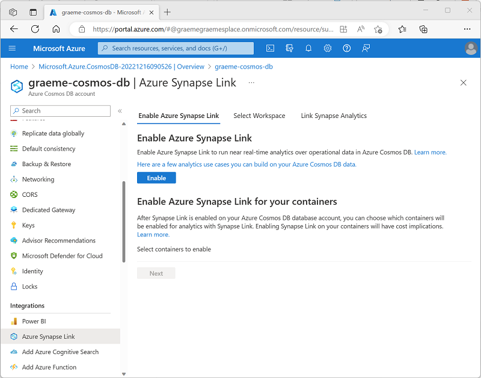
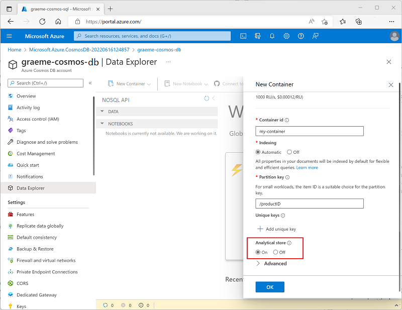
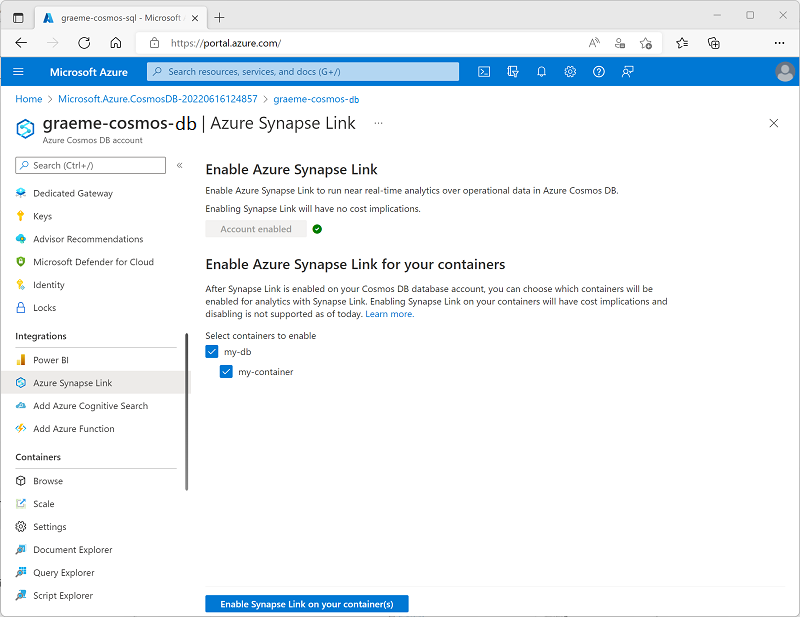
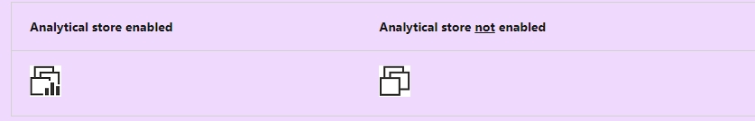

# Implement Azure Synapse Link with Azure Cosmos DB

Azure Synapse Link for Azure Cosmos DB enables HTAP integration between operational data in Azure Cosmos DB and Azure Synapse Analytics runtimes for Spark and SQL.

## Learning objectives
After completing this module, you'll be able to:

 - Configure an Azure Cosmos DB Account to use Azure Synapse Link.
 - Create an analytical store enabled container.
 - Create a linked service for Azure Cosmos DB.
 - Analyze linked data using Spark.
 - Analyze linked data using Synapse SQL.

## Introduction

Azure Synapse Analytics Link for Cosmos DB enables hybrid transactional/analytical processing (HTAP) integration between Azure Cosmos DB and Azure Synapse Analytics. By using this HTAP solution, organizations can make operational data in Azure Cosmos DB available for analysis and reporting in Azure Synapse Analytics in near-real time *without the need to develop a complex ETL pipeline*.

## Enable Cosmos DB account to use Azure Synapse Link

Azure Synapse Link for Azure Cosmos DB is a cloud-native HTAP capability that enables integration between Azure Cosmos DB and Azure Synapse Analytics.

### Enabling Azure Synapse Link in Azure Cosmos DB

The first step in using Azure Synapse Link for Cosmos DB is to enable it in an Azure Cosmos DB account. Azure Synapse Link is supported in the following types of Azure Cosmos DB account:

 - Azure Cosmos DB for **NoSQL**
 - Azure Cosmos DB for **MongoDB**
 - Azure Cosmos DB for **Apache Gremlin** (preview)

You can enable Azure Synapse Link in the Azure portal page for your Cosmos DB account, or by using the Azure CLI or Azure PowerShell from a command line or in a script.

#### Using the Azure portal

In the Azure portal, you can enable Azure Synapse Link for a Cosmos DB account on the **Azure Synapse Link** page in the **Integrations** section, as shown below.

<a href="#">
    
</a>

#### Tip

For Azure Cosmos DB for NoSQL accounts, there's also a link on the Data Explorer page.

### Using the Azure CLI

To enable Azure Synapse Link using the Azure CLI, run the`` az cosmosdb create`` command (to create a new Cosmos DB account) or ``az cosmosdb update`` command (to configure an existing Cosmos DB account) with the ``--enable-analytical-storage true`` parameter. For example, the following command updates an existing Cosmos DB account named **my-cosmos-db** to enable Azure Synapse Link.

```powershell
az cosmosdb update --name my-cosmos-db --resource-group my-rg --enable-analytical-storage true
```

To enable Azure Synapse Link for an Azure Cosmos DB for **Apache Gremlin** account, include the ``--capabilities EnableGremlin`` parameter.

### Using Azure PowerShell

To enable Azure Synapse Link using Azure PowerShell, run the ``New-AzCosmosDBAccount`` cmdlet (to create a new Cosmos DB account) or ``Update-AzCosmosDBAccount`` cmdlet (to configure an existing Cosmos DB account) with the ``-EnableAnalyticalStorage 1`` parameter. For example, the following command updates an existing Cosmos DB account named **my-cosmos-db** to enable Azure Synapse Link.

```powershell
Update-AzCosmosDBAccount -Name "my-cosmos-db" -ResourceGroupName "my-rg" -EnableAnalyticalStorage 1
```

### Considerations for enabling Azure Synapse Link

When planning to enable Azure Synapse Link for a Cosmos DB account, consider the following facts:

 - **After enabling** Azure Synapse Link for an account, **you can't disable it**.

 - Enabling Azure Synapse Link doesn't start synchronization of operational data to an analytical store - you must also create or update a container with support for an analytical store.

 - When enabling Azure Synapse Link for a Cosmos DB for NoSQL account using the Azure CLI or PowerShell, you can use the ``--analytical-storage-schema-type`` (Azure CLI) or ``-AnalyticalStorageSchemaType`` (PowerShell) parameter to specify the schema type as ``WellDefined`` (default) or ``FullFidelity``. For a Cosmos DB for MongoDB account, the default (and only supported) schema type is ``FullFidelity``.

 - After a schema type has been assigned, you can't change it.

## Create an analytical store enabled container

After enabling Azure Synapse Link in an Azure Cosmos DB account, you can create or update a container with support for an analytical store.

An analytical store is a column-based store within the same container as a row-based operational store. An auto-sync process synchronizes changes in the operational store to the analytical store; from where it can be queried without incurring processing overhead in the operational store.

### Analytical store schema types

As the data from the operational store is synchronized to the analytical store, the schema is updated dynamically to reflect the structure of the documents being synchronized. The specific behavior of this dynamic schema maintenance depends on the analytical store schema type configured for the Azure Cosmos DB account. Two types of schema representation are supported:

 - **Well-defined**: The default schema type for an Azure Cosmos DB for NoSQL account.
 - **Full fidelity**: The default (and only supported) schema type for an Azure Cosmos DB for MongoDB account.

The analytical store receives JSON data from the operational store and organizes it into a column-based structure. In a well-defined schema, the first non-null occurrence of a JSON field determines the data type for that field. Subsequent occurrences of the field that aren't compatible with the assigned data type aren't ingested into the analytical store.

For example, consider the following two JSON documents:

```json
{"productID": 123, "productName": "Widget"}
{"productID": "124", "productName": "Wotsit"}
```

The first document determines that the **productID** field is a ``numeric`` (integer) value. When the second document is encountered, its **productID** field has a ``string`` value, and so isn't imported into the analytical store. The document and the rest of its field is imported, but ``the incompatible field is dropped``. The following columns represent the data in the analytical store:

productID	| productName
:---	| :---:
123	| Widget
`  ` | Wotsit

In a **full fidelity schema**, the data type is appended to each instance of the field, with **new columns created as necessary**; enabling the analytical store to contain multiple occurrences of a field, each with a different data type, as shown in the following table:

productID.int32	| productName.string | productID.string
:---	| :---: | :---:
123	| Widget | 
`  ` | Wotsit | 124

### Enabling analytical store support in a container

**You can enable analytical store support** when creating a new container or for an existing container. To enable analytical store support, you can use the Azure portal, or you can use the Azure CLI or Azure PowerShell from a command line or in a script.

####  Using the Azure portal

To enable analytical store support when creating a new container in the Azure portal, select the **On** option for **Analytical Store**, as shown here:

<a href="#">
    
</a>

Alternatively, you can enable analytical store support for an existing container in the **Azure Synapse Link** page in the **Integrations** section of the page for your Cosmos DB account, as shown here:

<a href="#">
    
</a>

#### Using the Azure CLI

To use the Azure CLI to enable analytical store support in an Azure Cosmos DB for NoSQL container, run the ``az cosmosdb sql container create`` command (to create a new container) or ``az cosmosdb sql container update`` command (to configure an existing container) with the ``--analytical-storage-ttl`` parameter, assigning a retention time for analytical data. Specifying an ``-analytical-storage-ttl`` parameter of ``-1`` enables permanent retention of analytical data. For example, the following command creates a new container named ***my-container*** with analytical store support.

```powershell
az cosmosdb sql container create --resource-group my-rg --account-name my-cosmos-db --database-name my-db --name my-container --partition-key-path "/productID" --analytical-storage-ttl -1
```

For an Azure Cosmos DB for **MongoDB account**, you can use the ``az cosmosdb mongodb collection create`` or ``az cosmosdb mongodb collection update`` command with the ``--analytical-storage-ttl`` parameter. For an Azure Cosmos DB for **Apache Gremlin** account, use the ``az cosmosdb gremlin graph create`` or ``az cosmosdb gremlin graph update`` command with the ``--analytical-storage-ttl`` parameter.

#### Using Azure PowerShell

To use Azure PowerShell to enable analytical store support in n Azure Cosmos DB for NoSQL container, run the ``New-AzCosmosDBSqlContainer`` cmdlet (to create a new container) or ``Update-AzCosmosDBSqlContainer`` cmdlet (to configure an existing container) with the ``-AnalyticalStorageTtl`` parameter, assigning a retention time for analytical data. Specifying an ``-AnalyticalStorageTtl`` parameter of ``-1`` enables permanent retention of analytical data. For example, the following command creates a new container named ***my-container*** with analytical store support.

```powershell
New-AzCosmosDBSqlContainer -ResourceGroupName "my-rg" -AccountName "my-cosmos-db" -DatabaseName "my-db" -Name "my-container" -PartitionKeyKind "hash" -PartitionKeyPath "/productID" -AnalyticalStorageTtl -1
```

For an Azure Cosmos DB for **MongoDB API** account, use the ``New-AzCosmosDBMongoDBCollection`` or ``Update-AzCosmosDBMongoDBCollection`` cmdlet with the ``-AnalyticalStorageTtl`` parameter.

#### Considerations for enabling analytical store support

**Analytical store support can't be disabled without deleting the container**. Setting the analytical store TTL value to 0 or null effectively disables the analytical store by no longer synchronizing new items to it from the operational store and deleting items already synchronized from the analytical store. After setting this value to 0, you can't re-enable analytical store support in the container.

## Create a linked service for Cosmos DB

When you have an Azure Cosmos DB container with analytical store support, you can create a linked service in an Azure Synapse Analytics workspace to connect to it.

To create a linked service to an Azure Cosmos DB analytical data store, use Azure Synapse Studio, and add a linked service on the **Data** page by selecting the **Connect to external data** option, as shown here:

<a href="#">
    
</a>

As you complete the steps to create your linked service, select the type of Azure Cosmos DB account and then assign your linked service a meaningful name and provide the necessary information to connect to your Azure Cosmos DB database.

To connect to the Azure Cosmos DB database, you can use any of the following authentication options:

 - Account key: Specify an authentication key for your Cosmos DB account.
 - Service Principal: Use the identity of the Azure Synapse Analytics service.
 - System Assigned Managed Identity: Use system-assigned managed identity.
 - User Managed Identity: Use a user-defined managed identity.

#### Tip

For more information about using managed identities in Microsoft Entra ID, see [What are managed identities for Azure resources?](https://learn.microsoft.com/en-us/entra/identity/managed-identities-azure-resources/overview)

After creating a linked service, the Azure Cosmos DB database and its containers will be shown in the Data page of Azure Synapse Studio, as shown here:

<a href="#">
    
</a>

#### Note

The user interface differentiates between containers with analytical store support and those without by using the following icons:

<a href="#">
    
</a>

You can query a container without an analytical store, but you won't benefit from the advantages of an HTAP solution that offloads analytical query overhead from the operational data store.

## Query Cosmos DB data with Spark

After you've added a linked service for your analytical store enabled Azure Cosmos DB database, you can use it to query the data using a Spark pool in your Azure Synapse Analytics workspace.

### Loading Azure Cosmos DB analytical data into a dataframe

For initial exploration or quick analysis of data from an Azure Cosmos DB linked service, it's often easiest to load data from a container into a dataframe using a Spark-supported language like PySpark (A Spark-specific implementation of Python) or Scala (a Java-based language often used on Spark).

For example, the following PySpark code could be used to load a dataframe named ``df`` from the data in the **my-container** container connected to using the **my_linked_service** linked service, and display the first 10 rows of data:

```python
df = spark.read
     .format("cosmos.olap")\
     .option("spark.synapse.linkedService", "my_linked_service")\
     .option("spark.cosmos.container", "my-container")\
     .load()

display(df.limit(10))
```

Let's suppose the my-container container is used to store items similar to the following example:

```json
{
    "productID": 123,
    "productName": "Widget",
    "id": "7248f072-11c3-42b1-a368-...",
    "_rid": "mjMaAL...==",
    "_self": "dbs/mjM...==/colls/mjMaAL...=/docs/mjMaAL...==/",
    "_etag": "\"54004b09-0000-2300-...\"",
    "_attachments": "attachments/",
    "_ts": 1655414791
}
```

The output from the PySpark code would be similar to the following table:

_rid	| _ts	| productID	| productName	| id	| _etag
---	| ---	| ---	| ---	| ---	| ---
mjMaAL...==	| 1655414791	| 123	| Widget	| 7248f072-11c3-42b1-a368-...	| 54004b09-0000-2300-...
mjMaAL...==	| 1655414829	| 124	| Wotsit	| dc33131c-65c7-421a-a0f7-...	| 5400ca09-0000-2300-...
mjMaAL...==	| 1655414835	| 125	| Thingumy	| ce22351d-78c7-428a-a1h5-...	| 5400ca09-0000-2300-...
...	| ...	| ...	| ...	| ...	| ...

The data is loaded from the analytical store in the container, not from the operational store; ensuring that there's no querying overhead on the operational store. The fields in the analytical data store include the application-defined fields (in this case **productID** and **productName**) and automatically created metadata fields.

After loading the dataframe, you can use its native methods to explore the data. For example, the following code creates a new dataframe containing only the **productID** and **productName** columns, ordered by the **productName**:

```python
products_df = df.select("productID", "productName").orderBy("productName")

display(products_df.limit(10))
```

The output of this code would look similar this table:

productID | productName
---	| ---
125	| Thingumy
123	| Widget
124	| Wotsit
...	| ...

### Writing a dataframe to a Cosmos DB container

In most HTAP scenarios, you should use the linked service to read data into Spark from the analytical store. However you can write the contents of a dataframe to the container as shown in the following example:

```python
mydf.write.format("cosmos.oltp")\
    .option("spark.synapse.linkedService", "my_linked_service")\
    .option("spark.cosmos.container", "my-container")\
    .mode('append')\
    .save()
```

#### Note

Writing a dataframe to a container updates the operational store and can have an impact on its performance. The changes are then synchronized to the analytical store.

### Using Spark SQL to query Azure Cosmos DB analytical data

Spark SQL is a Spark API that provides SQL language syntax and relational database semantics in a Spark pool. **You can use Spark SQL to define metadata for tables** that can be queried using SQL.

For example, the following code creates a table named **Products** based on the hypothetical container used in the previous examples:

```sql
%%sql

-- Create a logical database in the Spark metastore
CREATE DATABASE mydb;

USE mydb;

-- Create a table from the Cosmos DB container
CREATE TABLE products using cosmos.olap options (
    spark.synapse.linkedService 'my_linked_service',
    spark.cosmos.container 'my-container'
);

-- Query the table
SELECT productID, productName
FROM products;
```

#### Tip

The %%sql keyword at the beginning of the code is a magic that instructs the Spark pool to run the code as SQL rather than the default language (which is usually set to PySpark).

By using this approach, you can create a logical database in your Spark pool that you can then use to query the analytical data in Azure Cosmos DB to support data analysis and reporting workloads without impacting the operational store in your Azure Cosmos DB account.

## Query Cosmos DB with Synapse SQL

In addition to using a Spark pool, you can also query an Azure Cosmos DB analytical container by using a built-in *serverless* SQL pool in Azure Synapse Analytics. To do this, you can use the **OPENROWSET** SQL function to connect to the linked service for your Azure Cosmos DB database.

### Using OPENROWSET with an authentication key

By default, access to an Azure Cosmos DB account is authenticated by an authentication key. You can use this key as part of a connection string in an **OPENROWSET** statement to connect through a linked service from a SQL pool, as shown in the following example:

```sql
SELECT *
FROM OPENROWSET(​
    'CosmosDB',
    'Account=my-cosmos-db;Database=my-db;Key=abcd1234....==',
    [my-container]) AS products_data
```

#### Tip

You can find a primary and secondary key for your Cosmos DB account on its Keys page in the Azure portal.

The results of this query might look something like the following, including metadata and application-defined fields from the items in the Azure Cosmos DB container:

_rid	| _ts	| productID	| productName	| id	| _etag
---	| ---	| ---	| ---	| ---	| ---
mjMaAL...==	| 1655414791	| 123	| Widget	| 7248f072-11c3-42b1-a368-...	| 54004b09-0000-2300-...
mjMaAL...==	| 1655414829	| 124	| Wotsit	| dc33131c-65c7-421a-a0f7-...	| 5400ca09-0000-2300-...
mjMaAL...==	| 1655414835	| 125	| Thingumy	| ce22351d-78c7-428a-a1h5-...	| 5400ca09-0000-2300-...
...	| ...	| ...	| ...	| ...	| ...

The data is retrieved from the analytical store, and the query doesn't impact the operational store.

### Using OPENROWSET with a credential

Instead of including the authentication key in each call to **OPENROWSET**, you can define a *credential* that encapsulates the authentication information for your Cosmos DB account, and use the credential in subsequent queries. To create a credential, use the **CREATE CREDENTIAL** statement as shown in this example:

```sql
CREATE CREDENTIAL my_credential
 WITH IDENTITY = 'SHARED ACCESS SIGNATURE',
 SECRET = 'abcd1234....==';
```

With the credential in place, you can use it in an **OPENROWSET** function like this:

```sql
SELECT *
FROM OPENROWSET(​PROVIDER = 'CosmosDB',
                CONNECTION = 'Account=my-cosmos-db;Database=my-db',
                OBJECT = 'my-container',
                SERVER_CREDENTIAL = 'my_credential'
) AS products_data
```

Once again, the results include metadata and application-defined fields from the analytical store:

_rid	| _ts	| productID	| productName	| id	| _etag
---	| ---	| ---	| ---	| ---	| ---
mjMaAL...==	| 1655414791	| 123	| Widget	| 7248f072-11c3-42b1-a368-...	| 54004b09-0000-2300-...
mjMaAL...==	| 1655414829	| 124	| Wotsit	| dc33131c-65c7-421a-a0f7-...	| 5400ca09-0000-2300-...
mjMaAL...==	| 1655414835	| 125	| Thingumy	| ce22351d-78c7-428a-a1h5-...	| 5400ca09-0000-2300-...
...	| ...	| ...	| ...	| ...	| ...

### Specifying a schema

The **OPENROWSET** syntax includes a ``WITH`` clause that you can use to define a schema for the resulting rowset. You can use this to specify individual fields and assign data types as shown in the following example:

```sql
SELECT *
 FROM OPENROWSET(​PROVIDER = 'CosmosDB',
                 CONNECTION = 'Account=my-cosmos-db;Database=my-db',
                 OBJECT = 'my-container',
                 SERVER_CREDENTIAL = 'my_credential'
 )
 WITH (
    productID INT,
    productName VARCHAR(20)
 ) AS products_data
```

In this case, assuming the fields in the analytical store include productID and productName, the resulting rowset will resemble the following table:

productID	 | productName
---	 | ---
123 | 	Widget
124	 | Wotsit
125	 | Thingumy
...	 | ...

You can of course specify individual column names in the ``SELECT`` clause (for example, ``SELECT productID, productName ...``), so this ability to specify individual columns may seem of limited use. However, consider cases where the source JSON documents stored in the operational store include multiple levels of fields, as show in the following example:

```json
{
    "productID": 126,
    "productName": "Sprocket",
    "supplier": {
        "supplierName": "Contoso",
        "supplierPhone": "555-123-4567"
    }
    "id": "62588f072-11c3-42b1-a738-...",
    "_rid": "mjMaAL...==",
    .
    .
    .
}
```

The ``WITH`` clause supports the inclusion of explicit JSON paths, enabling you to handle nested fields and to assign aliases to field names; as shown in this example:

```sql
SELECT *
 FROM OPENROWSET(​PROVIDER = 'CosmosDB',
                 CONNECTION = 'Account=my-cosmos-db;Database=my-db',
                 OBJECT = 'my-container',
                 SERVER_CREDENTIAL = 'my_credential'
 )
 WITH (
    ProductNo INT '$.productID',
    ProductName VARCHAR(20) '$.productName',
    Supplier VARCHAR(20) '$.supplier.supplierName',
    SupplierPhoneNo VARCHAR(15) '$.supplier.supplierPhone'
 ) AS products_data
```


The results of this query would include the following row for product 126:

ProductNo	| ProductName	| Supplier	| SupplierPhoneNo
---	| ---	| ---	| ---
126	 | Sprocket	| Contoso	| 555-123-4567

### Creating a view in a database

If you need to query the same data frequently, or you need to use reporting and visualization tools that rely on ``SELECT`` statements that don't include the **OPENROWSET** function, you can use a view to abstract the data. To create a view, you should create a new database in which to define it (user-defined views in the master database aren't supported), as shown in the following example:

```sql
CREATE DATABASE sales_db
   COLLATE Latin1_General_100_BIN2_UTF8;
 GO;

 USE sales_db;
 GO;

 CREATE VIEW products
 AS
 SELECT *
 FROM OPENROWSET(​PROVIDER = 'CosmosDB',
                 CONNECTION = 'Account=my-cosmos-db;Database=my-db',
                 OBJECT = 'my-container',
                 SERVER_CREDENTIAL = 'my_credential'
 )
 WITH (
    ProductNo INT '$.productID',
    ProductName VARCHAR(20) '$.productName',
    Supplier VARCHAR(20) '$.supplier.supplierName',
    SupplierPhoneNo VARCHAR(15) '$.supplier.supplierPhone'
 ) AS products_data
 GO
```

#### Tip

    When creating a database that will access data in Cosmos DB, it's best to use a UTF-8 based collation to ensure compatibility with strings in Cosmos DB.

After the view has been created, users and client applications can query it like any other SQL view or table:

```sql
SELECT * FROM products;
```

### Considerations for Serverless SQL pools and Azure Cosmos DB

When planning to use a serverless SQL pool to query data in an Azure Cosmos DB analytical store, consider the following best practices:

 - Provision your Azure Cosmos DB analytical storage and any client applications (for example Microsoft Power BI) in the same region as serverless SQL pool.

    Azure Cosmos DB containers can be replicated to multiple regions. If you have a multi-region container, you can specify a ``region`` parameter in the ``OPENROWSET`` connection string to ensure queries are sent to a specific regional replica of the container.

 - When working with string columns, use the ``OPENROWSET`` function with the explicit ``WITH`` clause and specify an appropriate data length for the string data.