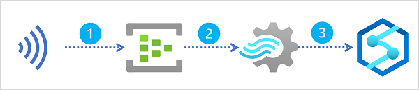

# Ingest streaming data using Azure Stream Analytics and Azure Synapse Analytics

Azure Stream Analytics provides a real-time data processing engine that you can use to ingest streaming event data into Azure Synapse Analytics for further analysis and reporting.

## Learning objectives

After completing this module, you'll be able to:

 - Describe common stream ingestion scenarios for Azure Synapse Analytics.
 - Configure inputs and outputs for an Azure Stream Analytics job.
 - Define a query to ingest real-time data into Azure Synapse Analytics.
 - Run a job to ingest real-time data, and consume that data in Azure Synapse Analytics.

## Introduction

Suppose a retail company **captures real-time** sales transaction **data** from an e-commerce website, and wants to analyze this data along with more static data related to products, customers, and employees. A common way to approach this problem is to ***ingest the stream of real-time data into a data lake or data warehouse***, where it can be queried together with data that is loaded using batch processing techniques.

Microsoft Azure Synapse Analytics provides a comprehensive enterprise data analytics platform, into which real-time data captured in Azure Event Hubs or Azure IoT Hub, and processed by Azure Stream Analytics can be loaded.

<a href="#">
    
</a>

A typical pattern for real-time data ingestion in Azure consists of the following sequence of service integrations:

 1. A real-time source of data is captured in an ***event ingestor***, such as **Azure Event Hubs or Azure IoT Hub**.
 2. The captured data is *perpetually filtered and aggregated* by an **Azure Stream Analytics query**.
 3. The results of the **query are loaded into a data lake or data warehouse** in Azure Synapse Analytics for subsequent analysis.

In this module, you'll explore multiple ways in which you can use Azure Stream Analytics to ingest real-time data into Azure Synapse Analytics.

## Stream ingestion scenarios

Azure Synapse Analytics provides multiple ways to analyze large volumes of data. ***Two*** of the most common ***approaches*** to large-scale data analytics are:

 - **Data warehouses** - relational databases, optimized for distributed storage and query processing. Data is stored in tables and queried using SQL.
 - **Data lakes** - distributed file storage in which data is stored as files that can be processed and queried using multiple runtimes, including Apache Spark and SQL.

### Data warehouses in Azure Synapse Analytics
Azure Synapse Analytics provides dedicated SQL pools that you can use to implement enterprise-scale relational data warehouses. Dedicated SQL pools are based on a *massively parallel processing* (**MPP**) instance of the Microsoft SQL Server relational database engine in which data is stored and queried in tables.

To ingest real-time data into a relational data warehouse, your Azure Stream Analytics query must write its results to an output that references the table into which you want to load the data.

A diagram of a stream of data being ingested into a dedicated SQL pool in Azure Synapse Analytics.

### Data lakes in Azure Synapse Analytics

An Azure Synapse Analytics workspace typically includes at least one storage service that is used as a data lake. Most commonly, the data lake is hosted in an Azure Storage account using a container configured to support Azure Data Lake Storage Gen2. Files in the data lake are organized hierarchically in directories (folders), and can be stored in multiple file formats, including delimited text (such as comma-separated values, or CSV), Parquet, and JSON.

When ingesting real-time data into a data lake, your Azure Stream Analytics query must write its results to an output that references the location in the Azure Data Lake Gen2 storage container where you want to save the data files. Data analysts, engineers, and scientists can then process and query the files in the data lake by running code in an Apache Spark pool, or by running SQL queries using a serverless SQL pool.

## Configure inputs and outputs

**All Azure Stream Analytics jobs include at least one input and output**. In most cases, ***inputs reference sources of streaming data*** (though you can also define inputs for static reference data to augment the streamed event data). ***Outputs determine where the results of the stream processing query will be sent***. In the case of data ingestion into Azure Synapse Analytics, the output usually references an Azure Data Lake Storage Gen2 container or a table in a dedicated SQL pool database.

### Streaming data inputs

Inputs for streaming data consumed by Azure Stream Analytics can include:

 - Azure Event Hubs
 - Azure IoT Hubs
 - Azure Blob or Data Lake Gen 2 Storage

Depending on the specific input type, the data for each streamed event includes the event's data fields as well as input-specific metadata fields. For example, data consumed from an Azure Event Hubs input includes an **EventEnqueuedUtcTime** field indicating the time when the event was received in the event hub.

#### Tip 

For more information about streaming inputs, see [Stream data as input into Stream Analytics](https://learn.microsoft.com/en-us/azure/stream-analytics/stream-analytics-define-inputs) in the Azure Stream Analytics documentation.

### Azure Synapse Analytics outputs

If you ***need to load the results*** of your stream processing ***into a table in a dedicated SQL pool***, ***use an Azure Synapse Analytics output***. The output configuration includes the identity of the dedicated SQL pool in an Azure Synapse Analytics workspace, details of how the Azure Stream Analytics job should establish an authenticated connection to it, and the existing table into which the data should be loaded.

Authentication to Azure Synapse Analytics is usually accomplished through SQL Server authentication, which requires a username and password. Alternatively, you can use a managed identity to authenticate. When using an Azure Synapse Analytics output, your Azure Stream Analytics job configuration must include an Azure Storage account in which authentication metadata for the job is stored securely.

#### Note

For more information about using an Azure Synapse Analytics output, see [Azure Synapse Analytics output from Azure Stream Analytics in the Azure Stream Analytics](https://learn.microsoft.com/en-us/azure/stream-analytics/azure-synapse-analytics-output) documentation.

### Azure Data Lake Storage Gen2 outputs

If you ***need to write the results*** of stream processing ***to an Azure Data Lake Storage Gen2 container that hosts a data lake in an Azure Synapse Analytics workspace***, use a **Blob storage/ADLS Gen2** ***output***. The output configuration includes details of the storage account in which the container is defined, authentication settings to connect to it, and details of the files to be created. You can specify the file format, including CSV, JSON, Parquet, and Delta formats. You can also specify custom patterns to define the folder hierarchy in which the files are saved - for example using a pattern such as *YYYY/MM/DD* to generate a folder hierarchy based on the current year, month, and day.

You can specify minimum and maximum row counts for each batch, which determines the number of output files generated (each batch creates a new file). You can also configure the write mode to control when the data is written for a time window - appending each row as it arrives or writing all rows once (which ensures "exactly once" delivery).

#### Note

For more information about using a Blob storage/ADLS Gen2 output, see [Blob storage and Azure Data Lake Gen2 output from Azure Stream Analytics](https://learn.microsoft.com/en-us/azure/stream-analytics/blob-storage-azure-data-lake-gen2-output) in the Azure Stream Analytics documentation.

## Define a query to select, filter, and aggregate data

After defining the input(s) and output(s) for your Azure Stream Analytics job, ***you can define a query to process the incoming data from an input and write the results to an output***.

### Selecting input fields

The simplest approach to ingesting streaming data into Azure Synapse Analytics is to capture the required field values for every event using a ``SELECT``...``INTO`` query, as shown here:

```sql
SELECT
    EventEnqueuedUtcTime AS ReadingTime,
    SensorID,
    ReadingValue
INTO
    [synapse-output]
FROM
    [streaming-input] TIMESTAMP BY EventEnqueuedUtcTime
```

#### Tip

When using an Azure Synapse Analytics output to write the results to a table in a dedicated SQL pool, the schema of the results produced by the query must match the table into which the data is to be loaded. You can use AS clauses to rename fields, and cast them to alternative (compatible) data types as necessary.

### Filtering event data

In some cases, you might want to filter the data to include only specific events by adding a ``WHERE`` clause. For example, the following query writes data only for events with a negative **ReadingValue** field value.

```sql
SELECT
    EventEnqueuedUtcTime AS ReadingTime,
    SensorID,
    ReadingValue
INTO
    [synapse-output]
FROM
    [streaming-input] TIMESTAMP BY EventEnqueuedUtcTime
WHERE ReadingValue < 0
```

### Aggregating events over temporal windows

A common pattern for streaming queries is to aggregate event data over temporal (time-based) intervals, or **windows**. To accomplish this, you can use a ``GROUP BY`` clause that includes a Window function defining the kind of window you want to define (for example, *tumbling*, *hopping*, or *sliding*).

#### Tip

For more information about window functions, see Introduction to [Stream Analytics windowing functions](https://learn.microsoft.com/en-us/azure/stream-analytics/stream-analytics-window-functions) in the Azure Stream Analytics documentation.

The following example groups streaming sensor readings into 1 minute ***tumbling*** (serial, non-overlapping) windows, recording the start and end time of each window and the maximum reading for each sensor. The **HAVING** clause filters the results to include only windows where at least one event occurred.

```sql
SELECT
    DateAdd(second, -60, System.TimeStamp) AS StartTime,
    System.TimeStamp AS EndTime,
    SensorID,
    MAX(ReadingValue) AS MaxReading
INTO
    [synapse-output]
FROM
    [streaming-input] TIMESTAMP BY EventEnqueuedUtcTime
GROUP BY SensorID, TumblingWindow(second, 60)
HAVING COUNT(*) >= 1
```

#### Tip

For more information about common patters for queries, see Common query patterns in [Azure Stream Analytics in the Azure Stream Analytics](https://learn.microsoft.com/en-us/azure/stream-analytics/stream-analytics-stream-analytics-query-patterns) documentation.

## Run a job to ingest data

When you've created and saved your query, you can run the Azure Stream Analytics job to process events in the input(s) and write the results to output(s). Once started, the query will run perpetually until stopped; constantly ingesting new event data into your Azure Synapse Analytics workspace (into a table in relational data warehouse or files in a data lake, depending on the output type).

### Working with ingested data

You **can work with the ingested streaming data** like any other data in Azure Synapse Analytics, **combining it with data ingested using batch processing techniques or synchronized** from operational data sources by using Azure Synapse Link.

#### Querying data in a relational data warehouse

If you used an Azure Synapse Analytics output to ingest the results of your stream processing job into a table in a dedicated SQL pool, you can query the table using a SQL query, just like any other table. The results of the query will always include the latest data to be ingested at the time the query is run. Your data warehouse can include tables for streaming data as well as tables for batch ingested data, enabling you to join real-time and batch data for historical analytics.

For example, the following SQL code could be used to query a table named factSensorReadings that contains the results of stream processing, and combine it with a dimDate table containing detailed data about the dates on which readings were captured.

```sql
SELECT d.Weekday, s.SensorID, AVG(s.SensorReading) AS AverageReading
FROM factSensorReadings AS s
JOIN dimDate AS d
    ON CAST(s.ReadingTime AS DATE) = d.DateKey
GROUP BY d.Weekday, s.SensorID
```

#### Tip

To Learn more about using a dedicated SQL pool to analyze data in a data warehouse, see the [Analyze data in a relational data warehouse](https://learn.microsoft.com/en-us/training/modules/design-multidimensional-schema-to-optimize-analytical-workloads/) module on Microsoft Learn.

#### Querying data in a data lake

As streaming data is ingested into files in a data lake, you can query those files by using a serverless SQL pool in Azure Synapse Analytics. For example, the following query reads all fields from all Parquet files under the **sensors** folder in the data file system container.

```sql
SELECT *
FROM OPENROWSET(
    BULK 'https://mydatalake.blob.core.windows.net/data/sensors/*',
    FORMAT = 'parquet') AS rows
```

#### Tip

To Learn more about using serverless SQL pools to query files in a data lake, see the [Use Azure Synapse serverless SQL pool to query files in a data lake](https://learn.microsoft.com/en-us/training/modules/query-data-lake-using-azure-synapse-serverless-sql-pools/) module on Microsoft Learn.

You can also query the data lake by using code running in an Apache Spark pool, as shown in this example:

```python
%%pyspark
df = spark.read.load('abfss://data@datalake.dfs.core.windows.net/sensors/*', format='parquet'
)
display(df)
```

#### Tip

To Learn more about using Apache Spark pools to query files in a data lake, see the [Analyze data with Apache Spark in Azure Synapse Analytics](https://learn.microsoft.com/en-us/training/modules/understand-big-data-engineering-with-apache-spark-azure-synapse-analytics/) module on Microsoft Learn.

## Exercise - Ingest streaming data into Azure Synapse Analytics

<a href="https://microsoftlearning.github.io/dp-203-azure-data-engineer/Instructions/Labs/18-Ingest-stream-synapse.html" target="_blank">
    Exercise
</a>

## Knowledge check

1. Which type of output should you use to ingest the results of an Azure Stream Analytics job into a dedicated SQL pool table in Azure Synapse Analytics? 

    - [x] Azure Synapse Analytics
    - [ ] Blob storage/ADLS Gen2
    - [ ] Azure Event Hubs

2. Which type of output should be used to ingest the results of an Azure Stream Analytics job into files in a data lake for analysis in Azure Synapse Analytics? 

    - [ ] Azure Synapse Analytics
    - [x] Blob storage/ADLS Gen2
    - [ ] Azure Event Hubs