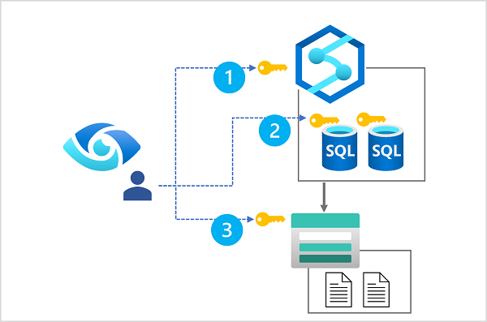
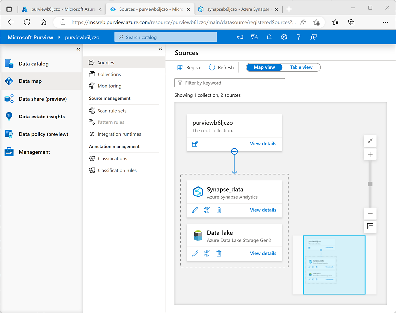

# Integrate Microsoft Purview and Azure Synapse Analytics

Learn how to integrate Microsoft Purview with Azure Synapse Analytics to improve data discoverability and lineage tracking.

## Learning objectives

After completing this module, you'll be able to:

 - Catalog Azure Synapse Analytics database assets in Microsoft Purview.
 - Configure Microsoft Purview integration in Azure Synapse Analytics.
 - Search the Microsoft Purview catalog from Synapse Studio.
 - Track data lineage in Azure Synapse Analytics pipelines activities.

## Introduction

Microsoft Purview is a cloud service that provides the basis of a ***data governance*** solution in which you can catalog, classify, and track data assets across a large-scale data estate.

Azure Synapse Analytics is a cloud-scale data analytics suite that supports data ingestion and transformation, distributed big data processing and exploration with SQL and Spark, and enterprise data warehousing.

When combined, Microsoft Purview and Azure Synapse Analytics can be used to create a comprehensive solution for reliable, massively scalable data analytics with rich data asset discovery and lineage tracking capabilities.

In this module you'll learn how to:

 - Catalog Azure Synapse Analytics database assets in Microsoft Purview.
 - Configure Microsoft Purview integration in Azure Synapse Analytics.
 - Search the Microsoft Purview catalog from Synapse Studio.
 - Track data lineage in Azure Synapse Analytics pipelines activities.

## Catalog Azure Synapse Analytics data assets in Microsoft Purview

Azure Synapse Analytics is a platform for cloud-scale analytics workloads that process data in multiple sources; including:

 - Relational databases in serverless and dedicated SQL pools
 - Files in Azure Data Lake Storage Gen2

A comprehensive data analytics solution can include many folders and files in a data lake, and multiple databases that each contain many tables, each with multiple fields. For a data analyst, finding and understanding the data assets associated with a Synapse Analytics workspace can present a significant challenge before any analysis or reporting can even begin.

Microsoft Purview can help in this scenario by cataloging the **data assets** in a ***data map***, and enabling data stewards to add metadata, categorization, subject matter contact details, and other information that helps data analysts identify and understand data.

## Configure data access for Microsoft Purview

In order to scan the data assets in the data lake storage and databases used in your Azure Synapse Workspace, Microsoft Purview **must have appropriate permissions to read the data**. In practice, this means that the account used by your Microsoft Purview account (usually a system-assigned managed identity that is created when Microsoft Purview is provisioned) needs to be a member of the appropriate ***role-based access control (RBAC)*** and database roles.

The diagram shows that Microsoft Purview requires role membership that permits the following access:

 1. Read access to the Azure Synapse workspace (achieved through membership of the **Reader** role for the Azure Synapse Workspace resource in the Azure subscription).
 2. Read access to each SQL database that will be scanned (achieved through membership of the **db_datareader** fixed database role in each database).
 3. Read access to data lake storage (achieved through membership of the **Storage Blob Data Reader** role for the Azure Storage account hosting the Azure Data Lake Storage Gen2 container for the data lake).

#### Tip

Learn more:

 - For more information about RBAC in Microsoft Azure, see [What is Azure role-based access control (Azure RBAC)](https://learn.microsoft.com/en-us/azure/role-based-access-control/overview)?
 - For more information about database-level roles in Azure Synapse Analytics SQL pools, see [Database-level roles](https://learn.microsoft.com/en-us/sql/relational-databases/security/authentication-access/database-level-roles?azure-portal-true).

You'll get a chance to assign RBAC and SQL database role membership to support Microsoft Purview data access for yourself in the exercise later in this module.

### Register and scan data sources

Microsoft Purview supports the creation of a data map that catalogs data assets in collections by scanning registered sources. Collections form a hierarchy of logical groupings of related data assets, under a root collection that is created when you provision a Microsoft Purview account. You can use the Microsoft Purview Governance Portal to create and manage collections in your account.

**To include assets from a particular data source, you need to register the source in a collection**. Microsoft Purview supports many kinds of source, including:

 - **Azure Synapse Analytics** - One or more SQL databases in a Synapse Analytics workspace.
 - **Azure Data Lake Storage Gen2** - Blob containers used to host folders and files in a data lake.

To catalog assets used in an Azure Synapse Analytics workspace, you can register one or both of these sources in a collection, as shown here:

After registering the sources where your data assets are stored, you can scan each source to catalog the assets it contains. You can scan each source interactively, and you can schedule period scans to keep the data map up to date.

#### Tip

To learn more about registering and scanning sources, see [Scans and ingestion in Microsoft Purview](https://learn.microsoft.com/en-us/purview/concept-scans-and-ingestion).

You'll get a chance to register and scan sources for an Azure Synapse Analytics workspace in the exercise later in this module.

### View and manage cataloged data assets

As each scan finds data assets in the registered sources, they're added to the associated collection in the data catalog. **You can query the data catalog in the Microsoft Purview Governance Portal** to view and filter the data assets, as shown here:

Data assets include items in the registered data stores at multiple levels. For example, assets from an Azure Synapse Analytics source include databases, schemas, tables, and individual fields; and assets from an Azure Data Lake Storage Gen 2 source include containers, folders, and files.

You can view and edit the properties of each asset to add contextual information such as descriptions, contacts for expert help, and other useful metadata. Data assets can also be classified using built-in or custom classifications that match specific patterns of data field to common types of data - for example, passport numbers, credit card numbers, and others.

#### Tip

To learn more about data asset classification, see [Data classification in the Microsoft Purview governance portal.](https://learn.microsoft.com/en-us/azure/purview/concept-classification)

## Connect Microsoft Purview to an Azure Synapse Analytics workspace

So far, you've learned how you can use Azure Synapse Analytics data stores as sources for a Microsoft Purview catalog; which is similar in most respects to using any other data source.

What sets Azure Synapse Analytics apart from many other data sources is the ability to configure direct integration between an Azure Synapse Analytics workspace and a Microsoft Purview account. By linking your workspace to a Purview account, you can:

 - Search the Purview catalog in the Synapse Studio user interface.
 - Push details of data pipeline activities to Purview in order to track data lineage information.

### Connect a Purview account to a Synapse Analytics workspace

You connect a Microsoft Purview account to an Azure Synapse Analytics workspace on the Manage page of Synapse Studio, as shown here:

#### Security considerations

To connect a Purview account by using the Synapse Studio interface, you ***require Collection Administrator access to the Purview account's root collection***. After successfully connecting the account, the managed identity used by your Azure Synapse Analytics workspace will be added to the collection's **Data Curator** role.

**If your Microsoft Purview account is behind a firewall, you need to create a managed endpoint, and configure the connection to access Purview using that endpoint**. For more information, see [Access a secured Microsoft Purview account from Azure Synapse Analytics](https://learn.microsoft.com/en-us/azure/synapse-analytics/catalog-and-governance/how-to-access-secured-purview-account).

#### Tip

To learn more about connecting Azure Synapse Analytics to Microsoft Purview, see [QuickStart: Connect a Synapse workspace to a Microsoft Purview account](https://learn.microsoft.com/en-us/azure/synapse-analytics/catalog-and-governance/quickstart-connect-azure-purview).

You'll get a chance to connect an Azure Synapse Analytics workspace to a Microsoft Purview account in the exercise later in this module.

## Search a Purview catalog in Synapse Studio

After connecting an Azure Synapse Analytics workspace to a Microsoft Purview account, you can search the Purview catalog from Synapse Studio. This ability to discover and examine data assets from across the enterprise can greatly assist data engineers, data analysts, and other consumers of data by providing a curated catalog of documented data sources for analysis and reporting.

### Search the Purview catalog in Synapse Studio

You can search the catalog from a connected Purview account by using the ***Search*** bar in the ***Data***, ***Develop***, or ***Integrate*** pages in Synapse Studio, as shown here:

The *search results* interface, and the details for each asset found reflect the user interface in the Microsoft Purview Governance Portal, ensuring that the data discovery and examination experience in Synapse Studio is consistent for users of Microsoft Purview in its own portal.

#### Tip

For more information about searching the Purview catalog in Synapse Studio, see [Discover, connect, and explore data in Synapse using Microsoft Purview](https://learn.microsoft.com/en-us/azure/synapse-analytics/catalog-and-governance/how-to-discover-connect-analyze-azure-purview).

You'll get a chance to try searching a connected Purview account for yourself in the exercise later in this module.

## Track data lineage in pipelines

In a typical large-scale analytics solution, data is transferred and transformed across multiple systems until it's loaded into an analytical data store for reporting and analysis. ***Tracking the lineage of data*** as moves across the enterprise ***is an important factor in determining the provenance, trustworthiness, and recency of data assets*** used to inform analysis and decision making.

### Generate and view data lineage information

In Azure Synapse Analytics, data movement and transformation is managed by using *pipelines*, which consist of an orchestrated set of *activities* that operate on data. The design and implementation of pipelines is too large a subject to cover in depth in this module, but a key point to be aware of is that there are two activity types available in Synapse Analytics pipelines that automatically generate data lineage information in a connected Purview catalog:

 - The **Copy Data** activity
 - The **Data Flow** activity

Running a pipeline that includes either of these activities in a workspace with a connected Purview account will result in the creation or update of data assets with lineage information. The assets recorded include:

 - The source from which the data is extracted.
 - The activity used to transfer the data.
 - The destination where the data is stored.

In the Microsoft Purview Governance Portal, you can open the assets in the Purview catalog, and view the lineage information as shown here:

You can also view the lineage for a pipeline activity in Synapse Studio.

#### Tip

For more information about tracking data lineage for Azure Synapse Analytics pipelines in Microsoft Purview, see [How to get lineage from Azure Synapse Analytics into Microsoft Purview](https://learn.microsoft.com/en-us/azure/purview/how-to-lineage-azure-synapse-analytics).

You'll get a chance to generate and view data lineage from a Synapse Analytics pipeline in the exercise later in this module.

## Exercise - Integrate Azure Synapse Analytics and Microsoft Purview

<a href="https://microsoftlearning.github.io/dp-203-azure-data-engineer/Instructions/Labs/17-stream-analytics.html" target="_blank">
    Exercise
</a>

## Knowledge check

1. Which definition of stream processing is correct? 

    - [x] Data is processed continually as new data records arrive.
    - [ ] Data is collected in a temporary store, and all records are processed together as a batch.
    - [ ] Data that is incomplete or contains errors is redirected to separate storage for correction by a human operator.