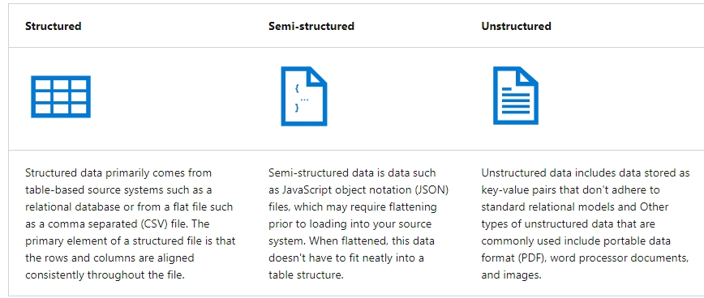

# Introduction to data engineering on Azure

## Learning Objetives

In this module you will learn how to:

 - Identify common data engineering tasks
 - Describe common data engineering concepts
 - Identify Azure services for data engineering

## Introduction

In most organizations, a **data engineer** is the primary role responsible for **integrating, transforming, and consolidating data** from various structured and unstructured data systems into structures that are suitable **for building analytics solutions**. An **Azure data engineer also helps ensure that data pipelines and data stores are high-performing, efficient, organized, and reliable**, given a specific set of business requirements and constraints.

## What is data engineering?

The **data engineer will often work with multiple types of data** to perform many operations using many scripting or coding languages that are appropriate to their individual organization.

## Types of data

There are three primary types of data that a data engineer will work with.

