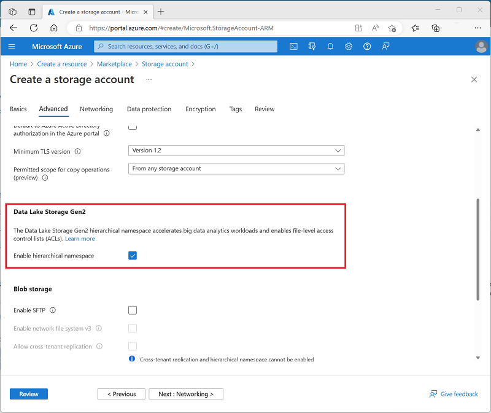
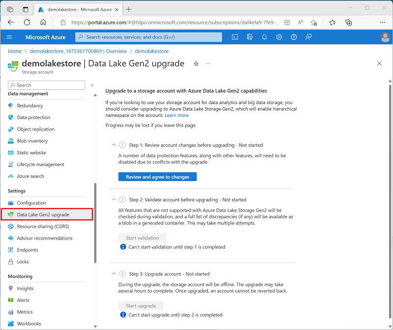
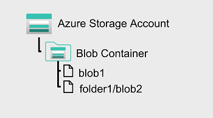
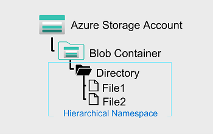

# Introduction to Azure Data Lake Storage Gen2

## Learning Objetives

In this module you will learn how to:

 - Describe the key features and benefits of Azure Data Lake Storage Gen2
 - Enable Azure Data Lake Storage Gen2 in an Azure Storage account
 - Compare Azure Data Lake Storage Gen2 and Azure Blob storage
 - Describe where Azure Data Lake Storage Gen2 fits in the stages of analytical processing
 - Describe how Azure data Lake Storage Gen2 is used in common analytical workloads

## Introduction

Many organizations have spent the last two decades building data warehouses and business intelligence (BI) solutions based on relational database systems. Many BI solutions have lost out on opportunities to store unstructured data due to cost and complexity in these types of data in databases.

Data lakes have become a common solution to this problem. A **data lake provides file-based storage, usually in a distributed file system that supports high scalability for massive volumes of data**. Organizations can store structured, semi-structured, and unstructured files in the data lake and then **consume them from there in big data processing technologies, such as Apache Spark**.

**Azure Data Lake Storage Gen2 provides a cloud-based solution for data lake storage** in Microsoft Azure, and underpins many large-scale analytics solutions built on Azure.

## Understand Azure Data Lake Storage Gen2

**A data lake is a repository of data that is stored in its natural format, usually as blobs or files**. Azure Data Lake Storage is a comprehensive, massively scalable, secure, and cost-effective data lake solution for high performance analytics built into Azure.

Azure Data Lake Storage combines a file system with a storage platform to help you quickly identify insights into your data. Data Lake Storage builds on Azure Blob storage capabilities to optimize it specifically for analytics workloads. This integration enables analytics performance, the tiering and data lifecycle management capabilities of Blob storage, and the high-availability, security, and durability capabilities of Azure Storage.

### Benefits

Data Lake Storage is designed to deal with this variety and volume of data at exabyte scale while securely handling hundreds of gigabytes of throughput. With this, you can **use Data Lake Storage Gen2 as the basis for both real-time and batch solutions**.

#### Hadoop compatible access

A benefit of Data Lake Storage is that **you can treat the data as if it's stored in a Hadoop Distributed File System (HDFS)**. With this feature, **you can store the data in one place and access it through compute technologies including Azure Databricks**, **Azure HDInsight**, and **Azure Synapse Analytics** without moving the data between environments. The *data engineer also has the ability to use storage mechanisms such as the parquet format*, which is highly compressed and performs well across multiple platforms using an internal columnar storage.

#### Security

Data Lake Storage **supports access control lists (ACLs)** and **Portable Operating System Interface (POSIX)** permissions that don't inherit the permissions of the parent directory. In fact, you can set permissions at a directory level or file level for the data stored within the data lake, providing a much more secure storage system. This *security is configurable through technologies such as **Hive** and **Spark** or utilities such as **Azure Storage Explorer**,* which runs on Windows, macOS, and Linux. All data that is stored is encrypted at rest by using either Microsoft or customer-managed keys.

#### Performance

Azure Data Lake Storage **organizes the stored data into a hierarchy of directories and subdirectories**, much like a file system, for easier navigation. As a result, data processing requires less computational resources, reducing both the time and cost.

#### Data redundancy

Data Lake Storage takes advantage of the **Azure Blob replication models** that provide data redundancy in a single data center with **locally redundant storage (LRS)**, or to a secondary region by using the **Geo-redundant storage (GRS)** option. This feature ensures that your data is always available and protected if catastrophe strikes.

## Enable Azure Data Lake Storage Gen2 in Azure Storage

**Azure Data Lake Storage Gen2 isn't a standalone Azure service**, but rather a configurable capability of a StorageV2 (General Purpose V2) Azure Storage.

To enable Azure Data Lake Storage Gen2 in an Azure Storage account, you can select the option to **Enable hierarchical namespace** in the **Advanced page** when creating the storage account in the Azure portal:

Alternatively, if you already have an Azure Storage account and want to enable the Azure data Lake Storage Gen2 capability, you can use the **Data Lake Gen2 upgrade wizard** in the Azure portal page for your storage account resource.

## Compare Azure Data Lake Store to Azure Blob storage

In **Azure Blob storage**, you can **store** large amounts of **unstructured ("object") data** in a flat namespace within a *blob container*. Blob names can include **"/"** characters to organize blobs into *virtual "folders"*, but in terms of blob manageability the blobs are stored as a single-level hierarchy in a flat namespace.

**You can access this data by using HTTP or HTTPs**

**Azure Data Lake Storage Gen2 builds on blob storage** and optimizes I/O of high-volume data by using a hierarchical namespace that **organizes blob data into directories**, and stores metadata about each directory and the files within it. This structure allows operations, such as directory renames and deletes, to be performed in a single atomic operation. Flat namespaces, by contrast, require several operations proportionate to the number of objects in the structure. Hierarchical namespaces keep the data organized, which **yields better storage and retrieval performance for an analytical use case and lowers the cost of analysis**.

### Tip

If you want to store data without performing analysis on the data, set the **Hierarchical Namespace** option to **Disabled** to set up the storage account as an Azure Blob storage account. You can also use blob storage to archive rarely used data or to store website assets such as images and media.

If you are performing analytics on the data, set up the storage account as an Azure Data Lake Storage Gen2 account by setting the **Hierarchical Namespace** option to **Enabled**. Because Azure Data Lake Storage Gen2 is integrated into the Azure Storage platform, applications can use either the Blob APIs or the Azure Data Lake Storage Gen2 file system APIs to access data.