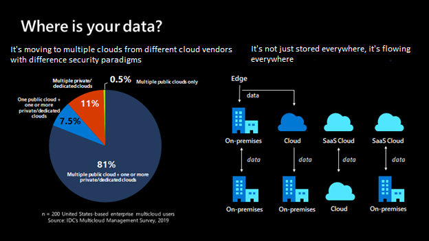
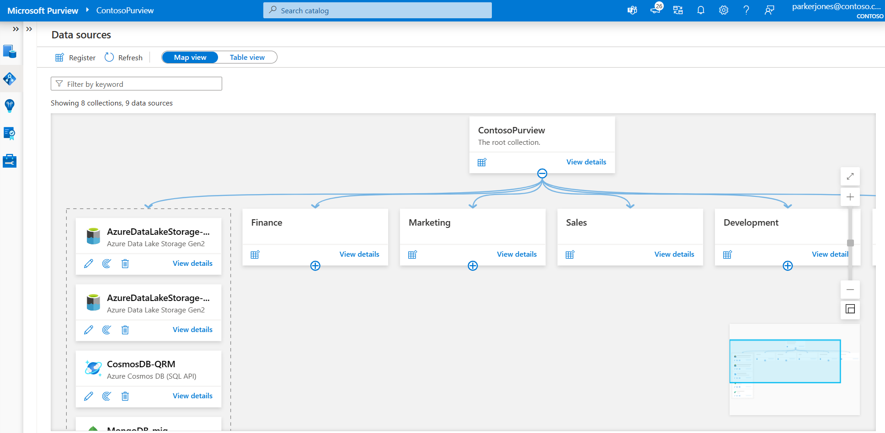
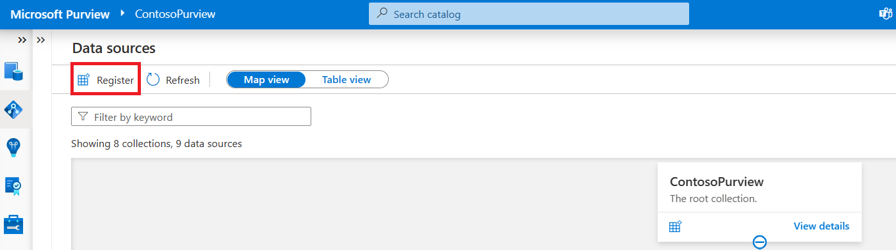
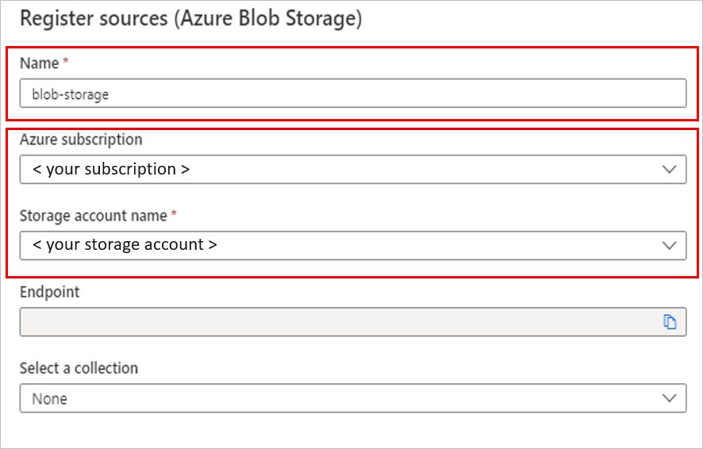
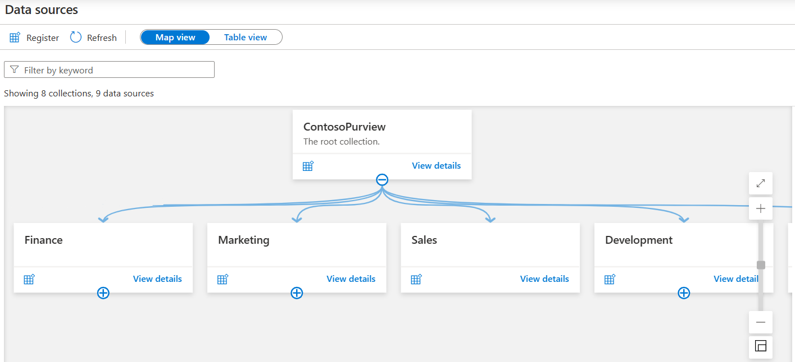
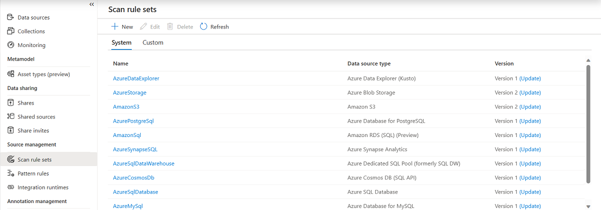
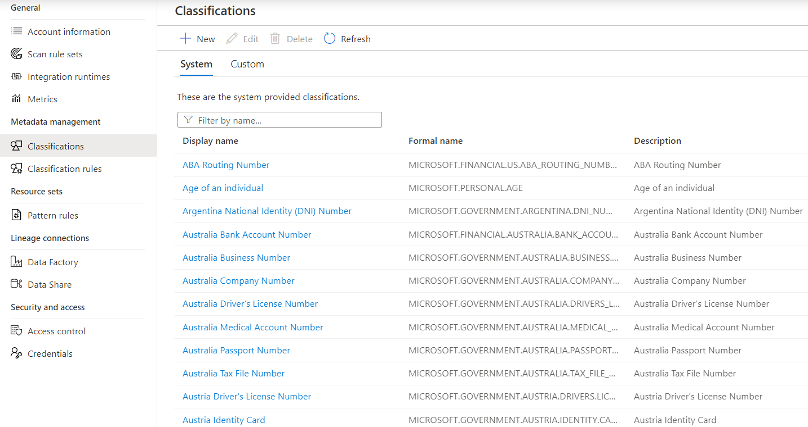
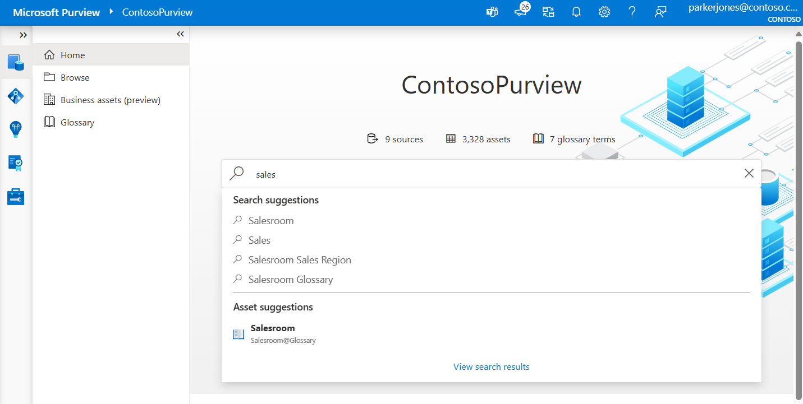
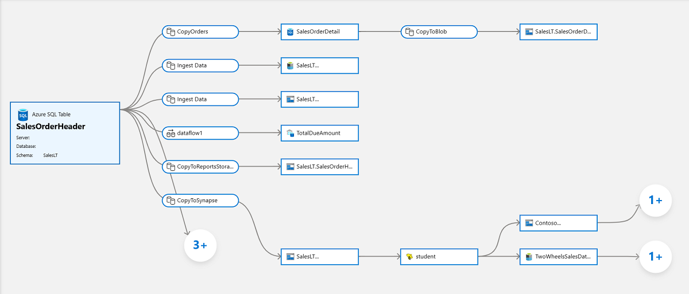

# Introduction to Microsoft Purview

In this module, you'll evaluate whether Microsoft Purview is the right choice for your data discovery and governance needs.

## Learning objectives

By the end of this module, you'll be able to:

 - Evaluate whether Microsoft Purview is appropriate for your data discovery and governance needs.
 - Describe how the features of Microsoft Purview work to provide data discovery and governance.

## Introduction

As the volume and variety of data increases, the challenges of good data governance are likely to become more difficult. Digital transformation technologies have resulted in new data sources. How do users know what data is available? How do administrators manage data when they might not know what type of data exists and where it's stored? Does the data contain sensitive or personal information?

All these questions aren't easy to answer without insights into the data and the source of storage. Before you can develop data-governance plans for usage and storage, you need to understand the data your organization uses.

### Example scenario

As a user or producer of data, you might be a business or technical data analyst, data scientist, or data engineer. You probably spend significant time on manual processes to annotate, catalog, and find trusted data sources.

Without a central location to register data sources, you might be unaware of a data source unless you come into contact with it as part of another process.

Writing metadata descriptions for data sources is often a wasted effort. Client applications typically ignore descriptions that are stored in the data source. Creating documentation for data sources is difficult because you must keep documentation in sync with data sources. Users also might not trust documentation that they think is out of date.

Without the ability to track data from end to end, you must spend time tracing problems created by data pipelines that other teams own. If you make changes to your datasets, you can accidentally affect related reports that are business or mission critical.

***Microsoft Purview*** is designed to address these issues and ***help enterprises get the most value from their existing information assets***. Its catalog makes data sources easy to discover and understand by the users who manage the data.

### What will we be doing?

This high-level overview of Microsoft Purview helps you discover the key aspects that make it the tool of choice for mapping out your enterprise data. You learn how it can help you:

 - Manage and govern your data across various platforms and locations.
 - Map out your data landscape.
 - Classify sensitive data.
 - Empower customers to find trustworthy data.

### What's the main goal?

By the end of this session, you'll be able to decide whether Microsoft Purview is the right choice to help you manage your enterprise data environment and your various data sources.

## What is Microsoft Purview?

Let's start with a few definitions and a quick tour of the core features of Microsoft Purview.

### What's Microsoft Purview?

**Microsoft Purview is a unified data-governance service that helps you manage and govern your on-premises, multicloud, and software-as-a-service (SaaS) data**. You can easily create a broad, up-to-date map of your data landscape with:

 - Automated data discovery.
 - Sensitive data classification.
 - End-to-end data lineage.

You can also empower data users to find valuable, trustworthy data.

Microsoft Purview is designed to help enterprises get the most value from their existing information assets. With this cloud-based service, you can register your data sources to help you discover and manage them. Your data sources remain in place, but a copy of the metadata for the source is added to Microsoft Purview.

You can register a wide range of sources in Azure and across your multicloud data estate in Microsoft Purview. These sources include Azure Data Lake Storage, AWS, Azure SQL Database on-premises and in the cloud, and many more.

Microsoft Purview has three main elements:

**Microsoft Purview Data Map**: The data map provides a structure for your data estate in Microsoft Purview, where you can map your existing data stores into groups and hierarchies. In the data map, you can grant users and teams access to these groups so that they have access to find relevant data stores. The data map can then scan your data stores and gather metadata such as schemas and data types. It can also identify sensitive data types so that you can keep track of them in your data estate.

**Microsoft Purview Data Catalog**: The data catalog allows your users to browse the metadata stored in the data map so that they can find reliable data and understand its context. For example, users can see where the data comes from and who are the experts they can contact about that data source. The data catalog also integrates with other Azure products, like the Azure Synapse Analytics workspace, so that users can search for the data they need from the applications they need it in.

**Microsoft Purview Data Estate Insights**: Insights offer a high-level view into your data catalog, covering these key facets:

 - **Data stewardship**: A report on how curated your data assets are so that you can track your governance progress.
 - **Catalog adoption**: A report on the number of active users in your data catalog, their top searches, and your most viewed assets.
 - **Asset insights**: A report on the data estate and source-type distribution. You can view by source type, classification, and file size. View the insights as a graph or as key performance indicators.
 - **Scan insights**: A report that provides information on the health of your scans (successes, failures, or canceled).
 - **Glossary insights**: A status report on the glossary to help users understand the distribution of glossary terms by status, and view how the terms are attached to assets.
 - **Classification insights**: A report that shows where classified data is located. It allows security administrators to understand the types of information found in their organization's data estate.
 - **Sensitivity insights**: A report that focuses on sensitivity labels found during scans. Security administrators can make use of this information to ensure security is appropriate for the data estate.

## How Microsoft Purview works

Here's where we take a look at how Microsoft Purview works. In this unit, you learn the core operational theory behind the functioning of **Microsoft Purview for mapping and scanning your data sources**. The key areas we focus on include how to:

 - Load data in the data map.
 - Browse and search information in the data catalog.

### Load data in the data map

The Microsoft Purview Data Map is a unified map of your data assets and their relationships. As one cohesive map, it's easier for you and your users to visualize and govern. It also houses the metadata that underpins the Microsoft Purview Data Catalog and Data Estate Insights. The Data Map scales up and down to meet your enterprise compliance requirements. You can use it to govern your data estate in a way that makes the most sense for your business.

#### Source data

Sourcing your data starts with a process where you register data sources. ***Microsoft Purview supports an array of data sources that span on-premises, multicloud, and software-as-a-service (SaaS) options***. You register the various data sources so that Microsoft Purview is aware of them. The **data remains in its location and isn't migrated to any other platform**.

After you have a Microsoft Purview service configured in Azure, you use the Microsoft Purview governance portal to register your data sources.

Each type of data source you choose requires specific information to complete the registration. For example, if your data sources reside in your Azure subscription, you choose the necessary subscription and storage account name. The following image is an example of choosing an Azure Blob Storage source.

After registration, you scan the data source. Scanning ingests metadata about your data source into the Microsoft Purview Data Map. Each data source has specific requirements for authenticating and configuration to permit scanning of the assets in that data source.

For example, if you have data stored in an Amazon S3 standard bucket, you'll need to provide a configuration for the connection. For this service, you use Microsoft Purview to provide a Microsoft account with secure access to AWS, where the Microsoft Purview scanner will run. The Microsoft Purview scanner uses this access to your Amazon S3 buckets to read your data. The scanner then reports the results (including only the metadata and classification) back to Azure. You can use the Microsoft Purview classification and labeling reports to analyze and review your data scan results.

#### Note 

Check the [Microsoft Purview connector for Amazon S3](https://learn.microsoft.com/en-us/azure/purview/register-scan-amazon-s3) documentation for region support related to AWS S3 sources.

In Microsoft Purview, there are a few options to use for authentication when the service needs to scan data sources. Some of these options are:

 - Microsoft Purview managed identity
 - Account key (using Azure Key Vault)
 - SQL authentication (using Key Vault)
 - Service principal (using Key Vault)

### Map data

The data map is the foundational platform for Microsoft Purview. The data map consists of:

 - Data assets.
 - Data lineage.
 - Data classifications.
 - Business context.

Customers create a knowledge graph of data that comes in from a range of sources. Microsoft Purview makes it easy to register and automatically scan and classify data at scale. Within a data map, you can identify the type of data source, along with other details around security and scanning.

The data map uses collections to organize these details. Collections are a way of grouping data assets into logical categories to simplify management and discovery of assets within the catalog. You also use collections to manage access to the metadata that's available in the data map.

Select **Map view** in the Microsoft Purview governance portal to display the data sources in a graphical view, along with the collections you created for them.

### Scan data

After you register your data sources, you'll need to run a scan to access their metadata and browse the asset information. Before you can scan the data sources, you're required to enter the credentials for these sources. You can use Azure Key Vault to store the credentials for security and ease of access by your scan rules. The Microsoft Purview governance portal comes with existing system scan rule sets that you can select when you create a new scan rule. You can also specify a custom scan rule set.

A *scan rule* set is a container for grouping scan rules together to use the same rules repeatedly. A scan rule set lets you select file types for schema extraction and classification. It also lets you define new custom file types. You might create a default scan rule set for each of your data source types. Then you can use these scan rule sets by default for all scans within your company.

For example, you might want to scan only the ``.csv`` files in an Azure Data Lake Storage account. Or you might want to check your data only for credit card numbers rather than all the possible classifications. You might also want users with the right permissions to create other scan rule sets with different configurations based on business needs.

### Classification

Metadata is used to help describe the data that's being scanned and made available in the catalog. During the configuration of a scan set, you can specify classification rules to apply during the scan that also serve as metadata. The classification rules fall under five major categories:

 - **Government**: Attributes such as government identity cards, driver license numbers, and passport numbers.
 - **Financial**: Attributes such as bank account numbers or credit card numbers.
 - **Personal**: Personal information such as a person's age, date of birth, email address, and phone number.
 - **Security**: Attributes like passwords that can be stored.
 - **Miscellaneous**: Attributes not included in the other categories.

You can use several system classifications to classify your data. These classifications align with the sensitive information types in the Microsoft Purview compliance portal. You can also create custom classifications to identify other important or sensitive information types in your data estate.

After you register a data source, you can enrich its metadata. With proper access, you can annotate a data source by providing descriptions, ratings, tags, glossary terms, identifying experts, or other metadata for requesting data-source access. This descriptive metadata supplements the structural metadata, such as column names and data types, that's registered from the data source.

Discovering and understanding data sources and their use is the primary purpose of registering the sources. If you're an enterprise user, you might need data for business intelligence, application development, data science, or any other task where the right data is required. You can use the data catalog discovery experience to quickly find data that matches your needs. You can evaluate the data for its fitness for the purpose and then open the data source in your tool of choice.

At the same time, you can contribute to the catalog by tagging, documenting, and annotating data sources that have already been registered. You can also register new data sources, which are then discovered, evaluated, and used by the community of catalog users.

### Browse and search

Microsoft Purview allows you to search information from the data map by using the Microsoft Purview Data Catalog. You can perform text-based search and browse through results by using filters like data source type, tags, ratings, or collection.

You can use business context to search information from the Microsoft Purview catalog. You can define business glossaries and bulk import existing ones, too. You can also apply business context onto assets in the data map. By using a metamodel, you can define business processes in your environment and associate your data sources with those processes. Users can then apply these business contexts to browse and search for information in the data catalog.

Discovery enables you to use:

 - Semantic search and browse.
 - Business glossary and workflows.
 - Data lineage with sources, owners, transformations, and lifecycle.

### Data lineage

The concept of **data lineage focuses on the lifecycle of data**. The lifecycle concerns itself with the various stages data might go through. Data is sourced, moved, and stored throughout its lifecycle. Data might also undergo transformations in the extract, load, and transform/extract, transform, and load (ELT/ETL) operations.

Data lineage can offer insights into the data lifecycle by looking at the data pipeline. You can use the lineage to identify the root cause of data issues, perform data quality analysis, and verify compliance.

**Microsoft Purview represents this data lineage in a visual form** by showing data movement from source to destination.

## When to use Microsoft Purview

