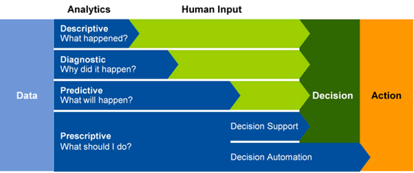
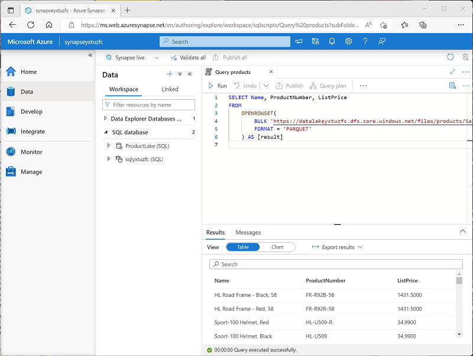
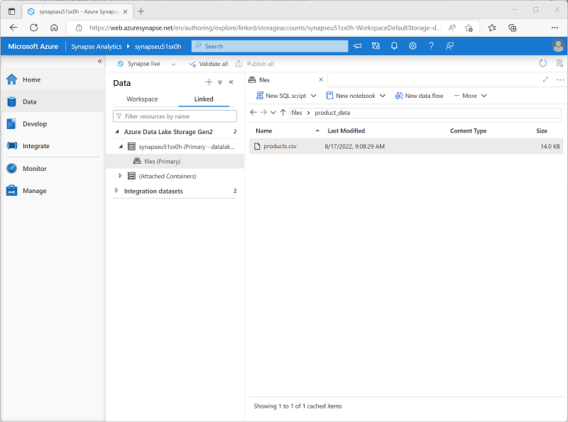

# Introduction to Azure Synapse Analytics

## Learning Objetives

In this module, you'll learn how to:

 - Identify the business problems that Azure Synapse Analytics addresses.
 - Describe core capabilities of Azure Synapse Analytics.
 - Determine when to use Azure Synapse Analytics.

## Introduction

The volume of data generated by individuals and organizations is growing at a phenomenal rate. This data powers businesses and other organizations by providing a basis for descriptive, diagnostic, predictive, and prescriptive analytical solutions that support decision making and autonomous systems by providing real-time insights into established and emerging patterns.

Organizations have a choice of many tools and techniques for data analytics, often requiring expertise across multiple systems and complex integration of infrastructure and administrative operations. **Azure Synapse Analytics provides a single, cloud-scale platform that supports multiple analytical technologies**; enabling a consolidated and integrated experience for data engineers, data analysts, data scientists, and other professionals who need to work with data.

In this module, you'll learn how to:

 - Identify the business problems that Azure Synapse Analytics addresses.
 - Describe core capabilities of Azure Synapse Analytics.
 - Determine when to use Azure Synapse Analytics.

## What is Azure Synapse Analytics

The technological research and consulting firm Gartner defines four common types of analytical technique that organizations commonly use:

 - **Descriptive analytics**, which answers the question “**What is happening** in my business?”. The data to answer this question is typically answered through the creation of a data warehouse in which historical data is persisted in relational tables for multidimensional modeling and reporting.

 - **Diagnostic analytics**, which deals with answering the question “**Why is it happening?**”. This may involve exploring information that already exists in a data warehouse, but typically involves a wider search of your data estate to find more data to support this type of analysis.

 - **Predictive analytics**, which enables you to answer the question “**What is likely to happen** in the future based on previous trends and patterns?”

 - **Prescriptive analytics**, which **enables autonomous decision making** based on real-time or near real-time analysis of data, using predictive analytics.


<a href="#">
    
</a>

**Azure Synapse Analytics provides a cloud platform for all of these analytical workloads through support for multiple data storage, processing, and analysis technologies in a single, integrated solution**. The integrated design of Azure Synapse Analytics enables organizations to leverage investments and skills in multiple commonly used data technologies, including SQL, Apache Spark, and others; while providing a centrally managed service and a single, consistent user interface.

## How Azure Synapse Analytics works

To support the analytics needs of today's organizations, Azure Synapse Analytics combines a centralized service for data storage and processing with an extensible architecture through which linked services enable you to integrate commonly used data stores, processing platforms, and visualization tools.

### Creating and using an Azure Synapse Analytics workspace

**A Synapse Analytics workspace** defines an instance of the Synapse Analytics service in which you can manage the services and data resources needed for your analytics solution. You can **create a Synapse Analytics workspace in an Azure subscription interactively by using the Azure portal**, or you **can automate deployment by using Azure PowerShell, the Azure command-line interface (CLI), or with an Azure Resource Manager or Bicep template**.

After creating a Synapse Analytics workspace, you can **manage the services in it and perform data analytics tasks with them by using Synapse Studio**; a web-based portal for Azure Synapse Analytics.

<a href="#">
    
</a>

### Working with files in a data lake

One of the core resources in a Synapse Analytics workspace is a **data lake**, in which data files can be stored and processed at scale. A **workspace typically has a default data lake**, which is implemented **as a linked service to an Azure Data Lake Storage Gen2 container**. **You can add linked services for multiple data lakes** that are based on different storage platforms as required.

<a href="#">
    
</a>

### Ingesting and transforming data with pipelines

In most enterprise data analytics solutions, data is extracted from multiple operational sources and transferred to a central data lake or data warehouse for analysis. Azure Synapse Analytics includes built-in support for creating, running, and managing pipelines that orchestrate the activities necessary to retrieve data from a range of sources, transform the data as required, and load the resulting transformed data into an analytical store.

<a href="#">
    
</a>

#### Note:

    Pipelines in Azure Synapse Analytics are based on the same underlying technology as Azure Data Factory. If you are already familiar with Azure Data Factory, you can leverage your existing skills to build data ingestion and transformation solutions in Azure Synapse Analytics.

### Querying and manipulating data with SQL

Structured Query Language (SQL) is a ubiquitous language for querying and manipulating data, and is the foundation for relational databases, including the popular **Microsoft SQL Server database** platform. **Azure Synapse Analytics supports SQL-based data querying and manipulation** through two kinds of SQL pool that are based on the SQL Server relational database engine:

 - A built-in serverless pool that is optimized for using relational SQL semantics to query file-based data in a data lake.
 - Custom dedicated SQL pools that host relational data warehouses.

The **Azure Synapse SQL** system uses a distributed **query processing model to parallelize SQL operations**, resulting in a highly scalable solution for relational data processing. You can use the built-in serverless pool for cost-effective analysis and processing of file data in the data lake, and use dedicated SQL pools to create relational data warehouses for enterprise data modeling and reporting.

<a href="#">
    
</a>

### Processing and analyzing data with Apache Spark

**Apache Spark** is an open source platform **for big data analytics**. Spark performs **distributed processing of files in a data lake** by running jobs that can be implemented using any of a range of supported programming languages. **Languages supported in Spark include Python, Scala, Java, SQL, and C#**.

In **Azure Synapse Analytics, you can create one or more Spark pools** and **use interactive notebooks** to combine code and notes as you build solutions for data analytics, machine learning, and data visualization.

<a href="#">
    
</a>


### Exploring data with Data Explorer

**Azure Synapse Data Explorer** is a **data processing engine** in Azure Synapse Analytics that is based on the Azure Data Explorer service. Data Explorer **uses an intuitive query syntax named Kusto Query Language (KQL)** to enable high performance, low-latency analysis of batch and streaming data.

<a href="#">
    
</a>

### Integrating with other Azure data services

Azure Synapse Analytics can be integrated with other Azure data services for end-to-end analytics solutions. Integrated solutions include:

 - **Azure Synapse Link** enables near-realtime synchronization between operational data in Azure Cosmos DB, Azure SQL Database, SQL Server, and Microsoft Power Platform Dataverse and analytical data storage that can be queried in Azure Synapse Analytics.
 - **Microsoft Power BI** integration enables data analysts to integrate a **Power BI workspace into a Synapse workspace**, and perform interactive data visualization in Azure Synapse Studio.
 - **Microsoft Purview** integration **enables organizations to catalog data assets in Azure Synapse Analytics**, and makes it easier for data engineers to find data assets and track data lineage when implementing data pipelines that ingest data into Azure Synapse Analytics.
 - **Azure Machine Learning** integration enables data analysts and data scientists to integrate **predictive model training** and consumption into analytical solutions.

## When to use Azure Synapse Analytics

Across all organizations and industries, the common use cases for Azure Synapse Analytics are identified by the need for:

### Large-scale data warehousing

Data warehousing includes the need to integrate all data, including big data, to reason over data for analytics and reporting purposes from a descriptive analytics perspective, independent of its location or structure.

### Advanced analytics

Enables organizations to perform predictive analytics using both the native features of Azure Synapse Analytics, and integrating with other technologies such as Azure Machine Learning.

### Data exploration and discovery

The serverless SQL pool functionality provided by Azure Synapse Analytics enables Data Analysts, Data Engineers and Data Scientist alike to explore the data within your data estate. This capability supports data discovery, diagnostic analytics, and exploratory data analysis.

### Real time analytics

Azure Synapse Analytics can capture, store and analyze data in real-time or near-real time with features such as Azure Synapse Link, or through the integration of services such as Azure Stream Analytics and Azure Data Explorer.

### Data integration

Azure Synapse Pipelines enables you to ingest, prepare, model and serve the data to be used by downstream systems. This can be used by components of Azure Synapse Analytics exclusively.

### Integrated analytics

With the variety of analytics that can be performed on the data at your disposal, putting together the services in a cohesive solution can be a complex operation. Azure Synapse Analytics removes this complexity by integrating the analytics landscape into one service. That way you can spend more time working with the data to bring business benefit, than spending much of your time provisioning and maintaining multiple systems to achieve the same outcomes.

## Exercise - Explore Azure Synapse Analytics

Now it's your chance to explore the capabilities of Azure Synapse Analytics for yourself. In this exercise, you'll use a provided script to provision an Azure Synapse Analytics workspace in your Azure subscription; and then use Azure Synapse Studio to perform core data analytics tasks.

#### Note:

 To [complete this lab](https://microsoftlearning.github.io/dp-203-azure-data-engineer/Instructions/Labs/01-Explore-Azure-Synapse.html), you will need an Azure subscription in which you have administrative access.


### Provision an Azure Synapse Analytics workspace

An Azure Synapse Analytics workspace provides a central point for managing data and data processing runtimes. You can provision a workspace using the interactive interface in the Azure portal, or you can deploy a workspace and resources within it by using a script or template. In most production scenarios, **it’s best to automate provisioning with scripts and templates** so that you can incorporate resource deployment into a repeatable **development and operations (DevOps) process**.

In this exercise, you’ll use a combination of a **PowerShell script and an ARM template** to provision Azure Synapse Analytics.

 1) In a web browser, sign into the [Azure portal](https://portal.azure.com).
 2) Use the [>_] button to the right of the search bar at the top of the page to create a **new Cloud Shell** in the Azure portal, **selecting a PowerShell environment** and creating storage if prompted. The cloud shell provides a command line interface in a pane at the bottom of the Azure portal, as shown here:

<a href="#">
    
</a>

#### Note:
 If you have previously created a cloud shell that uses a Bash environment, use the the drop-down menu at the top left of the cloud shell pane to change it to PowerShell.

 3) Note that you can resize the cloud shell by dragging the separator bar at the top of the pane, or by using the —, ◻, and X icons at the top right of the pane to minimize, maximize, and close the pane. For more information about using the Azure Cloud Shell, see the [Azure Cloud Shell documentation](https://learn.microsoft.com/en-us/azure/cloud-shell/overview).

 4) In the PowerShell pane, enter the following commands to **clone this repo**:

 ```powershell
    rm -r dp-203 -f
    git clone https://github.com/MicrosoftLearning/dp-203-azure-data-engineer dp-203
 ```

 5) After the repo has been cloned, enter the following commands to change to the folder for this exercise and **run the setup.ps1 script** it contains:

 ```powershell
    cd dp-203/Allfiles/labs/01
    ./setup.ps1
 ```

 6) If prompted, choose which subscription you want to use (this will only happen if you have access to multiple Azure subscriptions).

 7) When prompted, **enter a suitable password** to be set for your Azure Synapse SQL pool. **Be sure to remember this password! Additionally, the password cannot contain all or part of the login name**.

 8) Wait for the script to complete - this typically takes around 20 minutes, but in some cases may take longer. While you are waiting, review the What is [Azure Synapse Analytics?](https://learn.microsoft.com/en-us/azure/synapse-analytics/overview-what-is) article in the Azure Synapse Analytics documentation.

### Explore Synapse Studio

Synapse Studio is a web-based portal in which you can manage and work with the resources in your Azure Synapse Analytics workspace.

 1) When the setup script has finished running, in the Azure portal, go to the dp203-xxxxxxx resource group that it created, and notice that this resource group contains your Synapse workspace, a Storage account for your data lake, an Apache Spark pool, a Data Explorer pool, and a Dedicated SQL pool.

 2) Select your Synapse workspace, and in its Overview page, in the Open Synapse Studio card, select Open to open Synapse Studio in a new browser tab. Synapse Studio is a web-based interface that you can use to work with your Synapse Analytics workspace.
 
 3) On the left side of Synapse Studio, use the ›› icon to expand the menu - this reveals the different pages within Synapse Studio that you’ll use to manage resources and perform data analytics tasks, as shown here:

 <a href="#">
    
 </a>

 4) View the **Data** page, and note that there are two tabs containing data sources:
     - A **Workspace tab** containing databases defined in the workspace (including dedicated SQL databases and Data Explorer databases)
     - A **Linked tab** containing data sources that are linked to the workspace, including Azure Data Lake storage.
 5) View the **Develop page**, which is currently empty. This is where you can define scripts and other assets used to develop data processing solutions.
 6) View the **Integrate page**, which is also empty. You use this page to manage data ingestion and integration assets; such as pipelines to transfer and transform data between data sources.
 7) View the **Monitor page**. This is where you can observe data processing jobs as they run and view their history.
 8) View the **Manage page**. This is where you manage the pools, runtimes, and other assets used in your Azure Synapse workspace. View each of the tabs in the Analytics pools section and note that your workspace includes the following pools:
     - **SQL pools**:
         - **Built-in**: A serverless SQL pool that you can use on-demand to explore or process data in a data lake by using SQL commands.
         - **sqlxxxxxxx**: A dedicated SQL pool that hosts a relational data warehouse database.
     - **Apache Spark pools**:
         - **sparkxxxxxxx**: that you can use on-demand to explore or process data in a data lake by using programming languages like Scala or Python.

### Ingest data with a pipeline

One of the key tasks you can perform with Azure Synapse Analytics is to **define pipelines that transfer** (and if necessary, transform) **data** from a wide range of sources **into your workspace for analysis**.

#### Use the Copy Data task to create a pipeline

 1) In Synapse Studio, on the Home page, **select Ingest** to open the Copy Data tool
 2) In the **Copy Data tool**, on the **Properties** step, ensure that Built-in copy task and **Run once now** are selected, and click **Next >**.
 3) On the **Source** step, in the **Dataset** substep, select the following settings:
     - **Source type**: All
     - **Connection**: Create a new connection, and in the **Linked service** pane that appears, on the **Generic protocol tab**, select **HTTP**. Then continue and create a connection to a data file using the following settings:
         - **Name**: Products
         - **Description**: Product list via HTTP
         - **Connect via integration runtime**: AutoResolveIntegrationRuntime
         - **Base URL**: 
             ```url
             https://raw.githubusercontent.com/MicrosoftLearning/dp-203-azure-data-engineer/master/Allfiles/labs/01/adventureworks/products.csv
             ```             
         - **Server Certificate Validation**: Enable
         - **Authentication type**: Anonymous
 4) After creating the connection, on the **Source data store** page, ensure the following settings are selected, and then select **Next >**:
     - **Relative URL**: Leave blank
     - **Request method**: GET
     - **Additional headers**: Leave blank
     - **Binary copy**: Unselected
     - **Request timeout**: Leave blank
     - **Max concurrent connections**: Leave blank

 5) On the **Source** step, in the **Configuration** substep, select **Preview data** to see a preview of the product data your pipeline will ingest, then close the preview.
 6) After previewing the data, on the **File format settings** page, ensure the following settings are selected, and then select **Next >**:
     - **File format**: DelimitedText
     - **Column delimiter**: Comma (,)
     - **Row delimiter**: Line feed (\n)
     - **First rowas header** : Selected
     - **Compression type**: None
 7) On the **Destination** step, in the **Dataset** substep, select the following settings:
     - **Destination type**: Azure Data Lake Storage Gen 2
     - **Connection**: Select the existing connection to your data lake store (this was created for you when you created the workspace).
 8) After selecting the connection, on the **Destination/Dataset** step, ensure the following settings are selected, and then select *Next >*:
     - **Folder path**: files/product_data
     - **File name**: products.csv
     - **Copy behavior**: None
     - **Max concurrent** connections: Leave blank
     - **Block size (MB)**: Leave blank
 9) On the **Destination** step, in the **Configuration** substep, on the **File format settings** page, ensure that the following properties are selected. Then select *Next >*:
     - **File format**: DelimitedText
     - **Column delimiter**: Comma (,)
     - **Row delimiter**: Line feed (\n)
     - **Add header to file**: Selected
     - **Compression type**: None
     - **Max rows per file**: Leave blank
     - **File name prefix**: Leave blank
 10) On the **Settings** step, enter the following settings and then click **Next >**:
     - **Task name**: Copy products
     - **Task description** Copy products data
     - **Fault tolerance**: Leave blank
     - **Enable logging**: Unselected
     - **Enable staging**: Unselected
 11) On the **Review and finish** step, on the **Review** substep, read the summary and then click **Next >**.
 12) On the **Deployment** step, wait for the pipeline to be deployed and then click **Finish**.
 13) In **Synapse Studio**, select the **Monitor page**, and in the **Pipeline runs tab**, wait for the **Copy products** pipeline to complete with a status of **Succeeded** (you can use the ↻ *Refresh* button on the Pipeline runs page to refresh the status).
 14) View the **Integrate** page, and verify that it now contains a pipeline named **Copy products**.

#### View the ingested data

 1) On the **Data** page, select the **Linked** tab and expand the **synapsexxxxxxx (Primary) datalake** container hierarchy until you see the **files** file storage for your Synapse workspace. Then select the file storage to verify that a folder named **product_data** containing a file named **products.csv** has been copied to this location, as shown here:

 <a href="#">
    
 </a>

 2) **Right-click the products.csv** data file and select **Preview** to view the ingested data. Then close the preview.

### Use a serverless SQL pool to analyze data

Now that you’ve ingested some data into your workspace, you can **use Synapse Analytics to query and analyze it**. One of the most common ways to query data is to use SQL, and in Synapse Analytics you can use a **serverless SQL pool to run SQL code against data in a data lake**.

 1) In Synapse Studio, right-click the **products.csv** file in the file storage for your Synapse workspace, point to **New SQL script**, and select **Select TOP 100 rows**.

 2) In the **SQL Script 1** pane that opens, review the SQL code that has been generated, which should be similar to this:

 ```powershell
  -- This is auto-generated code
 SELECT
     TOP 100 *
 FROM
     OPENROWSET(
         BULK 'https://datalakexxxxxxx.dfs.core.windows.net/files/product_data/products.csv',
         FORMAT = 'CSV',
         PARSER_VERSION='2.0'
     ) AS [result]
 ```
 This code opens a rowset from the text file you imported and retrieves the first 100 rows of data.

 3) In the **Connect to** list, ensure **Built-in** is selected - this represents the built-in SQL Pool that was created with your workspace.

 4) On the toolbar, use the **▷ Run** button to run the SQL code, and review the results, which should look similar to this:
    ```table
     C1	            C2	            C3	        C4
     ProductID	    ProductName	    Category	ListPrice
     771	        Mountain-100    Silver, 38	Mountain Bikes	3399.9900
     772	        Mountain-100    Silver, 42	Mountain Bikes	3399.9900
     …	            …	            …	        …
    ```

 5) Note the results consist of four columns named C1, C2, C3, and C4; and that the first row in the results contains the names of the data fields. To **fix headers**, add a **HEADER_ROW = TRUE** parameters to the **OPENROWSET function** as shown here (replacing datalakexxxxxxx with the name of your data lake storage account), and then rerun the query:

    ```powershell
    SELECT
        TOP 100 *
    FROM
        OPENROWSET(
             BULK 'https://datalakexxxxxxx.dfs.core.windows.net/files/product_data/products.csv',
             FORMAT = 'CSV',
             PARSER_VERSION='2.0',
            HEADER_ROW = TRUE
        ) AS [result]
    ```
 
     Now the results look like this:
    
    ```table     
     ProductID	    ProductName	    Category	ListPrice
     771	        Mountain-100    Silver, 38	Mountain Bikes	3399.9900
     772	        Mountain-100    Silver, 42	Mountain Bikes	3399.9900
     …	            …	            …	        …
    ```

 6) Modify the query as follows (replacing datalakexxxxxxx with the name of your data lake storage account):

    ```powershell
    SELECT
        Category, COUNT(*) AS ProductCount
    FROM
        OPENROWSET(
            BULK 'https://datalakexxxxxxx.dfs.core.windows.net/files/product_data/products.csv',
            FORMAT = 'CSV',
            PARSER_VERSION='2.0',
            HEADER_ROW = TRUE
        ) AS [result]
    GROUP BY Category;
    ```

 7) Run the modified query, which should return a resultset that contains the number products in each category, like this:

    ```table     
     Category	    ProductCount	 
     Bib Shorts	    3   
     Bike Racks	    1  
     …	            …	         
    ```

 8) In the **Properties** pane for **SQL Script 1**, change the **Name** to **Count Products by Category**. Then in the toolbar, select **Publish** to save the script.

 9) Close the **Count Products by Category** script pane.

 10) In **Synapse Studio**, select the **Develop** page, and notice that your published **Count Products by Category** SQL script has been saved there.

 11) Select the **Count Products by Category** SQL script to reopen it. Then ensure that the script is connected to the **Built-in** SQL pool and run it to retrieve the product counts.

 12) In the **Results** pane, select the **Chart** view, and then select the following settings for the chart:
         - **Chart type**: Column
         - **Category column**: Category
         - **Legend (series) columns**: ProductCount
         - **Legend position**: bottom - center
         - **Legend (series) label**: Leave blank
         - **Legend (series) minimum** value: Leave blank
         - **Legend (series) maximum**: Leave blank
         - **Category label**: Leave blank
    
    The resulting chart should resemble this:

<a href="#">
    
</a>

### Use a Spark pool to analyze data

While SQL is a common language for querying structured datasets, many data analysts find languages like Python useful to explore and prepare data for analysis. In Azure Synapse Analytics, **you can run Python** (and other) code **in a Spark pool**; which uses a distributed data processing engine **based on Apache Spark**.

 1) in Synapse Studio, if the **files** tab you opened earlier containing the **products.csv** file is no longer open, on the **Data** page, browse **product_data** folder. Then right-click **products.csv**, point to **New notebook**, and select **Load to DataFrame**.

 2) In the **Notebook 1** pane that opens, in the **Attach to** list, select the **sparkxxxxxxx** Spark pool and ensure that the **Language** is set to **PySpark** **(Python)**.

 3) Review the code in the first (and only) cell in the notebook, which should look like this:

    ```python
    %%pyspark
    df = spark.read.load('abfss://files@datalakexxxxxxx.dfs.core.windows.net/product_data/products.csv', format='csv'
    ## If header exists uncomment line below
    ##, header=True
    )
    display(df.limit(10))
    ```

 4) Use the **▷ icon** to the left of the code cell **to run it**, and wait for the results. The first time you run a cell in a notebook, the Spark pool is started - so it may take a minute or so to return any results.

 5) Eventually, the results should appear below the cell, and they should be similar to this:

    ```table    
         c0	            c1	                        c2	            c3
         ProductID	    ProductName	                Category	    ListPrice
         771	        Mountain-100 Silver, 38	    Mountain Bikes	3399.9900
         772	        Mountain-100 Silver, 42	    Mountain Bikes	3399.9900
         …	            …	                        …	            …
    ```

 6) Uncomment the ,**header=True** line (because the products.csv file has the column headers in the first line), so your code looks like this:

    ```python
    %%pyspark
    df = spark.read.load('abfss://files@datalakexxxxxxx.dfs.core.windows.net/product_data/products.csv', format='csv'
    ## If header exists uncomment line below
    , header=True
    )
    display(df.limit(10))
    ```

 7) Rerun the cell and verify that the results look like this:

    ```table    
         ProductID	    ProductName	                Category	    ListPrice
         771	        Mountain-100 Silver, 38	    Mountain Bikes	3399.9900
         772	        Mountain-100 Silver, 42	    Mountain Bikes	3399.9900
         …	            …	                        …	            …
    ```

    Notice that running the cell again takes less time, because the Spark pool is already started.

 8) Under the results, use the **＋ Code** icon **to add a new code cell** to the notebook.

 9) In the new empty code cell, add the following code:

    ```python
    df_counts = df.groupby(df.Category).count()
    display(df_counts)
    ```

 10) Run the new code cell by clicking its ▷ icon, and review the results, which should look similar to this:

        ```table     
         Category	    count	 
         Headsets	    3   
         Wheels	        14  
         …	            …	         
        ```

 11) In the results output for the cell, select the **Chart** view. The resulting chart should resemble this:

<a href="#">
    
</a>

 12) If it is not already visible, show the **Properties** page by selecting the **Properties** button (which looks similar to 🗏*) on the right end of the toolbar. Then in the **Properties** pane, change the notebook name to **Explore products** and use the **Publish** button on the toolbar to save it.

 13) Close the notebook pane and stop the Spark session when prompted. Then view the **Develop** page to verify that the notebook has been saved.


### Use a dedicated SQL pool to query a data warehouse

So far you’ve seen some techniques for exploring and processing file-based data in a data lake. In many cases, an enterprise analytics solution uses a data lake to store and prepare unstructured data that can then be loaded into a relational data warehouse to support business intelligence (BI) workloads. In Azure Synapse Analytics, these data warehouses can be implemented in a dedicated SQL pool.

 1) In Synapse Studio, on the **Manage** page, in the **SQL pools** section, select the **sqlxxxxxxx** dedicated SQL pool row and then use its ▷ icon to resume it.

 2) Wait for the SQL pool to start. This can take a few minutes. Use the **↻ Refresh** button to check its status periodically. The status will show as **Online** when it is ready.

 3) When the SQL pool has started, select the **Data** page; and on the **Workspace** tab, expand **SQL databases** and verify that **sqlxxxxxxx** is listed (use **↻** icon at the top-left of the page to refresh the view if necessary).

 4) Expand the **sqlxxxxxxx** database and its **Tables** folder, and then in the **…** menu for the **FactInternetSales** table, point to **New SQL script**, and select **Select TOP 100 rows**.

 5) Review the results of the query, which show the first 100 sales transactions in the table. This data was loaded into the database by the setup script, and is permanently stored in the database associated with the dedicated SQL pool.

 6) Replace the SQL query with the following code:

    ```sql
    SELECT d.CalendarYear, d.MonthNumberOfYear, d.EnglishMonthName,
    p.EnglishProductName AS Product, SUM(o.OrderQuantity) AS UnitsSold
    FROM dbo.FactInternetSales AS o
    JOIN dbo.DimDate AS d ON o.OrderDateKey = d.DateKey
    JOIN dbo.DimProduct AS p ON o.ProductKey = p.ProductKey
    GROUP BY d.CalendarYear, d.MonthNumberOfYear, d.EnglishMonthName, p.EnglishProductName
    ORDER BY d.MonthNumberOfYear
    ```

 7) Use the **▷ Run** button to run the modified query, which returns the quantity of each product sold by year and month.

 8) If it is not already visible, show the **Properties** page by selecting the **Properties** button (which looks similar to 🗏*) on the right end of the toolbar. Then in the **Properties** pane, change the query name to **Aggregate product sales** and use the **Publish** button on the toolbar to save it.

 9) Close the query pane, and then view the **Develop** page to verify that the SQL script has been saved.

 10) On the **Manage** page, select the **sqlxxxxxxx** dedicated SQL pool row and use its **❚❚** icon to pause it.

### Delete Azure resources

Now that you’ve finished exploring Azure Synapse Analytics, you should delete the resources you’ve created to avoid unnecessary Azure costs.

 1) Close the Synapse Studio browser tab and return to the Azure portal.
 
 2) On the Azure portal, on the **Home** page, select **Resource groups**.
 
 3) Select the **dp203-xxxxxxx** resource group for your Synapse Analytics workspace (not the managed resource group), and verify that it contains the Synapse workspace, storage account, SQL pool, Data Explorer pool, and Spark pool for your workspace.
 
 4) At the top of the Overview page for your resource group, select **Delete resource group**.
 
 5) Enter the **dp203-xxxxxxx** resource group name to confirm you want to delete it, and select **Delete**.

    After a few minutes, your Azure Synapse workspace resource group and the managed workspace resource group associated with it will be deleted.


## Knowledge check

1. Which feature of Azure Synapse Analytics enables you to transfer data from one store to another and apply transformations to the data at scheduled intervals?

    - [ ] Serverless SQL pool
    - [ ] Apache Spark pool
    - [x] Pipelines

2. You want to create a data warehouse in Azure Synapse Analytics in which the data is stored and queried in a relational data store. What kind of pool should you create? 

    - [ ] Serverless SQL pool
    - [x] Dedicated SQL pool
    - [ ] Apache Spark pool

3. A data analyst wants to analyze data by using Python code combined with text descriptions of the insights gained from the analysis. What should they use to perform the analysis? 

    - [x] A notebook connected to an Apache Spark pool.
    - [ ] A SQL script connected to a serverless SQL pool.
    - [ ] A KQL script connected to a Data Explorer pool.

## Summary

Azure Synapse Analytics provides an integrated cloud-based platform for big data processing and analysis. You can use it to build descriptive, diagnostic, predictive, and prescriptive analytics solutions.

In this module, you learned how to:

 - Identify the business problems that Azure Synapse Analytics addresses.
 - Describe core capabilities of Azure Synapse Analytics.
 - Determine when to use Azure Synapse Analytics.