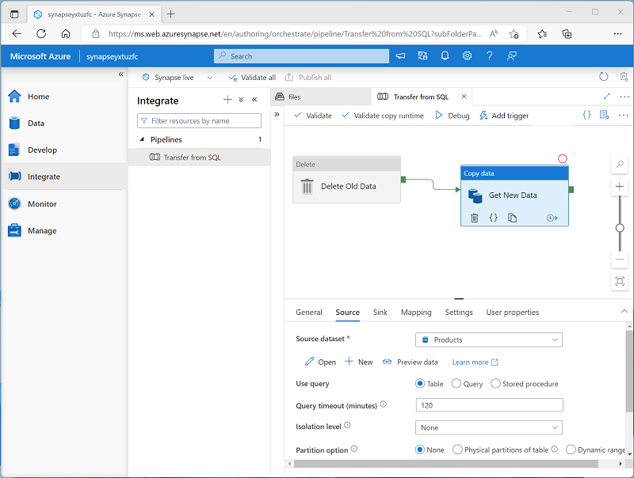
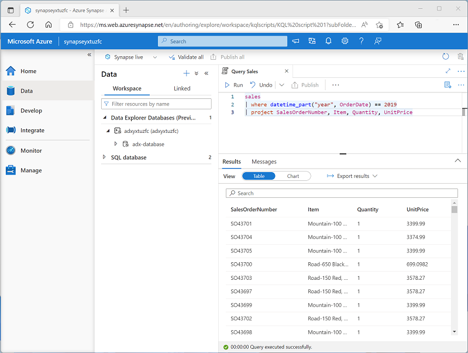

# Introduction to Azure Synapse Analytics

## Learning Objetives

In this module, you'll learn how to:

 - Identify the business problems that Azure Synapse Analytics addresses.
 - Describe core capabilities of Azure Synapse Analytics.
 - Determine when to use Azure Synapse Analytics.

## Introduction

The volume of data generated by individuals and organizations is growing at a phenomenal rate. This data powers businesses and other organizations by providing a basis for descriptive, diagnostic, predictive, and prescriptive analytical solutions that support decision making and autonomous systems by providing real-time insights into established and emerging patterns.

Organizations have a choice of many tools and techniques for data analytics, often requiring expertise across multiple systems and complex integration of infrastructure and administrative operations. **Azure Synapse Analytics provides a single, cloud-scale platform that supports multiple analytical technologies**; enabling a consolidated and integrated experience for data engineers, data analysts, data scientists, and other professionals who need to work with data.

In this module, you'll learn how to:

 - Identify the business problems that Azure Synapse Analytics addresses.
 - Describe core capabilities of Azure Synapse Analytics.
 - Determine when to use Azure Synapse Analytics.

## What is Azure Synapse Analytics

The technological research and consulting firm Gartner defines four common types of analytical technique that organizations commonly use:

 - **Descriptive analytics**, which answers the question “**What is happening** in my business?”. The data to answer this question is typically answered through the creation of a data warehouse in which historical data is persisted in relational tables for multidimensional modeling and reporting.

 - **Diagnostic analytics**, which deals with answering the question “**Why is it happening?**”. This may involve exploring information that already exists in a data warehouse, but typically involves a wider search of your data estate to find more data to support this type of analysis.

 - **Predictive analytics**, which enables you to answer the question “**What is likely to happen** in the future based on previous trends and patterns?”

 - **Prescriptive analytics**, which **enables autonomous decision making** based on real-time or near real-time analysis of data, using predictive analytics.


<a href="#">
    
</a>

**Azure Synapse Analytics provides a cloud platform for all of these analytical workloads through support for multiple data storage, processing, and analysis technologies in a single, integrated solution**. The integrated design of Azure Synapse Analytics enables organizations to leverage investments and skills in multiple commonly used data technologies, including SQL, Apache Spark, and others; while providing a centrally managed service and a single, consistent user interface.

## How Azure Synapse Analytics works

To support the analytics needs of today's organizations, Azure Synapse Analytics combines a centralized service for data storage and processing with an extensible architecture through which linked services enable you to integrate commonly used data stores, processing platforms, and visualization tools.

### Creating and using an Azure Synapse Analytics workspace

**A Synapse Analytics workspace** defines an instance of the Synapse Analytics service in which you can manage the services and data resources needed for your analytics solution. You can **create a Synapse Analytics workspace in an Azure subscription interactively by using the Azure portal**, or you **can automate deployment by using Azure PowerShell, the Azure command-line interface (CLI), or with an Azure Resource Manager or Bicep template**.

After creating a Synapse Analytics workspace, you can **manage the services in it and perform data analytics tasks with them by using Synapse Studio**; a web-based portal for Azure Synapse Analytics.

<a href="#">
    
</a>

### Working with files in a data lake

One of the core resources in a Synapse Analytics workspace is a **data lake**, in which data files can be stored and processed at scale. A w**orkspace typically has a default data lake**, which is implemented **as a linked service to an Azure Data Lake Storage Gen2 container**. **You can add linked services for multiple data lakes** that are based on different storage platforms as required.

<a href="#">
    
</a>

### Ingesting and transforming data with pipelines

In most enterprise data analytics solutions, data is extracted from multiple operational sources and transferred to a central data lake or data warehouse for analysis. Azure Synapse Analytics includes built-in support for creating, running, and managing pipelines that orchestrate the activities necessary to retrieve data from a range of sources, transform the data as required, and load the resulting transformed data into an analytical store.

<a href="#">
    
</a>

#### Note:

    Pipelines in Azure Synapse Analytics are based on the same underlying technology as Azure Data Factory. If you are already familiar with Azure Data Factory, you can leverage your existing skills to build data ingestion and transformation solutions in Azure Synapse Analytics.

### Querying and manipulating data with SQL

Structured Query Language (SQL) is a ubiquitous language for querying and manipulating data, and is the foundation for relational databases, including the popular **Microsoft SQL Server database** platform. **Azure Synapse Analytics supports SQL-based data querying and manipulation** through two kinds of SQL pool that are based on the SQL Server relational database engine:

 - A built-in serverless pool that is optimized for using relational SQL semantics to query file-based data in a data lake.
 - Custom dedicated SQL pools that host relational data warehouses.

The **Azure Synapse SQL** system uses a distributed **query processing model to parallelize SQL operations**, resulting in a highly scalable solution for relational data processing. You can use the built-in serverless pool for cost-effective analysis and processing of file data in the data lake, and use dedicated SQL pools to create relational data warehouses for enterprise data modeling and reporting.

<a href="#">
    
</a>

### Processing and analyzing data with Apache Spark

**Apache Spark** is an open source platform **for big data analytics**. Spark performs **distributed processing of files in a data lake** by running jobs that can be implemented using any of a range of supported programming languages. **Languages supported in Spark include Python, Scala, Java, SQL, and C#**.

In **Azure Synapse Analytics, you can create one or more Spark pools** and **use interactive notebooks** to combine code and notes as you build solutions for data analytics, machine learning, and data visualization.

<a href="#">
    
</a>


### Exploring data with Data Explorer

**Azure Synapse Data Explorer** is a **data processing engine** in Azure Synapse Analytics that is based on the Azure Data Explorer service. Data Explorer **uses an intuitive query syntax named Kusto Query Language (KQL)** to enable high performance, low-latency analysis of batch and streaming data.

<a href="#">
    
</a>

### Integrating with other Azure data services

Azure Synapse Analytics can be integrated with other Azure data services for end-to-end analytics solutions. Integrated solutions include:

 - **Azure Synapse Link** enables near-realtime synchronization between operational data in Azure Cosmos DB, Azure SQL Database, SQL Server, and Microsoft Power Platform Dataverse and analytical data storage that can be queried in Azure Synapse Analytics.
 - **Microsoft Power BI** integration enables data analysts to integrate a **Power BI workspace into a Synapse workspace**, and perform interactive data visualization in Azure Synapse Studio.
 - **Microsoft Purview** integration **enables organizations to catalog data assets in Azure Synapse Analytics**, and makes it easier for data engineers to find data assets and track data lineage when implementing data pipelines that ingest data into Azure Synapse Analytics.
 - **Azure Machine Learning** integration enables data analysts and data scientists to integrate **predictive model training** and consumption into analytical solutions.

## When to use Azure Synapse Analytics

Across all organizations and industries, the common use cases for Azure Synapse Analytics are identified by the need for:

### Large-scale data warehousing

Data warehousing includes the need to integrate all data, including big data, to reason over data for analytics and reporting purposes from a descriptive analytics perspective, independent of its location or structure.

### Advanced analytics

Enables organizations to perform predictive analytics using both the native features of Azure Synapse Analytics, and integrating with other technologies such as Azure Machine Learning.

### Data exploration and discovery

The serverless SQL pool functionality provided by Azure Synapse Analytics enables Data Analysts, Data Engineers and Data Scientist alike to explore the data within your data estate. This capability supports data discovery, diagnostic analytics, and exploratory data analysis.

### Real time analytics

Azure Synapse Analytics can capture, store and analyze data in real-time or near-real time with features such as Azure Synapse Link, or through the integration of services such as Azure Stream Analytics and Azure Data Explorer.

### Data integration

Azure Synapse Pipelines enables you to ingest, prepare, model and serve the data to be used by downstream systems. This can be used by components of Azure Synapse Analytics exclusively.

### Integrated analytics

With the variety of analytics that can be performed on the data at your disposal, putting together the services in a cohesive solution can be a complex operation. Azure Synapse Analytics removes this complexity by integrating the analytics landscape into one service. That way you can spend more time working with the data to bring business benefit, than spending much of your time provisioning and maintaining multiple systems to achieve the same outcomes.

## Exercise - Explore Azure Synapse Analytics

Now it's your chance to explore the capabilities of Azure Synapse Analytics for yourself. In this exercise, you'll use a provided script to provision an Azure Synapse Analytics workspace in your Azure subscription; and then use Azure Synapse Studio to perform core data analytics tasks.

#### Note:

 To [complete this lab](https://microsoftlearning.github.io/dp-203-azure-data-engineer/Instructions/Labs/01-Explore-Azure-Synapse.html), you will need an Azure subscription in which you have administrative access.


### Provision an Azure Synapse Analytics workspace

An Azure Synapse Analytics workspace provides a central point for managing data and data processing runtimes. You can provision a workspace using the interactive interface in the Azure portal, or you can deploy a workspace and resources within it by using a script or template. In most production scenarios, **it’s best to automate provisioning with scripts and templates** so that you can incorporate resource deployment into a repeatable **development and operations (DevOps) process**.

In this exercise, you’ll use a combination of a **PowerShell script and an ARM template** to provision Azure Synapse Analytics.

 1) In a web browser, sign into the [Azure portal](https://portal.azure.com).
 2) Use the [>_] button to the right of the search bar at the top of the page to create a **new Cloud Shell** in the Azure portal, **selecting a PowerShell environment** and creating storage if prompted. The cloud shell provides a command line interface in a pane at the bottom of the Azure portal, as shown here:

<a href="#">
    
</a>

#### Note:
 If you have previously created a cloud shell that uses a Bash environment, use the the drop-down menu at the top left of the cloud shell pane to change it to PowerShell.

 3) Note that you can resize the cloud shell by dragging the separator bar at the top of the pane, or by using the —, ◻, and X icons at the top right of the pane to minimize, maximize, and close the pane. For more information about using the Azure Cloud Shell, see the [Azure Cloud Shell documentation](https://learn.microsoft.com/en-us/azure/cloud-shell/overview).

 4) In the PowerShell pane, enter the following commands to **clone this repo**:

 ```powershell
    rm -r dp-203 -f
    git clone https://github.com/MicrosoftLearning/dp-203-azure-data-engineer dp-203
 ```

 5) After the repo has been cloned, enter the following commands to change to the folder for this exercise and **run the setup.ps1 script** it contains:

 ```powershell
    cd dp-203/Allfiles/labs/01
    ./setup.ps1
 ```

 6) If prompted, choose which subscription you want to use (this will only happen if you have access to multiple Azure subscriptions).

 7) When prompted, **enter a suitable password** to be set for your Azure Synapse SQL pool. **Be sure to remember this password! Additionally, the password cannot contain all or part of the login name**.
