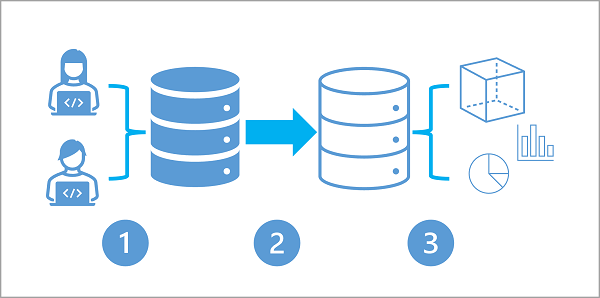
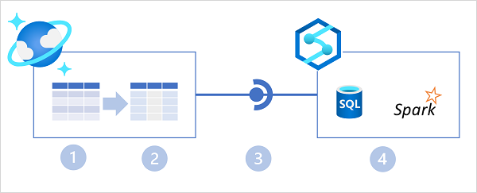
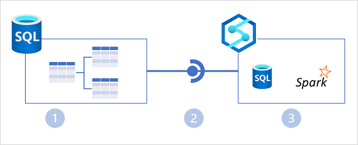
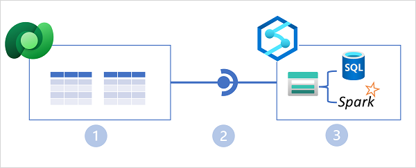

# Plan hybrid transactional and analytical processing using Azure Synapse Analytics

Learn how hybrid transactional / analytical processing (HTAP) can help you perform operational analytics with Azure Synapse Analytics.

## Learning objectives

After completing this module, you'll be able to:

 - Describe Hybrid Transactional / Analytical Processing patterns.
 - Identify Azure Synapse Link services for HTAP.

## Introduction

**Hybrid Transactional / Analytical Processing (HTAP)** **is a style of data processing that combines transactional data processing**, such as is typically found in a business application, **with analytical processing**, such as is used in a business intelligence (BI) or reporting solution. The data access patterns and storage optimizations used in these two kinds of workload are very different, so usually a complex extract, transform, and load (ETL) process is required to copy data out of transactional systems and into analytical systems; adding complexity and latency to data analysis. **In an HTAP solution, the transactional data is replicated automatically**, with low-latency, **to an analytical store**, where it can be queried without impacting the performance of the transactional system.

In Azure Synapse Analytics, HTAP capabilities are provided by multiple Azure Synapse Link services, each connecting a commonly used transactional data store to your Azure Synapse Analytics workspace and making the data available for processing using Spark or SQL.

## Understand hybrid transactional and analytical processing patterns

Many business application architectures separate transactional and analytical processing into separate systems with data stored and processed on separate infrastructures. These infrastructures are commonly referred to as **OLTP (online transaction processing)** systems working with operational data, and **OLAP (online analytical processing)** systems working with historical data, with each system is optimized for their specific task.

OLTP systems are optimized for dealing with discrete system or user requests immediately and responding as quickly as possible.

OLAP systems are optimized for the analytical processing, ingesting, synthesizing, and managing large sets of historical data. The data processed by OLAP systems largely originates from OLTP systems and needs to be loaded into the OLAP systems by ETL (Extract, Transform, and Load) batch processes.

Due to their complexity and the need to physically copy large amounts of data, this approach creates a delay in data being available to analyze in OLAP systems.

### Hybrid Transactional / Analytical Processing (HTAP)

As more businesses move to digital processes, they increasingly recognize the value of being able to respond to opportunities by making faster and well-informed decisions. **HTAP (Hybrid Transactional/Analytical processing) enables business to run advanced analytics in near-real-time on data stored and processed by OLTP systems**.

The following diagram illustrates the generalized pattern of an HTAP architecture:

 1. A business application processes user input and stores data in a transactional database that is optimized for a mix of data reads and writes based on the application's expected usage profile.
 2. The application data is automatically replicated to an analytical store with low latency.
 3. The analytical store supports data modeling, analytics, and reporting without impacting the transactional system.

## Describe Azure Synapse Link

**HTAP solutions are supported** in Azure Synapse Analytics **through Azure Synapse Link**; a general term for a set of linked services that support HTAP data synchronization into your Azure Synapse Analytics workspace.

## Azure Synapse Link for Cosmos DB

**Azure Cosmos DB** **is a** global-scale **NoSQL data service** in Microsoft Azure that enables applications **to store and access operational data by using** a choice of application programming interfaces **(APIs)**.

Azure Synapse Link for Azure Cosmos DB is a cloud-native HTAP capability that enables you to run near-real-time analytics over operational data stored in a Cosmos DB container. Azure Synapse Link creates a tight seamless integration between Azure Cosmos DB and Azure Synapse Analytics.

In the diagram above, the following key features of the Azure Synapse Link for Cosmos DB architecture are illustrated:

 1. An Azure Cosmos DB container provides a row-based transactional store that is optimized for read/write operations.
 2. The container also provides a column-based analytical store that is optimized for analytical workloads. A fully managed autosync process keeps the data stores in sync.
 3. Azure Synapse Link provides a linked service that connects the analytical store enabled container in Azure Cosmos DB to an Azure Synapse Analytics workspace.
 4. Azure Synapse Analytics provides Synapse SQL and Apache Spark runtimes in which you can run code to retrieve, process, and analyze data from the Azure Cosmos DB analytical store without impacting the transactional data store in Azure Cosmos DB.

### Azure Synapse Link for SQL

**Microsoft SQL Server** is a popular relational database system that powers business applications in some of the world's largest organizations. **Azure SQL Database is** a cloud-based platform-as-a-service database solution **based on SQL Server**. Both of these relational database solutions are commonly used as operational data stores.

**Azure Synapse Link for SQL enables HTAP integration** between data in SQL Server or Azure SQL Database and an Azure Synapse Analytics workspace.

In the diagram above, the following key features of the Azure Synapse Link for SQL architecture are illustrated:

 1. An Azure SQL Database or SQL Server instance contains a relational database in which transactional data is stored in tables.
 2. Azure Synapse Link for SQL replicates the table data to a dedicated SQL pool in an Azure Synapse workspace.
 3. The replicated data in the dedicated SQL pool can be queried in the dedicated SQL pool, or connected to as an external source from a Spark pool without impacting the source database.

### Azure Synapse Link for Dataverse

**Microsoft Dataverse is data storage service within the Microsoft Power Platform**. You can use Dataverse to store business data in tables that are accessed by Power Apps, Power BI, Power Virtual Agents, and other applications and services across Microsoft 365, Dynamics 365, and Azure.

A**zure Synapse Link for Dataverse enables HTAP integration by **replicating** table data to Azure Data Lake storage**, where it can be accessed by runtimes in Azure Synapse Analytics - either directly from the data lake or through a Lake Database defined in a serverless SQL pool.

In the diagram above, the following key features of the Azure Synapse Link for Dataverse architecture are illustrated:

 1. Business applications store data in Microsoft Dataverse tables.
 2. Azure Synapse Link for Dataverse replicates the table data to an Azure Data Lake Gen2 storage account associated with an Azure Synapse workspace.
 3. The data in the data lake can be used to define tables in a lake database and queried using a serverless SQL pool, or read directly from storage using SQL or Spark.

## Knowledge check

1. Which of the following descriptions matches a hybrid transactional/analytical processing (HTAP) architecture.  

    - [ ] Business applications store data in an operational data store, which is also used to support analytical queries for reporting.
    - [x] Business applications store data in an operational data store, which is synchronized with low latency to a separate analytical store for reporting and analysis.
    - [ ] Business applications store operational data in an analytical data store that is optimized for queries to support reporting and analysis.

2. You want to use Azure Synapse Analytics to analyze operational data stored in a Cosmos DB for NoSQL container. Which Azure Synapse Link service should you use?

    - [ ] Azure Synapse Link for SQL
    - [ ] Azure Synapse Link for Dataverse
    - [x] Azure Synapse Link for Azure Cosmos DB

3. You plan to use Azure Synapse Link for Dataverse to analyze business data in your Azure Synapse Analytics workspace. Where is the replicated data from Dataverse stored? 

    - [ ] In an Azure Synapse dedicated SQL pool
    - [x] In an Azure Data Lake Gen2 storage container.
    - [ ] In an Azure Cosmos DB container.

