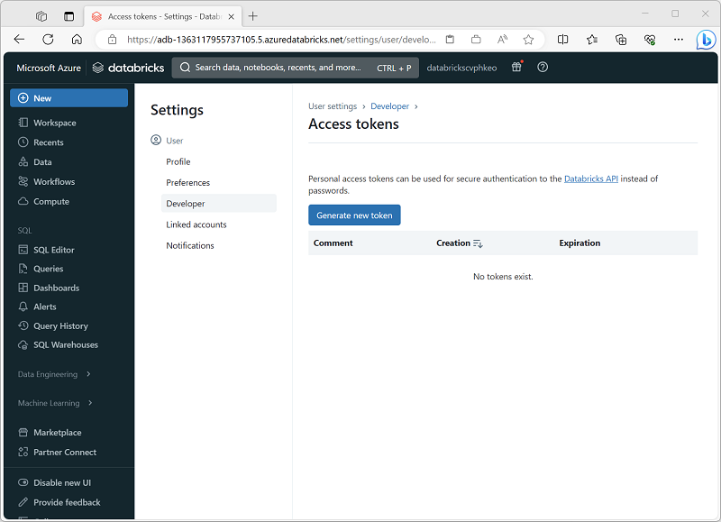
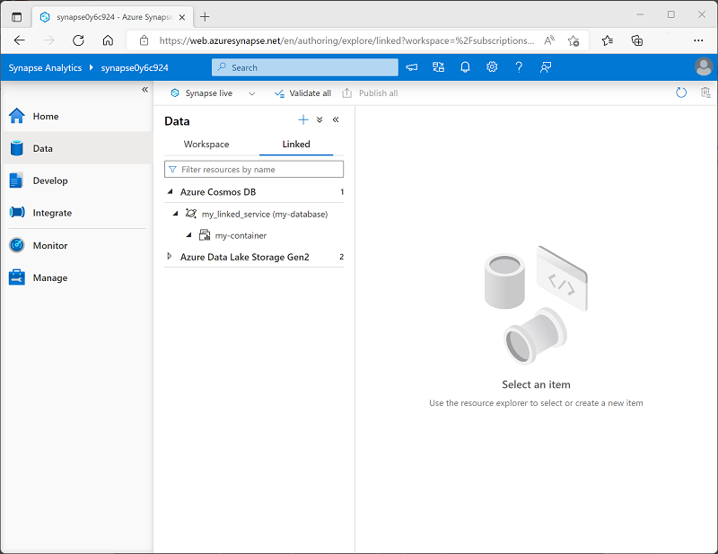
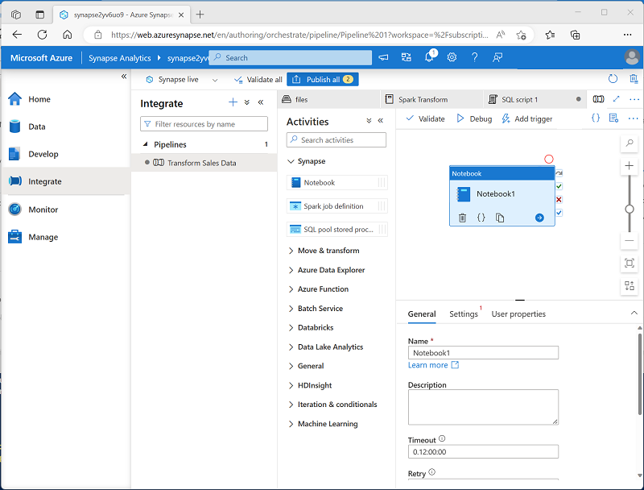
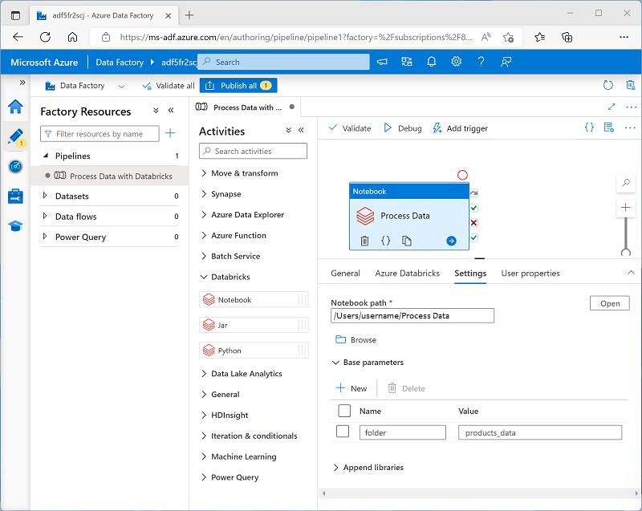

# Run Azure Databricks Notebooks with Azure Data Factory

Using pipelines in Azure Data Factory to run notebooks in Azure Databricks enables you to automate data engineering processes at cloud scale.

## Learning objectives

In this module, you'll learn how to:

 - Describe how Azure Databricks notebooks can be run in a pipeline.
 - Create an Azure Data Factory linked service for Azure Databricks.
 - Use a Notebook activity in a pipeline.
 - Pass parameters to a notebook.

## Create a linked service for Azure Databricks

***To run notebooks in an Azure Databricks workspace, the Azure Data Factory pipeline must be able to connect to the workspace***; which requires authentication. To enable this authenticated connection, you must perform two configuration tasks:

 1. Generate an access token for your Azure Databricks workspace.
 2. Create a linked service in your Azure Data Factory resource that uses the access token to connect to Azure Databricks.

### Generating an access token

An access token provides an authentication method for Azure Databricks as an alternative to credentials on the form of a user name and password. You can generate access tokens for applications, specifying an expiration period after which the token must be regenerated and updated in the client applications.

To create an Access token, use the **Generate new token** option on the **Developer** tab of the **User Settings** page in Azure Databricks portal.

<a href="#">
    
</a>

### Creating a linked service

To connect to Azure Databricks from Azure Data Factory, ***you need to create a linked service for Azure Databricks compute***. You can create a linked service in the Linked services page in the Manage section of Azure Data Factory Studio.

<a href="#">
    
</a>

When you create an Azure Databricks linked service, you must specify the following configuration settings:

Setting	 | Description
---	 | ---
Name	 | A unique name for the linked service
Description | 	A meaningful description
Integration runtime | 	The integration runtime used to run activities in this linked service. See Integration runtime in Azure Data Factory for more details.
Azure subscription	 | The Azure subscription in which Azure Databricks is provisioned
Databricks workspace	 | The Azure Databricks workspace
Cluster	 | The Spark cluster on which activity code will be run. You can have Azure Databricks dynamically provision a job cluster on-demand or you can specify an existing cluster in the workspace.
Authentication type	 | How the linked connection will be authenticated by Azure Databricks. For example, using an access token (in which case, you need to specify the access token you generated for your workspace).
Cluster configuration | 	The Databricks runtime version, Python version, worker node type, and number of worker nodes for your cluster.

## Use a Notebook activity in a pipeline

After you've created a linked service in Azure Data Factory for your Azure Databricks workspace, you can use it to define the connection for a **Notebook** activity in a pipeline.

To use a **Notebook** ***activity***, create a pipeline and from the **Databricks** category, add a **Notebook** activity to the pipeline designer surface.


<a href="#">
    
</a>

Use the following properties of the **Notebook** activity to configure it:

Category |	Setting |	Descriptions
--- |	--- |	---
General	| Name	| A unique name for the activity.
`` | Description	| A meaningful description.
`` | Timeout	| How long the activity should run before automatically canceling.
`` | Retries	| How many times should Azure Data Factory try before failing.
`` | Retry interval	| How long to wait before retrying.
`` | Secure input and output |	Determines if input and output values are logged.
Azure Databricks |	Azure Databricks linked service	| The linked service for the Azure Databricks workspace containing the notebook.
Settings	| Notebook path |	The path to the notebook file in the Workspace.
`` | Base parameters	| Used to pass parameters to the notebook.
`` | Append libraries	| Required code libraries that aren't installed by default.
User properties	| `` | 	Custom user-defined properties.

### Running a pipeline

When the pipeline containing the **Notebook** activity is published, you can run it by defining a ***trigger***. You can then monitor pipeline runs in the **Monitor** section of Azure Data Factory Studio.

## Use parameters in a notebook

You can use parameters to pass variable values to a notebook from the pipeline. Parameterization enables greater flexibility than using hard-coded values in the notebook code.

### Using parameters in a notebook

To define and use parameters in a notebook, use the ``dbutils.widgets`` library in your notebook code.

For example, the following Python code defines a variable named **folder** and assigns a default value of data:

```python
dbutils.widgets.text("folder", "data")
```

To retrieve a parameter value, use the get function, like this:

```python
folder = dbutils.widgets.get("folder")
```

The ``get`` function will retrieve the value for the specific parameter that was passed to the notebook. If no such parameter was passed, it will get the default value of the variable you declared previously.

#### Passing output values

In addition to using parameters that can be passed in to a notebook, you can pass values out to the calling application by using the ``notebook.exit`` function, as shown here:

```python
path = "dbfs:/{0}/products.csv".format(folder)
dbutils.notebook.exit(path)
```

### Setting parameter values in a pipeline

To pass parameter values to a **Notebook** activity, add each parameter to the activity's **Base parameters**, as shown here:

<a href="#">
    
</a>

In this example, the parameter value is explicitly specified as a property of the **Notebook** activity. You could also define a *pipeline* parameter and assign its value dynamically to the **Notebook** activity's base parameter; adding a further level of abstraction.

#### Tip

For more information about using parameters in Azure Data Factory, see [How to use parameters, expressions and functions in Azure Data Factory in the Azure Data Factory documentation](https://learn.microsoft.com/en-us/azure/data-factory/how-to-expression-language-functions).

## Exercise - Run an Azure Databricks Notebook with Azure Data Factory

<a href="https://microsoftlearning.github.io/mslearn-databricks/Instructions/Exercises/05-Azure-Databricks-Data-Factory.html" target="_blank">
    Exercise
</a>

## Knowledge check

1. You want to connect to an Azure Databricks workspace from Azure Data Factory. What must you define in Azure Data Factory?

    - [ ] A global parameter
    - [x] A linked service
    - [ ] A customer managed key

2. You need to run a notebook in the Azure Databricks workspace referenced by a linked service. What type of activity should you add to a pipeline? 

    - [x] Notebook
    - [ ] Python
    - [ ] Jar

3. You need to use a parameter in a notebook. Which library should you use to define parameters with default values and get parameter values that are passed to the notebook? 
    
    - [ ] notebook
    - [ ] argparse
    - [x] dbutils.widget