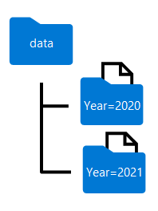

# Transform data with Spark in Azure Synapse Analytics

Data engineers commonly need to transform large volumes of data. Apache Spark pools in Azure Synapse Analytics provide a distributed processing platform that they can use to accomplish this goal.

## Learning objectives

In this module, you will learn how to:

 - Use Apache Spark to modify and save dataframes
 - Partition data files for improved performance and scalability.
 - Transform data with SQL

## Introduction

Apache Spark provides a powerful platform for performing data cleansing and transformation tasks on large volumes of data. By using the Spark dataframe object, you can easily load data from files in a data lake and perform complex modifications. You can then save the transformed data back to the data lake for downstream processing or ingestion into a data warehouse.

Azure Synapse Analytics provides Apache Spark pools that you can use to run Spark workloads to transform data as part of a data ingestion and preparation workload. You can use natively supported notebooks to write and run code on a Spark pool to prepare data for analysis. You can then use other Azure Synapse Analytics capabilities such as SQL pools to work with the transformed data.

## Modify and save dataframes

Apache Spark provides the dataframe object as the primary structure for working with data. You can use dataframes to query and transform data, and persist the results in a data lake. To load data into a dataframe, you use the **spark.read** function, specifying the file format, path, and optionally the schema of the data to be read. For example, the following code **loads data** from all **.csv files in** the **orders** folder into a dataframe named **order_details** and then displays the first five records.

```py
order_details = spark.read.csv('/orders/*.csv', header=True, inferSchema=True)
display(order_details.limit(5))
```

### Transform the data structure

After loading the source data into a dataframe, you can use the dataframe object's methods and Spark functions to transform it. Typical operations on a dataframe include:

 - Filtering rows and columns
 - Renaming columns
 - Creating new columns, often derived from existing ones
 - Replacing null or other values

In the following example, the code uses the split function to separate the values in the **CustomerName** column into two new columns named **FirstName** and **LastName**. Then it uses the drop method to delete the original **CustomerName** column.

```py
from pyspark.sql.functions import split, col

# Create the new FirstName and LastName fields
transformed_df = order_details.withColumn("FirstName", split(col("CustomerName"), " ").getItem(0)).withColumn("LastName", split(col("CustomerName"), " ").getItem(1))

# Remove the CustomerName field
transformed_df = transformed_df.drop("CustomerName")

display(transformed_df.limit(5))
```

You can use the full power of the Spark SQL library to transform the data by filtering rows, deriving, removing, renaming columns, and any applying other required data modifications.

### Save the transformed data

After your dataFrame is in the required structure, you can save the results to a supported format in your data lake.

The following code example saves the dataFrame into a parquet file in the data lake, replacing any existing file of the same name.

```py
transformed_df.write.mode("overwrite").parquet('/transformed_data/orders.parquet')
print ("Transformed data saved!")
```

 Note: The Parquet format is typically preferred for data files that you will use for further analysis or ingestion into an analytical store. Parquet is a very efficient format that is supported by most large scale data analytics systems. In fact, sometimes your data transformation requirement may simply be to convert data from another format (such as CSV) to Parquet!

## Partition data files

Partitioning is an optimization technique that enables spark to maximize performance across the worker nodes. More performance gains can be achieved when filtering data in queries by eliminating unnecessary disk IO.

### Partition the output file

To save a dataframe as a partitioned set of files, use the **partitionBy** method when writing the data.

The following example creates a derived **Year** field. Then uses it to partition the data.

```py
from pyspark.sql.functions import year, col

# Load source data
df = spark.read.csv('/orders/*.csv', header=True, inferSchema=True)

# Add Year column
dated_df = df.withColumn("Year", year(col("OrderDate")))

# Partition by year
dated_df.write.partitionBy("Year").mode("overwrite").parquet("/data")
```

The folder names generated when partitioning a dataframe include the partitioning column name and value in a **column=value** format, as shown here:

<a href="#">
    
</a>

 Note: You can partition the data by multiple columns, which results in a hierarchy of folders for each partitioning key. For example, you could partition the order in the example by year and month, so that the folder hierarchy includes a folder for each year value, which in turn contains a subfolder for each month value.

### Filter parquet files in a query

When reading data from parquet files into a dataframe, you have the ability to pull data from any folder within the hierarchical folders. This filtering process is done with the use of explicit values and wildcards against the partitioned fields.

In the following example, the following code will pull the sales orders, which were placed in 2020.

```py
orders_2020 = spark.read.parquet('/partitioned_data/Year=2020')
display(orders_2020.limit(5))
```

 Note: The partitioning columns specified in the file path are omitted in the resulting dataframe. The results produced by the example query would not include a Year column - all rows would be from 2020.

## Transform data with SQL

The SparkSQL library, which provides the dataframe structure also enables you to use SQL as a way of working with data. With this approach, You can query and transform data in dataframes by using SQL queries, and persist the results as tables.

 Note: Tables are metadata abstractions over files. The data is not stored in a relational table, but the table provides a relational layer over files in the data lake.

### Define tables and views

Table definitions in Spark are stored in the metastore, a metadata layer that encapsulates relational abstractions over files. External tables are relational tables in the metastore that reference files in a data lake location that you specify. You can access this data by querying the table or by reading the files directly from the data lake.

 Note: External tables are "loosely bound" to the underlying files and deleting the table does not delete the files. This allows you to use Spark to do the heavy lifting of transformation then persist the data in the lake. After this is done you can drop the table and downstream processes can access these optimized structures. You can also define managed tables, for which the underlying data files are stored in an internally managed storage location associated with the metastore. Managed tables are "tightly-bound" to the files, and dropping a managed table deletes the associated files.

The following code example saves a dataframe (loaded from CSV files) as an external table name sales_orders. The files are stored in the /sales_orders_table folder in the data lake.

```py
order_details.write.saveAsTable('sales_orders', format='parquet', mode='overwrite', path='/sales_orders_table')
```

### Use SQL to query and transform the data

After defining a table, you can use of SQL to query and transform its data. The following code creates two new derived columns named Year and Month and then creates a new table transformed_orders with the new derived columns added.

```py
# Create derived columns
sql_transform = spark.sql("SELECT *, YEAR(OrderDate) AS Year, MONTH(OrderDate) AS Month FROM sales_orders")

# Save the results
sql_transform.write.partitionBy("Year","Month").saveAsTable('transformed_orders', format='parquet', mode='overwrite', path='/transformed_orders_table')
```

The data files for the new table are stored in a hierarchy of folders with the format of **Year=*NNNN* / Month=*N***, with each folder containing a parquet file for the corresponding orders by year and month.

### Query the metastore

Because this new table was created in the metastore, you can use SQL to query it directly with the **%%sql** magic key in the first line to indicate that the SQL syntax will be used as shown in the following script:

```sql
%%sql

SELECT * FROM transformed_orders
WHERE Year = 2021
    AND Month = 1
```

### Drop tables

When working with external tables, you can use the DROP command to delete the table definitions from the metastore without affecting the files in the data lake. This approach enables you to clean up the metastore after using SQL to transform the data, while making the transformed data files available to downstream data analysis and ingestion processes.

```sql
%%sql

DROP TABLE transformed_orders;
DROP TABLE sales_orders;
```

## Exercise: Transform data with Spark in Azure Synapse Analytics

Now it's your chance to use Spark to transform data for yourself. In this exercise, you’ll use a Spark notebook in Azure Synapse Analytics to transform data in files.

### Transform data using Spark in Synapse Analytics

Data engineers often use Spark notebooks as one of their preferred tools to perform extract, transform, and load (ETL) or extract, load, and transform (ELT) activities that transform data from one format or structure to another.

In this exercise, you’ll use a Spark notebook in Azure Synapse Analytics to transform data in files.

### Provision an Azure Synapse Analytics workspace

You’ll need an Azure Synapse Analytics workspace with access to data lake storage. You can use the built-in serverless SQL pool to query files in the data lake.

In this exercise, you’ll use a combination of a PowerShell script and an ARM template to provision an Azure Synapse Analytics workspace.

 1) Sign into the Azure portal at [Azure Portal link](https://portal.azure.com).

 2) Use the **[>_]** button to the right of the search bar at the top of the page to create a new Cloud Shell in the Azure portal, selecting a **PowerShell** environment and creating storage if prompted. The cloud shell provides a command line interface in a pane at the bottom of the Azure portal, as shown here:

<a href="#">
    
</a>

    NOTE: If you have previously created a cloud shell that uses a Bash environment, use the the drop-down menu at the top left of the cloud shell pane to change it to PowerShell.

 3) Note that you can resize the cloud shell by dragging the separator bar at the top of the pane, or by using the **—**, **◻**, and **X** icons at the top right of the pane to minimize, maximize, and close the pane. For more information about using the Azure Cloud Shell, see the [Azure Cloud Shell documentation](https://learn.microsoft.com/en-us/azure/cloud-shell/overview).

 4) In the PowerShell pane, enter the following commands to clone this repo:

```bash
 rm -r dp-203 -f
 git clone https://github.com/MicrosoftLearning/dp-203-azure-data-engineer dp-203
```

 5) After the repo has been cloned, enter the following commands to change to the folder for this exercise and run the **setup.ps1** script it contains:

```bash
 cd dp-203/Allfiles/labs/06
 ./setup.ps1
```

 6) **If prompted**, choose which subscription you want to use (this will only happen if you have access to multiple Azure subscriptions).

 7) When prompted,**enter a suitable password** to be set for your Azure Synapse SQL pool.

    NOTE: Be sure to remember this password!

 8) Wait for the script to complete - this typically takes around 10 minutes, but in some cases may take longer. While you are waiting, review the[ Apache Spark in Azure Synapse Analytics Core Concepts](https://learn.microsoft.com/en-us/azure/synapse-analytics/spark/apache-spark-concepts) article in the Azure Synapse Analytics documentation.

### Use a Spark notebook to transform data

 1) After the deployment script has completed, in the Azure portal, go to the **dp203-xxxxxxx** resource group that it created, and notice that this resource group contains your Synapse workspace, a Storage account for your data lake, and an Apache Spark pool.
 2) Select your Synapse workspace, and in its **Overview** page, in the **Open Synapse Studio** card, select **Open** to open Synapse Studio in a new browser tab; signing in if prompted.
 3) On the left side of Synapse Studio, use the **››** icon to expand the menu - this reveals the different pages within Synapse Studio that you’ll use to manage resources and perform data analytics tasks.
 4) On the **Manage** page, select the **Apache Spark pools** tab and note that a Spark pool with a name similar to **sparkxxxxxxx** has been provisioned in the workspace.
 5) On the **Data** page, view the **Linked** tab and verify that your workspace includes a link to your Azure Data Lake Storage Gen2 storage account, which should have a name similar to **synapsexxxxxxx** (**Primary - datalakexxxxxxx**).
 6) Expand your storage account and verify that it contains a file system container named **files** (**Primary**).
 7) Select the **files** container, and note that it contains *folders* named **data** and **synapse**. The synapse folder is used by Azure Synapse, and the data folder contains the data **files** you are going to query.
 8) Open the data folder and observe that it contains .csv files for three years of sales data.
 9) Right-click any of the files and select **Preview** to see the data it contains. Note that the files contain a header row, so you can select the option to display column headers.
 10) Close the preview. Then download the **Spark Transform.ipynb** from from **Allfiles/labs/06/notebooks**

 NOTE: **It’s best to copy** this text using the **ctrl+a** then ctrl+c **and pasting** into a tool using **ctrl+v**, such as, notepad and then using file, save as Spark Transform.ipynb with a filetype of all files. You can also download the file by clicking on it, then selecting the ellipsis (…) and then download, remembering where you saved it.

 11) Then on **Develop** page, expand **Notebooks** click on the **+** Import options

<a href="#">
    
</a>

 12) Select the file you just downloaded and saved as **Spark Transfrom.ipynb**.
 13) Attach the notebook to your **sparkxxxxxxx** Spark pool.
 14) Review the notes in the **notebook** and run the code cells.

 note: The first code cell will take a few minutes to run because the Spark pool must be started. Subsequent cells will run more quickly.


## Delete Azure resources

If **you’ve finished** exploring Azure Synapse Analytics, **you should delete the resources you’ve created to avoid unnecessary Azure costs**.

 1) Close the Synapse Studio browser tab and **return to the Azure portal**.
 2) On the Azure portal, on the **Home** page, select **Resource groups**.
 3) Select the **dp203-xxxxxxx** resource group for your Synapse Analytics workspace (not the managed resource group), and verify that it contains the Synapse workspace and storage account for your workspace.
 4) At the top of the **Overview** page for your resource group, select **Delete resource group**.
 5) Enter the **dp203-xxxxxxx** resource group name to confirm you want to delete it, and select **Delete**.

After a few minutes, your Azure Synapse workspace resource group and the managed workspace resource group associated with it will be deleted.

