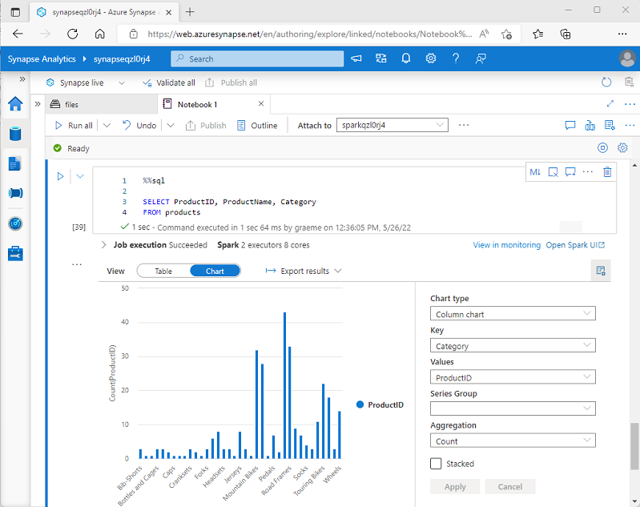

# Use Apache Spark in Azure Databricks

Azure Databricks is built on Apache Spark and enables data engineers and analysts to run Spark jobs to transform, analyze and visualize data at scale.

## Learning objectives

In this module, you'll learn how to:

 - Describe key elements of the Apache Spark architecture.
 - Create and configure a Spark cluster.
 - Describe use cases for Spark.
 - Use Spark to process and analyze data stored in files.
 - Use Spark to visualize data.

## Introduction

Azure Databricks offers a highly scalable platform for data analytics and processing using Apache Spark.

Spark is a flexible platform that supports many different programming languages and APIs. Most data processing and analytics tasks can be accomplished using the Dataframe API, which is what we'll focus on in this module.

## Get to know Spark

To gain a better understanding of how to process and analyze data with Apache Spark in Azure Databricks, it's important to understand the underlying architecture.

### High-level overview

From a high level, the Azure Databricks service launches and manages Apache Spark clusters within your Azure subscription. **Apache Spark clusters are groups of computers that are treated as a single computer and handle the execution of commands issued from notebooks**. Clusters enable ***processing of data to be parallelized*** across many computers to improve scale and performance. They consist of a Spark driver and worker nodes. The driver node sends work to the worker nodes and instructs them to pull data from a specified data source.

**In Databricks, the notebook interface is typically the driver program**. This driver program contains the main loop for the program and creates distributed datasets on the cluster, then applies operations to those datasets. Driver programs access Apache Spark through a **SparkSession** object regardless of deployment location.

<a href="#">
    
</a>

Microsoft Azure manages the cluster, and auto-scales it as needed based on your usage and the setting used when configuring the cluster. Auto-termination can also be enabled, which allows Azure to terminate the cluster after a specified number of minutes of inactivity.

### Spark jobs in detail

Work submitted to the cluster is split into as many independent jobs as needed. This is how work is distributed across the Cluster's nodes. Jobs are further subdivided into tasks. The input to a job is partitioned into one or more partitions. These partitions are the unit of work for each slot. In between tasks, partitions may need to be reorganized and shared over the network.

The secret to *Spark's high performance is parallelism*. **Scaling vertically** (by adding resources to a single computer) is limited to a finite amount of RAM, Threads and CPU speeds; **but clusters scale horizontally**, adding new nodes to the cluster as needed.

Spark parallelizes jobs at two levels:

 - The first level of parallelization is the ***executor*** - a Java virtual machine (JVM) running on a worker node, typically, one instance per node.
 - The second level of parallelization is the ***slot*** - the number of which is determined by the number of cores and CPUs of each node.
 - **Each executor has multiple slots** to which parallelized tasks can be assigned.

<a href="#">
    
</a>

The **JVM is naturally multi-threaded**, but a single JVM, such as the one coordinating the work on the driver, has a finite upper limit. By splitting the work into tasks, the driver can assign units of work to *slots in the executors on worker nodes for parallel execution. Additionally, the driver determines how to partition the data so that it can be distributed for parallel processing. So, the driver assigns a partition of data to each task so that each task knows which piece of data it is to process. Once started, each task will fetch the partition of data assigned to it.

### Jobs and stages

Depending on the work being performed, multiple parallelized jobs may be required. Each job is broken down into stages. A useful analogy is to imagine that the job is to build a house:

 - The first stage would be to lay the foundation.
 - The second stage would be to erect the walls.
 - The third stage would be to add the roof.

Attempting to do any of these steps out of order just doesn't make sense, and may in fact be impossible. Similarly, Spark breaks each job into stages to ensure everything is done in the right order.

## Create a Spark cluster

You can create one or more clusters in your Azure Databricks workspace by using the Azure Databricks portal.

<a href="#">
    
</a>

When creating the cluster, you can specify configuration settings, including:

 - A name for the cluster.
 - A cluster mode, which can be:
    - Standard: Suitable for single-user workloads that require multiple worker nodes.
    - High Concurrency: Suitable for workloads where multiple users will be using the cluster concurrently.
    - Single Node: Suitable for small workloads or testing, where only a single worker node is required.
 - The version of the Databricks Runtime to be used in the cluster; which dictates the version of Spark and individual components  - such as Python, Scala, and others that get installed.
The type of virtual machine (VM) used for the worker nodes in the cluster.
 - The minimum and maximum number of worker nodes in the cluster.
 - The type of VM used for the driver node in the cluster.
 - Whether the cluster supports autoscaling to dynamically resize the cluster.
 - How long the cluster can remain idle before being shut down automatically.

## How Azure manages cluster resources

When you create an Azure Databricks workspace, a *Databricks appliance is deployed as an Azure resource in your subscription*. When you create a cluster in the workspace, you specify the types and sizes of the virtual machines (VMs) to use for both the driver and worker nodes, and some other configuration options, but **Azure Databricks manages all other aspects of the cluster**.

The Databricks appliance is deployed into Azure as a managed resource group within your subscription. This resource group contains the driver and worker VMs for your clusters, along with other required resources, including a virtual network, a security group, and a storage account. All metadata for your cluster, such as scheduled jobs, is stored in an Azure Database with geo-replication for fault tolerance.

Internally, **Azure Kubernetes Service (AKS) is used to run the Azure Databricks control-plane and data-planes via containers** running on the latest generation of Azure hardware (Dv3 VMs), with NvMe SSDs capable of blazing 100us latency on high-performance Azure virtual machines with accelerated networking. Azure Databricks utilizes these features of Azure to further improve Spark performance. After the services within your managed resource group are ready, you can manage the Databricks cluster through the Azure Databricks UI and through features such as auto-scaling and auto-termination.

<a href="#">
    
</a>

#### Note

You also have the option of attaching your cluster to a pool of idle nodes to reduce cluster startup time. For more information, see [Pools](https://learn.microsoft.com/en-us/azure/databricks/compute/pools) in the Azure Databricks documentation.

## Use Spark in notebooks

You can run many different kinds of application on Spark, including code in Python or Scala scripts, Java code compiled as a **Java Archive (JAR)**, and others. Spark is commonly used in two kinds of workload:

 - Batch or stream processing jobs to ingest, clean, and transform data - often running as part of an automated pipeline.
 - Interactive analytics sessions to explore, analyze, and visualize data.

### Running Spark code in notebooks

Azure Databricks includes an integrated notebook interface for working with Spark. Notebooks provide an intuitive way to combine code with Markdown notes, commonly used by data scientists and data analysts. The look and feel of the integrated notebook experience within Azure Databricks is similar to that of Jupyter notebooks - a popular open source notebook platform.

<a href="#">
    
</a>

Notebooks consist of one or more cells, each containing either code or markdown. Code cells in notebooks have some features that can help you be more productive, including:

 - Syntax highlighting and error support.
 - Code auto-completion.
 - Interactive data visualizations.
 - The ability to export results.

## Use Spark to work with data files

One of the **benefits of using** **Spark is that you can write and run code in various programming languages**, enabling you to use the programming skills you already have and to use the most appropriate language for a given task. The *default language* in a new Azure Databricks Spark notebook is ***PySpark - a Spark-optimized version of Python***, which is commonly used by data scientists and analysts due to its strong support for data manipulation and visualization. Additionally, you can use languages such as ***Scala*** (a Java-derived language that can be used interactively) and ***SQL*** (a variant of the commonly used SQL language included in the Spark SQL library to work with relational data structures). Software engineers can also create compiled solutions that run on Spark using frameworks such as Java.

### Exploring data with dataframes

Natively, Spark uses a data structure called a resilient distributed dataset (RDD); but while you can write code that works directly with RDDs, the most commonly used data structure for working with structured data in Spark is the dataframe, which is provided as part of the Spark SQL library. Dataframes in Spark are similar to those in the ubiquitous Pandas Python library, but optimized to work in Spark's distributed processing environment.

#### Note

In addition to the Dataframe API, Spark SQL provides a strongly-typed Dataset API that is supported in Java and Scala. We'll focus on the Dataframe API in this module.

#### Loading data into a dataframe

Let's explore a hypothetical example to see how you can use a dataframe to work with data. Suppose you have the following data in a comma-delimited text file named products.csv in the data folder in your Databricks File System (DBFS) storage:

```csv
ProductID,ProductName,Category,ListPrice
771,"Mountain-100 Silver, 38",Mountain Bikes,3399.9900
772,"Mountain-100 Silver, 42",Mountain Bikes,3399.9900
773,"Mountain-100 Silver, 44",Mountain Bikes,3399.9900
...
```

In a Spark notebook, you could use the following PySpark code to load the data into a dataframe and display the first 10 rows:

```python
%pyspark
df = spark.read.load('/data/products.csv',
    format='csv',
    header=True
)
display(df.limit(10))
```

The ``%pyspark`` line at the beginning is called a magic, and tells Spark that the language used in this cell is PySpark. Here's the equivalent Scala code for the products data example:

```java
%spark
val df = spark.read.format("csv").option("header", "true").load("/data/products.csv")
display(df.limit(10))
```

The magic ``%spark`` is used to specify Scala.

Both of the examples shown previously would produce output like this:

ProductID	| ProductName	| Category	| ListPrice
---	| :---:	| ---	| ---:
771	| Mountain-100 Silver, 38	| Mountain Bikes	| 3399.9900
772	| Mountain-100 Silver, 42	| Mountain Bikes	| 3399.9900
773	| Mountain-100 Silver, 44	| Mountain Bikes	| 3399.9900
...	| ...	| ...	| ...

### Specifying a dataframe schema

In the previous example, the first row of the CSV file contained the column names, and Spark was able to infer the data type of each column from the data it contains. You can also specify an explicit schema for the data, which is useful when the column names aren't included in the data file, like this CSV example:

```csv
771,"Mountain-100 Silver, 38",Mountain Bikes,3399.9900
772,"Mountain-100 Silver, 42",Mountain Bikes,3399.9900
773,"Mountain-100 Silver, 44",Mountain Bikes,3399.9900
...
```

The following PySpark example shows how to specify a schema for the dataframe to be loaded from a file named product-data.csv in this format:

```python
from pyspark.sql.types import *
from pyspark.sql.functions import *

productSchema = StructType([
    StructField("ProductID", IntegerType()),
    StructField("ProductName", StringType()),
    StructField("Category", StringType()),
    StructField("ListPrice", FloatType())
    ])

df = spark.read.load('/data/product-data.csv',
    format='csv',
    schema=productSchema,
    header=False)
display(df.limit(10))
```

The results would once again be similar to:

ProductID	| ProductName	| Category	| ListPrice
---	| :---:	| ---	| ---:
771	| Mountain-100 Silver, 38	| Mountain Bikes	| 3399.9900
772	| Mountain-100 Silver, 42	| Mountain Bikes	| 3399.9900
773	| Mountain-100 Silver, 44	| Mountain Bikes	| 3399.9900
...	| ...	| ...	| ...

### Filtering and grouping dataframes

You can use the methods of the Dataframe class to filter, sort, group, and otherwise manipulate the data it contains. For example, the following code example uses the select method to retrieve the **ProductName** and **ListPrice** columns from the df dataframe containing product data in the previous example:

```python
pricelist_df = df.select("ProductID", "ListPrice")
```

The results from this code example would look something like this:

ProductID	| ListPrice
---		| ---:
771	| 3399.9900
772	| 3399.9900
773	| 3399.9900
...	|  ...

In common with most data manipulation methods, select returns a new dataframe object.

#### Tip

Selecting a subset of columns from a dataframe is a common operation, which can also be achieved by using the following shorter syntax:

``pricelist_df = df["ProductID", "ListPrice"]``

You can "chain" methods together to perform a series of manipulations that results in a transformed dataframe. For example, this example code chains the ``select`` and ``where`` methods to create a new dataframe containing the **ProductName** and **ListPrice** columns for products with a category of **Mountain Bikes** or **Road Bikes**:

```python
bikes_df = df.select("ProductName", "ListPrice").where((df["Category"]=="Mountain Bikes") | (df["Category"]=="Road Bikes"))
display(bikes_df)
```

The results from this code example would look something like this:

ProductName	| ListPrice
---		| ---:
Mountain-100 Silver, 38	| 3399.9900
Road-750 Black, 52	| 	539.9900
... | ...

To group and aggregate data, you can use the ``groupBy`` method and aggregate functions. For example, the following PySpark code counts the number of products for each category:

```python
counts_df = df.select("ProductID", "Category").groupBy("Category").count()
display(counts_df)
```

The results from this code example would look something like this:

Category	| count
:---:	| ---:
Headsets	| 3
Wheels	| 14
Mountain Bikes	| 32
...	| ...

### Using SQL expressions in Spark

The Dataframe API is part of a Spark library named Spark SQL, which enables data analysts to use SQL expressions to query and manipulate data.

#### Creating database objects in the Spark catalog

The Spark catalog is a metastore for relational data objects such as views and tables. The Spark runtime can use the catalog to seamlessly integrate code written in any Spark-supported language with SQL expressions that may be more natural to some data analysts or developers.

One of the ***simplest ways to make data in a dataframe available for querying in the Spark catalog is to create a temporary view***, as shown in the following code example:

```python
df.createOrReplaceTempView("products")
```

A view is temporary, meaning that it's automatically deleted at the end of the current session. You can also create tables that are persisted in the catalog to define a database that can be queried using Spark SQL.

##### Note

We won't explore Spark catalog tables in depth in this module, but it's worth taking the time to highlight a few key points:

 - You can create an empty table by using the ``spark.catalog.createTable method``. Tables are metadata structures that store their underlying data in the storage location associated with the catalog. Deleting a table also deletes its underlying data.
 - You can save a dataframe as a table by using its ``saveAsTable`` method.
 - You can create an external table by using the ``spark.catalog.createExternalTable`` method. External tables define metadata in the catalog but get their underlying data from an external storage location; typically a folder in a data lake. Deleting an external table does not delete the underlying data.

### Using the Spark SQL API to query data

You can use the Spark SQL API in code written in any language to query data in the catalog. For example, the following PySpark code uses a SQL query to return data from the products view as a dataframe.

```python
bikes_df = spark.sql("SELECT ProductID, ProductName, ListPrice \
                      FROM products \
                      WHERE Category IN ('Mountain Bikes', 'Road Bikes')")
display(bikes_df)
```

The results from the code example would look similar to the following table:

ProductName	 | ListPrice
---	 | ---:
Mountain-100 Silver, |  38	3399.9900
Road-750 Black, 52	 | 539.9900
...	 | ...

### Using SQL code

The previous example demonstrated how to use the Spark SQL API to embed SQL expressions in Spark code. In a notebook, you can also use the ``%sql`` magic to run SQL code that queries objects in the catalog, like this:

```sql
%sql

SELECT Category, COUNT(ProductID) AS ProductCount
FROM products
GROUP BY Category
ORDER BY Category
```

The SQL code example returns a resultset that is automatically displayed in the notebook as a table, like the one below:

Category	| ProductCount
---	| :---:
Bib-Shorts	| 3
Bike Racks	| 1
Bike Stands	| 1
...	| ...

## Visualize data

One of the most intuitive ways to analyze the results of data queries is to visualize them as charts. Notebooks in Azure Databricks provide charting capabilities in the user interface, and when that functionality doesn't provide what you need, you can use one of the many Python graphics libraries to create and display data visualizations in the notebook.

### Using built-in notebook charts

When you display a dataframe or run a SQL query in a Spark notebook in Azure Databricks, the results are displayed under the code cell. By default, results are rendered as a table, but you can also view the results as a visualization and customize how the chart displays the data, as shown here:

<a href="#">
    
</a>

The built-in visualization functionality in notebooks is useful when you want to quickly summarize the data visually. When you want to have more control over how the data is formatted, or to display values that you have already aggregated in a query, you should consider using a graphics package to create your own visualizations.

### Using graphics packages in code

There are many graphics packages that you can use to create data visualizations in code. In particular, Python supports a large selection of packages; most of them built on the base **Matplotlib** library. The output from a graphics library can be rendered in a notebook, making it easy to combine code to ingest and manipulate data with inline data visualizations and markdown cells to provide commentary.

For example, you could use the following PySpark code to aggregate data from the hypothetical products data explored previously in this module, and use Matplotlib to create a chart from the aggregated data.

```python
from matplotlib import pyplot as plt

# Get the data as a Pandas dataframe
data = spark.sql("SELECT Category, COUNT(ProductID) AS ProductCount \
                  FROM products \
                  GROUP BY Category \
                  ORDER BY Category").toPandas()

# Clear the plot area
plt.clf()

# Create a Figure
fig = plt.figure(figsize=(12,8))

# Create a bar plot of product counts by category
plt.bar(x=data['Category'], height=data['ProductCount'], color='orange')

# Customize the chart
plt.title('Product Counts by Category')
plt.xlabel('Category')
plt.ylabel('Products')
plt.grid(color='#95a5a6', linestyle='--', linewidth=2, axis='y', alpha=0.7)
plt.xticks(rotation=70)

# Show the plot area
plt.show()
```

The Matplotlib library requires data to be in a Pandas dataframe rather than a Spark dataframe, so the toPandas method is used to convert it. The code then creates a figure with a specified size and plots a bar chart with some custom property configuration before showing the resulting plot.

The chart produced by the code would look similar to the following image:

<a href="#">
    
</a>

You can use the Matplotlib library to create many kinds of chart; or if preferred, you can use other libraries such as Seaborn to create highly customized charts.

#### Note

The Matplotlib and Seaborn libraries may already be installed on Databricks clusters, depending on the Databricks Runtime for the cluster. If not, or if you want to use a different library that is not already installed, you can add it to the cluster. See [Cluster Libraries](https://learn.microsoft.com/en-us/azure/databricks/libraries/cluster-libraries) in the Azure Databricks documentation for details.

## Exercise - Use Spark in Azure Databricks

<a href="https://microsoftlearning.github.io/mslearn-databricks/Instructions/Exercises/02-Use-Spark-in-Azure-Databricks.html" target="_blank">
    Exercise
</a>

## Knowledge check

1. Which definition best describes Apache Spark? 

    - [ ] A highly scalable relational database management system.
    - [ ] A virtual server with a Python runtime.
    - [x] A distributed platform for parallel data processing using multiple languages.

2. You need to use Spark to analyze data in a parquet file. What should you do? 

    - [x] Load the parquet file into a dataframe.
    - [ ] Import the data into a table in a serverless SQL pool.
    - [ ] Convert the data to CSV format.

3. You want to write code in a notebook cell that uses a SQL query to retrieve data from a view in the Spark catalog. Which magic should you use? 

    - [ ] %%spark
    - [ ] %%pyspark
    - [x] %%sql