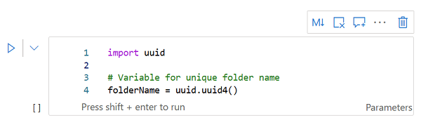
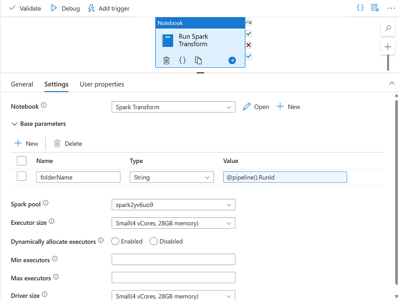

# Use Spark Notebooks in an Azure Synapse Pipeline

Apache Spark provides data engineers with a scalable, distributed data processing platform, which can be integrated into an Azure Synapse Analytics pipeline.

## Learning objectives

In this module, you will learn how to:

 - Describe notebook and pipeline integration.
 - Use a Synapse notebook activity in a pipeline.
 - Use parameters with a notebook activity.

## Introduction

With Azure Synapse Analytics pipelines, you can orchestrate data transfer and transformation activities and build data integration solutions across multiple systems. When you're working with analytical data in a data lake, Apache Spark provides a scalable, distributed processing platform that you can use to process huge volumes of data efficiently.

The **Synapse Notebook** activity **enables** you **to run data processing code in Spark notebooks as a task in a pipeline**; **making it possible to automate** big data processing and integrate it into extract, transform, and load **(ETL) workloads**.

## Understand Synapse Notebooks and Pipelines

Azure Synapse Pipelines enable you to create, run, and manage data integration and data flow activities. While many of these activities are built-into the Azure Synapse Pipeline platform and run natively in the integration runtime for your pipeline, you can also use external processing resources to perform specific tasks. One such **external resource is an Apache Spark** pool in your Azure Synapse Analytics workspace **on which you can run code in a notebook**.

It's common in big data analytics solutions for data engineers to use Spark notebooks for initial data exploration and interactive experimentation when designing data transformation processes. When the transformation logic has been completed, you can perform some final code optimization and refactoring for maintainability, and then include the notebook in a pipeline. The pipeline can then be run on a schedule or in response to an event (such as new data files being loaded into the data lake).

The notebook is run on a Spark pool, which you can configure with the appropriate compute resources and Spark runtime for your specific workload. The pipeline itself is run in an integration runtime that orchestrates the activities in the pipeline, coordinating the external services needed to run them.

### Tip

There are several best practices that can help make working with Spark notebooks more efficient and effective. Some of these include:

 - Keep your code organized: Use clear and descriptive variable and function names, and organize your code into small, reusable chunks.
 - Cache intermediate results: Spark allows you to cache intermediate results, which can significantly speed up the performance of your notebook.
 - Avoid unnecessary computations: Be mindful of the computations you are performing and try to avoid unnecessary steps. For example, if you only need a subset of your data, filter it out before running any further computations.
 - Avoid using collect() unless necessary: When working with large datasets, it is often better to perform operations on the entire dataset rather than bringing the data into the driver node using the collect() method.
 - Use Spark UI for monitoring and debugging: Spark's web-based user interface (UI) provides detailed information about the performance of your Spark jobs, including task execution times, input and output data sizes, and more.
 - Keep your dependencies version-consistent and updated: when working with Spark, it is important to keep dependencies version-consistent across your cluster and to use the latest version of Spark and other dependencies if possible.

## Use a Synapse notebook activity in a pipeline

To run a Spark notebook in a pipeline, you must **add a notebook activity** and configure it appropriately. You'll find the **Notebook** activity in the **Synapse** section of the activities pane in the Azure Synapse Analytics pipeline designer.

### Tip

To configure the notebook activity, edit the settings in the properties pane beneath the pipeline designer canvas. Notebook activity specific settings include:

 - **Notebook**: The notebook you want to run. You can select an existing notebook in your Azure Synapse Analytics workspace, or create a new one.
 - **Spark pool**: The Apache Spark pool on which the notebook should be run.
 - **Executor size**: The node size for the worker nodes in the pool, which determines the number of processor cores and the amount of memory allocated to worker nodes.
 - **Dynamically** allocate executors: Configures Spark dynamic allocation, enabling the pool to automatically scale up and down to support the workload.
 - **Min executors**: The minimum number of executors to be allocated.
 - **Max executors**: The maximum number of executors to be allocated.
 - **Driver size**: The node size for the driver node.

## Use parameters in a notebook

Parameters enable you to dynamically pass values for variables in the notebook each time it's run. This approach provides flexibility, enabling you to adjust the logic encapsulated in the notebook for each run.

### Create a parameters cell in the notebook

To define the parameters for a notebook, you declare and initialize variables in a cell, which you then configure as a **Parameters cell** by using the toggle option in the notebook editor interface.

Initializing a variable ensures that it has a default value, which will be used if the parameter isn't set in the notebook activity.

### Set base parameters for the notebook activity

After defining a parameters cell in the notebook, you can **set values to be used when the notebook is run by a notebook activity in a pipeline**. To set parameter values, *expand and edit* the **Base parameters** section of the settings for the activity.

You can assign explicit parameter values, or use an expression to assign a dynamic value. For example, the expression **@pipeline().RunId** returns the unique identifier for the current run of the pipeline.

## Exercise - Use an Apache Spark notebook in a pipeline

Now it's your chance to integrate spark into an Azure Synapse Analytics pipeline. In this exercise, you'll create a pipeline that includes a notebook activity, and configure parameters for the notebook.

<a href="https://microsoftlearning.github.io/dp-203-azure-data-engineer/Instructions/Labs/10-Synpase-pipeline.html" target="_blank">
    Exercise
</a>

## Knowledge check

1. What kind of pool is required to run a Synapse notebook in a pipeline?   

    - [ ] A Dedicated SQL pool
    - [ ] A Data Explorer pool
    - [x] An Apache Spark pool

2. What kind of pipeline activity encapsulates a Synapse notebook? 

    - [x] Notebook activity
    - [ ] HDInsight Spark activity
    - [ ] Script activity

3. A notebook cell contains variable declarations. How can you use them as parameters? 

    - [ ] Add a %%Spark magic at the beginning of the cell
    - [x] Toggle the Parameters cell setting for the cell
    - [ ] Use the var keyword for each variable declaration

## Summary

Apache Spark offers data engineers a powerful platform for transforming and processing data. The ability to include Spark notebooks in a pipeline enables you to automate Spark processing and integrate it into a data integration workflow.

### Tip

To learn more about using Spark notebooks in an Azure Synapse Analytics pipeline, see [Transform data by running a Synapse notebook in the Azure Synapse Analytics](https://learn.microsoft.com/en-us/azure/synapse-analytics/synapse-notebook-activity) documentation.