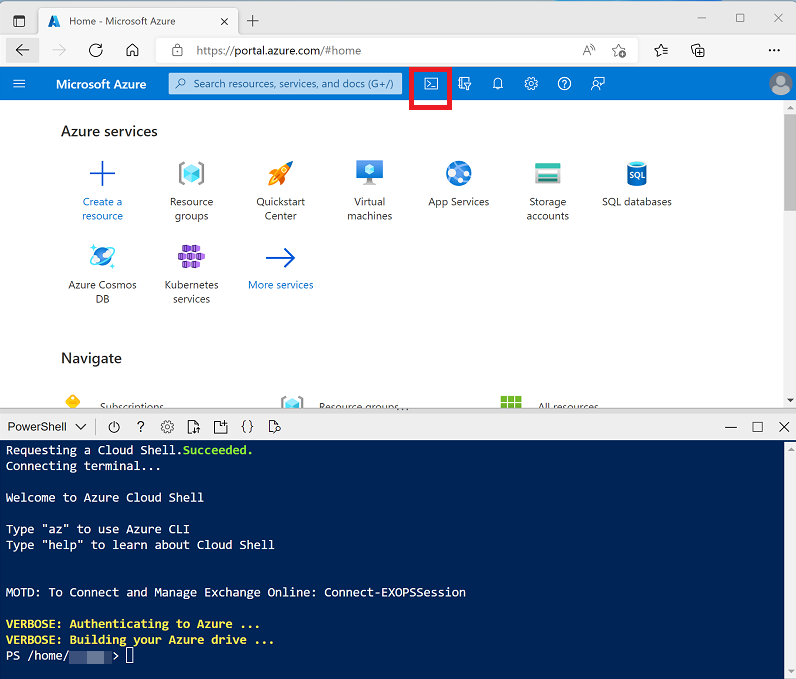

# Use Azure Synapse serverless SQL pool to query files in a data lake

## Learning Objetives

After the completion of this module, you will be able to:

 - Identify capabilities and use cases for serverless SQL pools in Azure Synapse Analytics
 - Query CSV, JSON, and Parquet files using a serverless SQL pool
 - Create external database objects in a serverless SQL pool

## Introduction

Azure Synapse Analytics includes serverless SQL pools, which are tailored for querying data in a data lake. With a serverless SQL pool you can use SQL code to query data in files of various common formats without needing to load the file data into database storage. This capability helps data analysts and data engineers analyze and process file data in the data lake using a familiar data processing language, without the need to create or maintain a relational database store.

#
# Prerequisites

Before starting this module, you should have the following prerequisite skills and knowledge:

 - Familiarity with the Microsoft Azure portal
 - Familiarity with data lake and data warehouse concepts
 - Experience of using SQL to query database tables

## Understand Azure Synapse serverless SQL pool capabilities and use cases

**Azure Synapse Analytics is an integrated analytics service** that brings together a wide range of commonly used technologies for processing and analyzing data at scale. One of the most prevalent technologies used in data solutions is SQL - an industry standard language for querying and manipulating data.

### Serverless SQL pools in Azure Synapse Analytics

**Azure Synapse SQL is a distributed query system in Azure Synapse Analytics** that offers two kinds of runtime environments:

 - **Serverless SQL pool**: on-demand SQL query processing, primarily used to work with data in a data lake.
 - **Dedicated SQL pool**: Enterprise-scale relational database instances used to host data warehouses in which data is stored in relational tables.

In this module, we'll focus on serverless **SQL pool, which provides a pay-per-query endpoint to query the data in your data lake**. The **benefits of using serverless SQL pool include**:

 - A familiar Transact-SQL syntax to query data in place without the need to copy or load data into a specialized store.
 - Integrated connectivity from a wide range of business intelligence and ad-hoc querying tools, including the most popular drivers.
 - Distributed query processing that is built for large-scale data, and computational functions - resulting in fast query performance.
 - Built-in query execution fault-tolerance, resulting in high reliability and success rates even for long-running queries involving large data sets.
 - No infrastructure to setup or clusters to maintain. A built-in endpoint for this service is provided within every Azure Synapse workspace, so you can start querying data as soon as the workspace is created.
 - No charge for resources reserved, you're only charged for the data processed by queries you run.

### When to use serverless SQL pools

Serverless SQL pool is tailored for querying the data residing in the data lake, so in addition to eliminating management burden, it eliminates a need to worry about ingesting the data into the system. You just point the query to the data that is already in the lake and run it.

**Synapse SQL serverless resource model** is great for **unplanned or "bursty" workloads** that can be processed using the always-on serverless SQL endpoint in your Azure Synapse Analytics workspace. Using the serverless pool helps when you need to know exact **cost for each query executed** to monitor and attribute costs.

#### Note
     Serverless SQL pool is an analytics system and is NOT recommended for OLTP workloads such as databases used by applications to store transactional data. Workloads that require millisecond response times and are looking to pinpoint a single row in a data set are not good fit for serverless SQL pool.

Common use cases for serverless SQL pools include:

 - **Data exploration**: Data exploration involves browsing the data lake to get initial insights about the data, and is easily achievable with Azure Synapse Studio. You can browse through the files in your linked data lake storage, and use the built-in serverless SQL pool to automatically generate a SQL script to select TOP 100 rows from a file or folder just as you would do with a table in SQL Server. From there, you can apply projections, filtering, grouping, and most of the operation over the data as if the data were in a regular SQL Server table.
 
 - **Data transformation**: While Azure Synapse Analytics provides great data transformations capabilities with Synapse Spark, some data engineers might find data transformation easier to achieve using SQL. Serverless SQL pool enables you to perform SQL-based data transformations; either interactively or as part of an automated data pipeline.
 
 - **Logical data warehouse**: After your initial exploration of the data in the data lake, you can define external objects such as tables and views in a serverless SQL database. The data remains stored in the data lake files, but are abstracted by a relational schema that can be used by client applications and analytical tools to query the data as they would in a relational database hosted in SQL Server.

## Query files using a serverless SQL pool

You can **use a serverless SQL pool to query data files** in various common file formats, including:

 - Delimited text, such as comma-separated values (**CSV**) files.
 - JavaScript object notation (**JSON**) files.
 - **Parquet** files.

The basic syntax for querying is the same for all of these types of file, and is built on the **OPENROWSET SQL function**; which generates a tabular rowset from data in one or more files. For example, **the following query could be used to extract data from CSV files**.

    ```sql
    SELECT TOP 100 *
    FROM OPENROWSET(
        BULK 'https://mydatalake.blob.core.windows.net/data/files/*.csv',
        FORMAT = 'csv') AS rows
    ```

The **OPENROWSET function** includes more parameters that determine factors such as:

 -The schema of the resulting rowset
 -Additional formatting options for delimited text files.

### tip 

You'll find the full syntax for the OPENROWSET function in the A[zure Synapse Analytics documentation](https://learn.microsoft.com/en-us/azure/synapse-analytics/sql/develop-openrowset#syntax).

The **output** from **OPENROWSET** is a **rowset** to which an alias must be assigned. In the previous example, the alias rows is used to name the resulting rowset.

The **BULK** parameter includes the full **URL to the location in the data lake containing the data files**. This can be an individual file, or a folder with a wildcard expression to filter the file types that should be included. The **FORMAT** parameter specifies the **type of data being queried**. The example above reads delimited text from all .csv files in the files folder.

#### Note

This example assumes that the user has access to the files in the underlying store, If the files are protected with a SAS key or custom identity, you would need to [create a server-scoped credential](https://learn.microsoft.com/en-us/azure/synapse-analytics/sql/develop-storage-files-storage-access-control?tabs=shared-access-signature#server-scoped-credential).

As seen in the previous example, you can use **wildcards** in the **BULK** parameter to *include or exclude* files in the query. The following list shows a few examples of how this can be used:

 - `https://mydatalake.blob.core.windows.net/data/files/file1.csv`: Only include file1.csv in the files folder.

 - `https://mydatalake.blob.core.windows.net/data/files/file*.csv`: All .csv files in the files folder with names that start with "file".

 - `https://mydatalake.blob.core.windows.net/data/files/*`: All files in the files folder.

 - `https://mydatalake.blob.core.windows.net/data/files/**`: All files in the files folder, and recursively its subfolders.

You can also specify multiple file paths in the **BULK** parameter, separating each path with a comma.

## Querying delimited text files

Delimited text files are a common file format within many businesses. The specific formatting used in delimited files can vary, for example:

 - With and without a header row.
 - Comma and tab-delimited values.
 - Windows and Unix style line endings.
 - Non-quoted and quoted values, and escaping characters.

Regardless of the type of delimited file you're using, you can read data from them by using the **OPENROWSET** function with the **csv FORMAT parameter**, and other parameters as required to handle the specific formatting details for your data. For example:

    ```sql
    SELECT TOP 100 *
    FROM OPENROWSET(
        BULK 'https://mydatalake.blob.core.windows.net/data/files/*.csv',
        FORMAT = 'csv',
        PARSER_VERSION = '2.0',
        FIRSTROW = 2) AS rows
    ```

The **PARSER_VERSION** is used to determine how the query interprets the text encoding used in the files. **Version 1.0** is the default and **supports a wide range of file encodings**, while **version 2.0** supports **fewer encodings but offers better performance**. The **FIRSTROW** parameter is used to skip rows in the text file, to eliminate any unstructured preamble text or to ignore a row containing column headings.

Additional parameters you might require when working with delimited text files include:

 - **FIELDTERMINATOR** - the character used to separate field values in each row. For example, a tab-delimited file separates fields with a **TAB (\t)** character. The **default field terminator is a comma (,)**.

 - **ROWTERMINATOR** - the character used to signify the end of a row of data. For example, a standard Windows text file uses a combination of a carriage return (CR) and line feed (LF), which is indicated by the code \n; while UNIX-style text files use a single line feed character, which can be indicated using the code 0x0a.

 - **FIELDQUOTE** - the character used to enclose quoted string values. For example, to ensure that the comma in the address field value 126 Main St, apt 2 isn't interpreted as a field delimiter, you might enclose the entire field value in quotation marks like this: "126 Main St, apt 2". The double-quote (") is the default field quote character.


### Specifying the rowset schema

It's common for delimited text files to include the column names in the first row. The **OPENROWSET** function can use this to define the schema for the resulting rowset, and automatically infer the data types of the columns based on the values they contain. For example, consider the following delimited text:

```text
    product_id,product_name,list_price
    123,Widget,12.99
    124,Gadget,3.99
```

The data consists of the following three columns:

 - product_id (integer number)
 - product_name (string)
 - list_price (decimal number)

You could use the following query to extract the data with the correct column names and appropriately inferred SQL Server data types (in this case INT, NVARCHAR, and DECIMAL)

```sql
    SELECT TOP 100 *
    FROM OPENROWSET(
        BULK 'https://mydatalake.blob.core.windows.net/data/files/*.csv',
        FORMAT = 'csv',
        PARSER_VERSION = '2.0',
        HEADER_ROW = TRUE) AS rows  
```

The HEADER_ROW parameter (which is only available when using parser version 2.0) instructs the query engine to use the first row of data in each file as the column names, like this:

```text
    product_id  product_name    list_price
    123         Widget          12.9900
    124         Gadget          3.9900
```

Now consider the following data:

```text
    123,Widget,12.99
    124,Gadget,3.99
```

This time, the file doesn't contain the column names in a header row; so while the data types can still be inferred, the column names will be set to C1, C2, C3, and so on.

```text
    C1          C2              C3
    123         Widget          12.9900
    124         Gadget          3.9900
```

To specify explicit column names and data types, you can override the default column names and inferred data types by providing a schema definition in a WITH clause, like this:

```sql
    SELECT TOP 100 *
    FROM OPENROWSET(
        BULK 'https://mydatalake.blob.core.windows.net/data/files/*.csv',
        FORMAT = 'csv',
        PARSER_VERSION = '2.0')
    WITH (
        product_id INT,
        product_name VARCHAR(20) COLLATE Latin1_General_100_BIN2_UTF8,
        list_price DECIMAL(5,2)
    ) AS rows
```

This query produces the expected results:

```text
    product_id  product_name    list_price
    123         Widget          12.99
    124         Gadget          3.99
```

#### Tip: [Incompatibility with UTF-8](https://learn.microsoft.com/en-us/azure/synapse-analytics/troubleshoot/reading-utf8-text)

    When working with text files, you may encounter some incompatibility with UTF-8 encoded data and the collation used in the master database for the serverless SQL pool. To overcome this, you can specify a compatible collation for individual VARCHAR columns in the schema. See the troubleshooting guidance for more details.

## Querying JSON files

JSON is a popular format for web applications that exchange data through REST interfaces or use NoSQL data stores such as Azure Cosmos DB. So, it's not uncommon to persist data as JSON documents in files in a data lake for analysis.

For example, a JSON file that defines an individual product might look like this:

```json
{
    "product_id": 123,
    "product_name": "Widget",
    "list_price": 12.99
}
```

To return product data from a folder containing multiple JSON files in this format, you could use the following SQL query:

```sql
    SELECT doc
    FROM
        OPENROWSET(
            BULK 'https://mydatalake.blob.core.windows.net/data/files/*.json',
            FORMAT = 'csv',
            FIELDTERMINATOR ='0x0b',
            FIELDQUOTE = '0x0b',
            ROWTERMINATOR = '0x0b'
        ) WITH (doc NVARCHAR(MAX)) as rows
```

OPENROWSET has no specific format for JSON files, so you must use csv format with FIELDTERMINATOR, FIELDQUOTE, and ROWTERMINATOR set to 0x0b, and a schema that includes a single NVARCHAR(MAX) column. The result of this query is a rowset containing a single column of JSON documents, like this:

```text
doc
{"product_id":123,"product_name":"Widget","list_price": 12.99}
{"product_id":124,"product_name":"Gadget","list_price": 3.99}
```

To extract individual values from the JSON, you can use the JSON_VALUE function in the SELECT statement, as shown here:

```sql
    SELECT JSON_VALUE(doc, '$.product_name') AS product,
            JSON_VALUE(doc, '$.list_price') AS price
    FROM
        OPENROWSET(
            BULK 'https://mydatalake.blob.core.windows.net/data/files/*.json',
            FORMAT = 'csv',
            FIELDTERMINATOR ='0x0b',
            FIELDQUOTE = '0x0b',
            ROWTERMINATOR = '0x0b'
        ) WITH (doc NVARCHAR(MAX)) as rows
```

This query would return a rowset similar to the following results:

```text
    product     price
    Widget      12.99
    Gadget      3.99
```

## Querying Parquet files

Parquet is a commonly used format for big data processing on distributed file storage. It's an efficient data format that is optimized for compression and analytical querying.

In most cases, the schema of the data is embedded within the Parquet file, so you only need to specify the BULK parameter with a path to the file(s) you want to read, and a FORMAT parameter of parquet; like this:

```sql
SELECT TOP 100 *
FROM OPENROWSET(
    BULK 'https://mydatalake.blob.core.windows.net/data/files/*.*',
    FORMAT = 'parquet') AS rows
```

## Query partitioned data

It's common in a data lake to partition data by splitting across multiple files in subfolders that reflect partitioning criteria. This enables distributed processing systems to work in parallel on multiple partitions of the data, or to easily eliminate data reads from specific folders based on filtering criteria. For example, suppose you need to efficiently process sales order data, and often need to filter based on the year and month in which orders were placed. You could partition the data using folders, like this:

 - /orders
    - /year=2020
        - /month=1
            - /01012020.parquet
            - /02012020.parquet
            - ...
        - /month=2
            - /01022020.parquet
            - /02022020.parquet
            - ...
            - ...
    - /year=2021
        - /month=1
            - /01012021.parquet
            - /02012021.parquet
            - ...
    - ...

To create a query that filters the results to include only the orders for January and February 2020, you could use the following code:

```sql
SELECT *
FROM OPENROWSET(
    BULK 'https://mydatalake.blob.core.windows.net/data/orders/year=*/month=*/*.*',
    FORMAT = 'parquet') AS orders
WHERE orders.filepath(1) = '2020'
    AND orders.filepath(2) IN ('1','2');
```

The numbered **filepath parameters** in the **WHERE** clause reference the **wildcards** in the folder names in the BULK path -so the parameter 1 is the * in the year=* folder name, and parameter 2 is the * in the month=* folder name.

## Create external database objects

You can use the **OPENROWSET** function in SQL queries that run in the default master database of the built-in serverless SQL pool to explore data in the data lake. However, sometimes you may want to create a custom database that contains some objects that make it easier to work with **external data in the data lake that you need to query frequently**.

### Creating a database

You can create a database in a serverless SQL pool just as you would in a SQL Server instance. You can **use the graphical interface in Synapse Studio, or a CREATE DATABASE statement**. One consideration is to set the collation of your database so that it supports conversion of text data in files to appropriate Transact-SQL data types.

The following example code **creates a database named** **salesDB** with a collation that makes it easier to import UTF-8 encoded text data into VARCHAR columns.

```sql
CREATE DATABASE SalesDB
    COLLATE Latin1_General_100_BIN2_UTF8
```

### Creating an external data source

You can use the OPENROWSET function with a BULK path to query file data from your own database, just as you can in the **master** database; but **if you plan to query data in the same location frequently**, it's more efficient to **define an external data source** that references that location. For example, the following code creates a data source named files for the hypothetical *https://mydatalake.blob.core.windows.net/data/files/* folder:

```sql
CREATE EXTERNAL DATA SOURCE files
WITH (
    LOCATION = 'https://mydatalake.blob.core.windows.net/data/files/'
)
```

One **benefit of an external data source**, is that you can simplify an OPENROWSET query to **use the combination of the data source and the relative path to the folders or files** you want to query:

```sql
SELECT *
FROM
    OPENROWSET(
        BULK 'orders/*.csv',
        DATA_SOURCE = 'files',
        FORMAT = 'csv',
        PARSER_VERSION = '2.0'
    ) AS orders
```

In this example, the **BULK** parameter is used to specify the **relative path for all .csv files in the orders folder**, which is a **subfolder** of the **files folder referenced by the data source**.

Another **benefit of using a data source** is that you can **assign a credential for the data source** to use when accessing the underlying storage, enabling you to provide access to data through SQL without permitting users to access the data directly in the storage account. For example, the following code **creates a credential that uses a shared access signature (SAS) to authenticate** against the underlying Azure storage account hosting the data lake.

```sql
CREATE DATABASE SCOPED CREDENTIAL sqlcred
WITH
    IDENTITY='SHARED ACCESS SIGNATURE',  
    SECRET = 'sv=xxx...';
GO

CREATE EXTERNAL DATA SOURCE secureFiles
WITH (
    LOCATION = 'https://mydatalake.blob.core.windows.net/data/secureFiles/'
    CREDENTIAL = sqlcred
);
GO
```

#### Tip [Control storage account access for serverless SQL pool](https://learn.microsoft.com/en-us/azure/synapse-analytics/sql/develop-storage-files-storage-access-control?tabs=user-identity)

    In addition to SAS authentication, you can define credentials that use managed identity (the Microsoft Entra identity used by your Azure Synapse workspace), a specific Microsoft Entra principal, or passthrough authentication based on the identity of the user running the query (which is the default type of authentication). To learn more about using credentials in a serverless SQL pool, see the Control storage account access for serverless SQL pool in Azure Synapse Analytics article in Azure Synapse Analytics documentation.


## Creating an external file format

While an external data source simplifies the code needed to access files with the OPENROWSET function, you **still need to provide format details for the file being access**; which may include multiple settings for delimited text files. You can **encapsulate these settings in an external file format**, like this:

```sql
CREATE EXTERNAL FILE FORMAT CsvFormat
    WITH (
        FORMAT_TYPE = DELIMITEDTEXT,
        FORMAT_OPTIONS(
            FIELD_TERMINATOR = ',',
            STRING_DELIMITER = '"'
        )
    );
GO
```

After creating file formats for the specific data files you need to work with, you can use the file format to create external tables, as discussed next.

## Creating an external table

When you **need to perform a lot of analysis or reporting from files in the data lake**, using the OPENROWSET function can result in complex code that includes data sources and file paths. To simplify access to the data, **you can encapsulate the files in an external table**; **which users and reporting applications can query** using a standard SQL SELECT statement just like any other database table. To create an external table, use the **CREATE EXTERNAL TABLE statement**, specifying the column schema as for a standard table, and including a WITH clause specifying the external data source, relative path, and external file format for your data.

```sql
CREATE EXTERNAL TABLE dbo.products
(
    product_id INT,
    product_name VARCHAR(20),
    list_price DECIMAL(5,2)
)
WITH
(
    DATA_SOURCE = files,
    LOCATION = 'products/*.csv',
    FILE_FORMAT = CsvFormat
);
GO

-- query the table
SELECT * FROM dbo.products;
```

By creating a database that contains the external objects discussed in this unit, **you can provide a relational database layer over files in a data lake**, *making it easier for many data analysts and reporting tools* to access the data by using standard SQL query semantics.


# Exercise - Query files using a serverless SQL pool

## Transform files using a serverless SQL pool

Data analysts often use SQL to query data for analysis and reporting. Data engineers can also make use of SQL to manipulate and transform data; often as part of a data ingestion pipeline or extract, transform, and load (ETL) process.

In this exercise, you’ll use a serverless SQL pool in Azure Synapse Analytics to transform data in files.

This exercise should take approximately 30 minutes to complete.

### Provision an Azure Synapse Analytics workspace

You’ll need an Azure Synapse Analytics workspace with access to data lake storage. You can use the built-in serverless SQL pool to query files in the data lake.

In this exercise, you’ll use a combination of a PowerShell script and an ARM template to provision an Azure Synapse Analytics workspace.

 1) Sign into the Azure portal at [Azure Portal link](https://portal.azure.com).

 2) Use the **[>_]** button to the right of the search bar at the top of the page to create a new Cloud Shell in the Azure portal, selecting a **PowerShell** environment and creating storage if prompted. The cloud shell provides a command line interface in a pane at the bottom of the Azure portal, as shown here:

<a href="#">
    
</a>

    NOTE: If you have previously created a cloud shell that uses a Bash environment, use the the drop-down menu at the top left of the cloud shell pane to change it to PowerShell.

 3) Note that you can resize the cloud shell by dragging the separator bar at the top of the pane, or by using the **—**, **◻**, and **X** icons at the top right of the pane to minimize, maximize, and close the pane. For more information about using the Azure Cloud Shell, see the [Azure Cloud Shell documentation](https://learn.microsoft.com/en-us/azure/cloud-shell/overview).

 4) In the PowerShell pane, enter the following commands to clone this repo:

```bash
 rm -r dp-203 -f
 git clone https://github.com/MicrosoftLearning/dp-203-azure-data-engineer dp-203
```

 5) After the repo has been cloned, enter the following commands to change to the folder for this exercise and run the **setup.ps1** script it contains:

```bash
 cd dp-203/Allfiles/labs/03
 ./setup.ps1
```

 6) **If prompted**, choose which subscription you want to use (this will only happen if you have access to multiple Azure subscriptions).

 7) When prompted,**enter a suitable password** to be set for your Azure Synapse SQL pool.

    NOTE: Be sure to remember this password!

 8) Wait for the script to complete - this typically takes around 10 minutes, but in some cases may take longer. While you are waiting, review the [CETAS with Synapse SQL](https://learn.microsoft.com/en-us/azure/synapse-analytics/sql/develop-tables-cetas) article in the Azure Synapse Analytics documentation.

### Query data in files

The script provisions an Azure Synapse Analytics workspace and an Azure Storage account to host the data lake, then uploads some data files to the data lake.

#### View files in the data lake

 1) After the script has completed, **in the Azure portal**, go to the **dp203-xxxxxxx** resource group that it created, and select your Synapse workspace.
 2) In the **Overview page** for your Synapse workspace, in the **Open Synapse Studio** card, select **Open** to open Synapse Studio in a new browser tab; signing in if prompted.
 3) On the left side of Synapse Studio, use the ›› icon to expand the menu - this reveals the different pages within Synapse Studio that you’ll use to manage resources and perform data analytics tasks.
 4) On the **Data page**, view the **Linked** tab and **verify** that your workspace includes a link to your Azure Data Lake Storage Gen2 storage account, which should have a **name similar** to **synapsexxxxxxx (Primary - datalakexxxxxxx)**.
 5) Expand your storage account and verify that it contains a file system container named **files**.
 6) Select the **files** container, and note that it contains a *folder named* **sales**. This folder contains the data files you are going to query.
 7) Open the **sales** folder and the **csv** folder it contains, and observe that this folder contains .csv files for three years of sales data.
 8) Right-click any of the files and select **Preview** to see the data it contains. Note that the files contain a header row.
 9) Close the preview, and then use the **↑** button to navigate back to the **sales** folder.

#### Use SQL to query CSV files

 1) Select the **csv** folder, and then in the **New SQL script** list on the toolbar, select **Select TOP 100 rows**.

 2) In the **File type** list, select **Text format**, and then apply the settings to open a new SQL script that queries the data in the folder.

 3) In the *Properties* pane for **SQL Script 1** that is created, change the name to **Query Sales CSV files**, and **change** the result **settings** to *show* **All rows**. Then in the toolbar, select **Publish to save** the script and use the **Properties** button (which looks similar to 🗏*) on the right end of the toolbar to hide the **Properties** pane.

 4) Review the SQL code that has been generated, which should be similar to this:

```sql
 -- This is auto-generated code
 SELECT
     TOP 100 *
 FROM
     OPENROWSET(
         BULK 'https://datalakexxxxxxx.dfs.core.windows.net/files/sales/csv/**',
         FORMAT = 'CSV',
         PARSER_VERSION='2.0'
     ) AS [result]
```

This code uses the OPENROWSET to read data from the CSV files in the sales folder and retrieves the first 100 rows of data.

 5) In this case, the **data files include the column names in the first row**; so *modify the query* to add a **HEADER_ROW = TRUE** parameter to the OPENROWSET clause, as shown here (don’t forget to add a comma after the previous parameter):

```sql
 SELECT
     TOP 100 *
 FROM
     OPENROWSET(
         BULK 'https://datalakexxxxxxx.dfs.core.windows.net/files/sales/csv/**',
         FORMAT = 'CSV',
         PARSER_VERSION='2.0',
         HEADER_ROW = TRUE
     ) AS [result]
```

 6) In the **Connect to** list, ensure **Built-in** is selected - this represents the built-in SQL Pool that was created with your workspace. Then on the toolbar, use the **▷ Run** button to run the SQL code, and review the results, which should look similar to this:


    SalesOrderNumber | SalesOrderLineNumber | OrderDate | CustomerName | EmailAddress | Item | Quantity | UnitPrice | TaxAmount 
    --- | :---: | --- | --- | --- | --- |:---: | ---: | ---:
    SO43701	 | 1 | 2019-07-01 | Christy Zhu | christy12@adventure-works.com | Mountain-100 Silver, 44 | 1 | 3399.99 | 271.9992 
    … | … |	… | … | … | … | … | … | …

 7) **Publish the changes to your script**, and then close the script pane.

### Transform data using CREATE EXTERNAL TABLE AS SELECT (CETAS) statements

A simple way to use SQL to **transform data in a file** and persist the results in another file is to use a **CREATE EXTERNAL TABLE AS SELECT (CETAS) statement**. This statement creates a table based on the requests of a query, but the data for **the table is stored as files in a data lake**. The transformed data can then be queried through the external table, or accessed directly in the file system (for example, for inclusion in a downstream process to load the transformed data into a data warehouse).

#### Create an external data source and file format

By **defining an external data source** in a database, you can **use it to reference the data lake location** where you want **to store files for external tables**. An external file format enables you to define the format for those files - for example, Parquet or CSV. To use these objects to work with external tables, you need to create them in a database other than the default **master** database.

 1) In Synapse Studio, on the Develop page, in the + menu, select SQL script.
 2) In the new script pane, add the following code (replacing datalakexxxxxxx with the name of your data lake storage account) to create a new database and add an external data source to it.