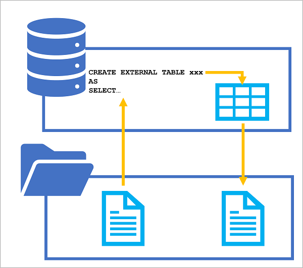

# Use Azure Synapse serverless SQL pools to transform data in a data lake

## Learning Objetives

By using a serverless SQL pool in Azure Synapse Analytics, you can use the ubiquitous SQL language to transform data in files in a data lake.

After completing this module, you'll be able to:

 - Use a CREATE EXTERNAL TABLE AS SELECT (CETAS) statement to transform data.
 - Encapsulate a CETAS statement in a stored procedure.
 - Include a data transformation stored procedure in a pipeline.

## Introduction

While SQL is commonly used by data analysts to query data and support analytical and reporting workloads, data engineers often **need to use SQL to transform data**; often as part of a data ingestion pipeline or extract, transform, and load **(ETL) process**.

In this module, you'll learn **how to use CREATE EXTERNAL TABLE AS SELECT (CETAS) statements** to transform data, and **store the results in files in a data lake** that can be queried through a relational table in a serverless SQL database or processed directly from the file system.

## Transform data files with the CREATE EXTERNAL TABLE AS SELECT statement

The SQL language includes many features and functions that enable you to manipulate data. For example, you can use SQL to:

 - **Filter** rows and columns in a dataset.
 - **Rename** **data** fields **and convert** between data types.
 - **Calculate** derived data fields.
 - **Manipulate** string values.
 - **Group and aggregate data**.

**Azure Synapse serverless SQL pools** can be **used to run SQL statements** that **transform** **data** and persist the results **as a file** **in a data lake** for further processing or querying. If you're familiar with Transact-SQL syntax, you can craft a SELECT statement that applies the specific transformation you're interested in, and store the results of the SELECT statement in a selected file format with a metadata table schema that can be queried using SQL.

You can **use a CREATE EXTERNAL TABLE AS SELECT (CETAS) statement** in a dedicated SQL pool or serverless SQL pool **to persist the results of a query in an external table**, which stores its data in a file **in the data lake**.

The CETAS statement includes a SELECT statement that queries and manipulates data from any valid data source (which could be an existing table or view in a database, or an OPENROWSET function that reads file-based data from the data lake). The results of the SELECT statement are then persisted in an external table, which is a metadata object in a database that provides a relational abstraction over data stored in files. The following diagram illustrates the concept visually:

<a href="#">
    
</a>

By applying this technique, you can use SQL to extract and transform data from files or tables, and store the transformed results for downstream processing or analysis. Subsequent operations on the transformed data can be performed against the relational table in the SQL pool database or directly against the underlying data file

### Creating external database objects to support CETAS

To use **CETAS expressions**, you must create the following types of object in a database for either a serverless or dedicated SQL pool. When using a serverless SQL pool, create these objects in a custom database (created using the CREATE DATABASE statement), not the **built-in** database.

#### External data source

**An external data source encapsulates a connection to a file system location in a data lake**. You can then use this connection to specify a relative path in which the data files for the external table created by the CETAS statement are saved.

If the source data for the CETAS statement is in files in the same data lake path, you can use the same external data source in the **OPENROWSET** function used to query it. Alternatively, you can create a separate external data source for the source files or use a fully qualified file path in the OPENROWSET function.

**To create an external data source**, use the **CREATE EXTERNAL DATA SOURCE statement**, as shown in this example:

```sql
-- Create an external data source for the Azure storage account
CREATE EXTERNAL DATA SOURCE files
WITH (
    LOCATION = 'https://mydatalake.blob.core.windows.net/data/files/',
    TYPE = HADOOP, -- For dedicated SQL pool
    -- TYPE = BLOB_STORAGE, -- For serverless SQL pool
    CREDENTIAL = storageCred
);
```

The **previous example assumes that users** running queries that use the external data source will **have sufficient permissions** to access the files. **An alternative approach is to encapsulate a credential in the external data source** so that it can be used **to access file data without granting all users permissions to read it directly**:

```sql
CREATE DATABASE SCOPED CREDENTIAL storagekeycred
WITH
    IDENTITY='SHARED ACCESS SIGNATURE',  
    SECRET = 'sv=xxx...';

CREATE EXTERNAL DATA SOURCE secureFiles
WITH (
    LOCATION = 'https://mydatalake.blob.core.windows.net/data/secureFiles/'
    CREDENTIAL = storagekeycred
);
```

#### Tip [Control storage account access for serverless SQL pool](https://learn.microsoft.com/en-us/azure/synapse-analytics/sql/develop-storage-files-storage-access-control?tabs=user-identity)
    In addition to SAS authentication, you can define credentials that use managed identity (the Microsoft Entra identity used by your Azure Synapse workspace), a specific Microsoft Entra principal, or passthrough authentication based on the identity of the user running the query (which is the default type of authentication). To learn more about using credentials in a serverless SQL pool, see the Control storage account access for serverless SQL pool in Azure Synapse Analytics article in Azure Synapse Analytics documentation.

### External file format

The CETAS statement creates a table with its data stored in files. You must specify the format of the files you want to create as an external file format.

To create an external file format, use the CREATE EXTERNAL FILE FORMAT statement, as shown in this example:

```sql
CREATE EXTERNAL FILE FORMAT ParquetFormat
WITH (
        FORMAT_TYPE = PARQUET,
        DATA_COMPRESSION = 'org.apache.hadoop.io.compress.SnappyCodec'
    );
```

#### Tip [CREATE EXTERNAL FILE FORMAT (Transact-SQL)](https://learn.microsoft.com/en-us/sql/t-sql/statements/create-external-file-format-transact-sql?view=sql-server-ver16&tabs=delimited)
    In this example, the files will be saved in Parquet format. You can also create external file formats for other types of file. See CREATE EXTERNAL FILE FORMAT (Transact-SQL) for details.


### Using the CETAS statement

After creating an external data source and external file format, you can **use the CETAS statement to transform data and stored the results in an external table**.

For example, suppose **the source data you want to transform** **consists** of sales orders **in comma-delimited text files** that are **stored** in a folder **in a data lake**. You **want to filter the data** to include only orders that are marked as "special order", **and save the transformed data as Parquet files** in a different folder **in the same data lake**. You could use the same external data source for both the source and destination folders as shown in this example:

```sql
CREATE EXTERNAL TABLE SpecialOrders
    WITH (
        -- details for storing results
        LOCATION = 'special_orders/',
        DATA_SOURCE = files,
        FILE_FORMAT = ParquetFormat
    )
AS
SELECT OrderID, CustomerName, OrderTotal
FROM
    OPENROWSET(
        -- details for reading source files
        BULK 'sales_orders/*.csv',
        DATA_SOURCE = 'files',
        FORMAT = 'CSV',
        PARSER_VERSION = '2.0',
        HEADER_ROW = TRUE
    ) AS source_data
WHERE OrderType = 'Special Order';
```

The **LOCATION** and **BULK** parameters in the previous example are relative paths for the results and source files respectively. The **paths are relative to the file system** location referenced by the **files** external data source.

An important point to understand is that you ***must*** use an external data source to specify the location where the transformed data for the external table is to be saved. **When file-based source data is stored in the same folder hierarchy, you can use the same external data source**. Otherwise, you can use a second data source to define a connection to the source data or use the fully qualified path, as shown in this example:

```sql
CREATE EXTERNAL TABLE SpecialOrders
    WITH (
        -- details for storing results
        LOCATION = 'special_orders/',
        DATA_SOURCE = files,
        FILE_FORMAT = ParquetFormat
    )
AS
SELECT OrderID, CustomerName, OrderTotal
FROM
    OPENROWSET(
        -- details for reading source files
        BULK 'https://mystorage.blob.core.windows.net/data/sales_orders/*.csv',
        FORMAT = 'CSV',
        PARSER_VERSION = '2.0',
        HEADER_ROW = TRUE
    ) AS source_data
WHERE OrderType = 'Special Order';
```

### Dropping external tables

If you no longer need the external table containing the transformed data, you can drop it from the database by using the **DROP EXTERNAL TABLE statement**, as shown here:

```sql
DROP EXTERNAL TABLE SpecialOrders;
```

However, **it's important to understand that external tables are a metadata abstraction** over the files that contain the actual data. **Dropping an external table does not delete the underlying files**.

## Encapsulate data transformations in a stored procedure

While you can run a **CREATE EXTERNAL TABLE AS SELECT (CETAS) statement** in a script whenever you need to transform data, **it's good practice to encapsulate the transformation operation in stored procedure**. This approach can make it easier to operationalize data transformations by enabling you to supply parameters, retrieve outputs, and include additional logic in a single procedure call.

For example, the following code creates a stored procedure that drops the external table if it already exists before recreating it with order data for the specified year:

```sql
CREATE PROCEDURE usp_special_orders_by_year @order_year INT
AS
BEGIN

	-- Drop the table if it already exists
	IF EXISTS (
                SELECT * FROM sys.external_tables
                WHERE name = 'SpecialOrders'
            )
        DROP EXTERNAL TABLE SpecialOrders

	-- Create external table with special orders
	-- from the specified year
	CREATE EXTERNAL TABLE SpecialOrders
		WITH (
			LOCATION = 'special_orders/',
			DATA_SOURCE = files,
			FILE_FORMAT = ParquetFormat
		)
	AS
	SELECT OrderID, CustomerName, OrderTotal
	FROM
		OPENROWSET(
			BULK 'sales_orders/*.csv',
			DATA_SOURCE = 'files',
			FORMAT = 'CSV',
			PARSER_VERSION = '2.0',
			HEADER_ROW = TRUE
		) AS source_data
	WHERE OrderType = 'Special Order'
	AND YEAR(OrderDate) = @order_year
END
```

In addition to encapsulating Transact-SQL logic, stored procedures also provide the following benefits:

### Reduces client to server network traffic

The commands in a procedure are executed as a single batch of code; which can significantly reduce network traffic between the server and client because only the call to execute the procedure is sent across the network.

### Provides a security boundary

Multiple users and client programs can perform operations on underlying database objects through a procedure, even if the users and programs don't have direct permissions on those underlying objects. The procedure controls what processes and activities are performed and protects the underlying database objects; eliminating the requirement to grant permissions at the individual object level and simplifies the security layers.

### Eases maintenance

Any changes in the logic or file system locations involved in the data transformation can be applied only to the stored procedure; without requiring updates to client applications or other calling functions.

### Improved performance

Stored procedures are compiled the first time they're executed, and the resulting execution plan is held in the cache and reused on subsequent runs of the same stored procedure. As a result, it takes less time to process the procedure.

## Include a data transformation stored procedure in a pipeline

**Encapsulating** a **CREATE EXTERNAL TABLE AS SELECT (CETAS) statement** **in a stored procedure** makes it easier for you to operationalize data transformations that you may need to perform repeatedly. In Azure Synapse Analytics and Azure Data Factory, you **can create pipelines that connect to linked services**, including Azure Data Lake Store Gen2 storage accounts that host data lake files, and serverless SQL pools; **enabling you to call your stored procedures as part of** an overall data extract, transform, and load **(ETL) pipeline**.

For example, you can **create a pipeline that** includes the following activities:

 - A **Delete** activity that deletes the target folder for the transformed data in the data lake if it already exists.
 - A **Stored procedure** activity that connects to your serverless SQL pool and runs the stored procedure that encapsulates your CETAS operation.

<a href="#">
    
</a>

**Creating a pipeline** for the data transformation **enables you to schedule the operation** to run at specific times **or based on specific events** (such as new files being added to the source storage location).

## Exercise - Transform files using a serverless SQL pool

Now it's your opportunity to use the CREATE EXTERNAL TABLE AS SELECT statement to transform data. In this exercise, you'll use a provided script to provision an Azure Synapse Analytics workspace in your Azure subscription; and then use a serverless SQL pool to transform data from files in a data lake.

 <a href="./use_synapse_sql_query_data_lake.md/#exercise---query-files-using-a-serverless-sql-pool" target="_blank">
    Exercise
</a>

## Knowledge check

1. You need to store the results of a query in a serverless SQL pool as files in a data lake. Which SQL statement should you use? 

    - [ ] BULK INSERT
    - [x] CREATE EXTERNAL TABLE AS SELECT
    - [ ] COPY

2. Which of the following file formats can you use to persist the results of a query? 

    - [ ] CSV only
    - [ ] Parquet only
    - [x] CSV and Parquet

3. You drop an existing external table from a database in a serverless SQL pool. What else must you do before recreating an external table with the same location?  

    - [x] Delete the folder containing the data files for dropped table.
    - [ ] Drop and recreate the database
    - [ ] Create an Apache Spark pool

