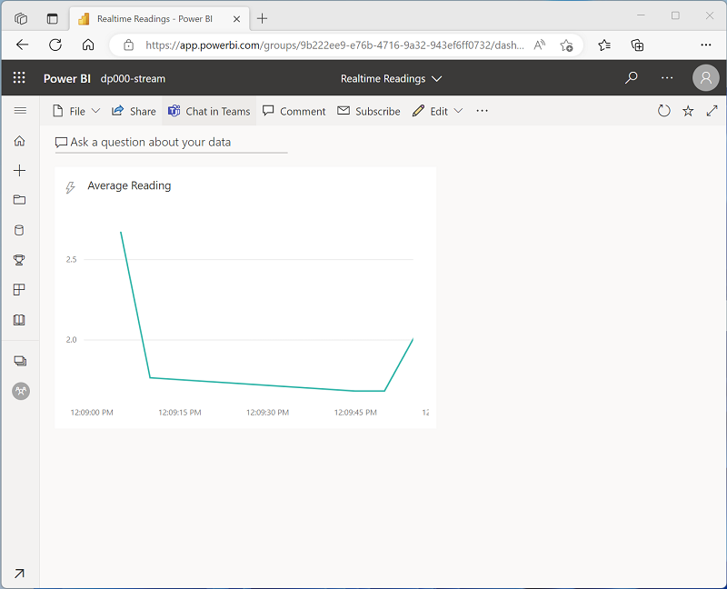

# Visualize real-time data with Azure Stream Analytics and Power BI

By combining the stream processing capabilities of Azure Stream Analytics and the data visualization capabilities of Microsoft Power BI, you can create real-time data dashboards.

## Learning objectives

In this module, you'll learn how to:

 - Configure a Stream Analytics output for Power BI.
 - Use a Stream Analytics query to write data to Power BI.
 - Create a real-time data visualization in Power BI.

## Introduction

Microsoft Power BI is used by organizations all around the world to create dynamic, interactive data visualizations that reveal insights on which important business decisions are based. Access to timely data can be the difference between failure and success, so the ability to capture and visualize data in real-time, or as near as possible, is critical in many scenarios.

Azure Stream Analytics provides a way to process a stream of real-time data from an input such as Azure Event Hubs, and direct the results to an output. One possible output is a Power BI dataset, from which dashboards can consume data for real-time visualization.

<a href="#">
    
</a>

In this module, we'll examine how to **use Azure Stream Analytics to process a stream of real-time data, and send the results to a Power BI dataset for visualization**.

## Use a Power BI output in Azure Stream Analytics

All Azure Stream Analytics jobs include at least one input and output. In most cases, inputs reference sources of streaming data (though you can also define inputs for static reference data to augment the streamed event data). Outputs determine where the results of the stream processing query will be sent. To support real-time data visualization, you can use a **Power BI** output.

### Streaming data inputs

Inputs for streaming data consumed by Azure Stream Analytics can include:

 - Azure Event Hubs
 - Azure IoT Hubs
 - Azure Blob or Data Lake Gen 2 Storage

Depending on the specific input type, the data for each streamed event includes the event's data fields and input-specific metadata fields. For example, data consumed from an Azure Event Hubs input includes an **EventEnqueuedUtcTime** field indicating the time when the event was received in the event hub.

#### Note

For more information about streaming inputs, see [Stream data as input into Stream Analytics](https://learn.microsoft.com/en-us/azure/stream-analytics/stream-analytics-define-inputs) in the Azure Stream Analytics documentation.

### Power BI outputs

You can use a Power BI output to write the results of a Stream Analytics query to a table in a Power BI streaming dataset, from where it can be visualized in a dashboard. When adding a Power BI output to a Stream Analytics job, you need to specify the following properties:

 - **Output alias**: A name for the output that can be used in a query.
 - **Group workspace**: The Power BI workspace in which you want to create the resulting dataset.
 - **Dataset name**: The name of the dataset to be generated by the output. You shouldn't pre-create this dataset as it will be created automatically (replacing any existing dataset with the same name).
 - **Table name**: The name of the table to be created in the dataset.
 - **Authorize connection**: You must authenticate the connection to your Power BI tenant so that the Stream Analytics job can write data to the workspace.

#### Note

For more information about Power BI outputs, see [Power BI output from Azure Stream Analytics](https://learn.microsoft.com/en-us/azure/stream-analytics/power-bi-output) in the Azure Stream Analytics documentation.

## Create a query for real-time visualization

To **send streaming data to Power BI**, your Azure Stream Analytics job uses a query that writes its results to a Power BI output. A simple query that **forwards event data from an event hub directly to Power BI** might look something like this:

```sql
SELECT
    EventEnqueuedUtcTime AS ReadingTime,
    SensorID,
    ReadingValue
INTO
    [powerbi-output]
FROM
    [eventhub-input] TIMESTAMP BY EventEnqueuedUtcTime
```

The results of the query determine the schema of the table in the output dataset in **Power BI**.

Alternatively, you ***might use your query to filter and/or aggregate the data***, sending only relevant or summarized data to the Power BI dataset. For example, the *following query calculates the maximum reading for each sensor other than sensor 0* for each *consecutive minute* in which an event occurs.

```sql
SELECT
    DateAdd(second, -60, System.TimeStamp) AS StartTime,
    System.TimeStamp AS EndTime,
    SensorID,
    MAX(ReadingValue) AS MaxReading
INTO
    [powerbi-output]
FROM
    [eventhub-input] TIMESTAMP BY EventEnqueuedUtcTime
WHERE SensorID <> 0
GROUP BY SensorID, TumblingWindow(second, 60)
HAVING COUNT(*) > 1
```

When working with window functions (such as the **TumblingWindow** function in the previous example), consider that Power BI is capable of handling a call every second. Additionally, ***streaming visualizations support packets with a maximum size of 15 KB***. As a general rule, use window functions to ensure data is sent to Power BI no more frequently than every second, and minimize the fields included in the results to optimize the size of the data load.

#### Note

For more information about Power BI output limitations, see [Power BI output from Azure Stream Analytics](https://learn.microsoft.com/en-us/azure/stream-analytics/power-bi-output#limitations-and-best-practices) in the Azure Stream Analytics documentation.

## Create real-time data visualizations in Power BI

When you successfully run an Azure Stream Analytics job that sends results to a Power BI output, a streaming dataset containing a single table is created in the Power BI workspace specified for the output. The table contains the data produced by the Stream Analytics query.

### Creating real-time visualizations in a dashboard

To visualize data in real-time, you can create a *dashboard* with a real-time visualization tile. Real-time visualizations on a dashboard show data from a streaming dataset, and are updated dynamically as new data flows into the dataset.

<a href="#">
    
</a>

## Exercise - Create a real-time data visualization

<a href="https://microsoftlearning.github.io/dp-203-azure-data-engineer/Instructions/Labs/19-Stream-Power-BI.html" target="_blank">
    Exercise
</a>

#### Tip

[Power Bi service credentials](https://app.powerbi.com/)

## Knowledge check

1. Which type of Azure Stream Analytics output should you use to support real-time visualizations in Microsoft Power BI? 

    - [ ] Azure Synapse Analytics
    - [ ] Azure Event Hubs
    - [x] Power BI

2. You want to use an output to write the results of a Stream Analytics query to a table named device-events in a dataset named realtime-data in a Power BI workspace named analytics workspace. What should you do?

    - [x] Create only the workspace. The dataset and table will be created automatically.
    - [ ] Create the workspace and dataset. The table will be created automatically.
    - [ ] Create the workspace, dataset, and table before creating the output.

3. You want to create a visualization that updates dynamically based on a table in a streaming dataset in Power BI. What should you do? 

    - [ ] Create a report from the dataset.
    - [x] Create a dashboard with a tile based on the streaming dataset.
    - [ ] Export the streaming dataset to Excel and create a report from the Excel workbook.